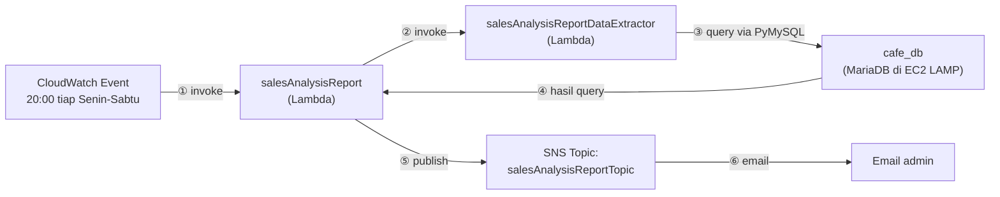
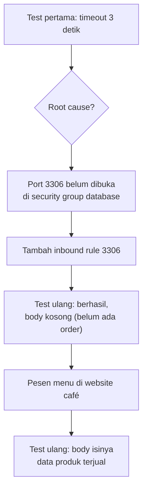

Kasusnya: pemilik café (Sofía) mau dapet laporan harian otomatis soal kebutuhan baking besok, berdasarkan penjualan hari ini. Solusinya, dibikin arsitektur serverless pake [AWS Lambda](/blog/aws-lambda-serverless-computing) yang jalan otomatis tiap malam.

## Arsitektur

Dua Lambda function saling manggil: `salesAnalysisReport` (yang di-trigger CloudWatch Event tiap jam 8 malam) manggil `salesAnalysisReportDataExtractor` buat narik data dari database, terus hasilnya diformat jadi laporan dan dipublish ke SNS topic yang udah di-subscribe email admin.

## IAM Role: Siapa Boleh Ngapain

Dua function ini punya role beda:

- **`salesAnalysisReportRole`** (dipake `salesAnalysisReport`): akses penuh ke SNS (buat publish laporan), read-only ke Systems Manager (buat baca Parameter Store), plus permission dasar nulis ke CloudWatch Logs dan permission buat manggil Lambda function lain.
- **`salesAnalysisReportDERole`** (dipake `salesAnalysisReportDataExtractor`): permission dasar CloudWatch Logs, plus permission VPC access (bikin/kelola network interface) karena function ini butuh nembak database yang ada di dalam VPC.

Dua-duanya trust `lambda.amazonaws.com`, jadi Lambda service yang boleh assume role ini.

## Bikin Lambda Layer buat Dependency PyMySQL

Function `salesAnalysisReportDataExtractor` butuh library **PyMySQL** buat konek ke database MySQL/MariaDB. Daripada di-bundle di tiap deployment package, library ini dipaketin jadi **Lambda layer** (`pymysqlLibrary`), sekali bikin, bisa dipake berkali-kali. Struktur foldernya di dalam zip harus ngikutin pola `python/<nama-library>`, biar Lambda runtime Python bisa nemuin library-nya.

## Bikin Function Data Extractor

Function ini di-attach ke `salesAnalysisReportDERole`, layer `pymysqlLibrary` ditambahin, kodenya di-upload dari zip. Karena butuh akses ke database di EC2 LAMP instance, function ini di-setting network-nya: VPC, subnet, dan security group yang sama kayak instance database-nya.

## Testing dan Troubleshooting

Test pertama dijalanin dengan input parameter connection database (`dbUrl`, `dbName`, `dbUser`, `dbPassword`, diambil dari **Parameter Store**), hasilnya **gagal, timeout setelah 3 detik**.

Penyebabnya: function nyoba konek ke MySQL port default (3306), tapi port ini belum dibuka di security group instance database. Setelah inbound rule 3306 ditambahin, test ulang berhasil, tapi `body`-nya kosong karena belum ada data order di database.

Setelah pesen beberapa menu lewat website café buat ngisi data, test diulang lagi, dan hasilnya nunjukin data produk yang kejual (nama produk, kategori, quantity).

## Setup Notifikasi: SNS Topic

Dibikin SNS topic `salesAnalysisReportTopic`, terus di-subscribe pake email admin. Subscription-nya perlu dikonfirmasi lewat link yang dikirim ke email sebelum notifikasi beneran bisa masuk.

## Function Utama: `salesAnalysisReport`

Function kedua ini yang jadi "otak" alurnya, manggil data extractor dan publish ke SNS. Karena butuh ARN dari SNS topic, itu disimpen sebagai **environment variable** (`topicARN`) di konfigurasi function, bukan di-hardcode di kode.

Testing-nya langsung berhasil dan email laporan "Daily Sales Analysis Report" masuk, isinya daftar item yang kejual dari website café.

## Trigger Terjadwal: CloudWatch Events (EventBridge)

Biar laporan jalan otomatis tiap hari, ditambahin trigger EventBridge dengan **cron expression**, jadwalnya Senin-Sabtu jam 8 malam. Cron expression di Lambda formatnya `cron(Menit Jam Tanggal Bulan HariMinggu Tahun)`, dan semua jamnya dalam **UTC**, jadi perlu dikonversi dulu dari waktu lokal.

Contoh buat testing (~5 menit dari sekarang, biar cepet keliatan hasilnya), lalu buat production di-set ke jadwal beneran jam 8 malam UTC, Senin-Sabtu.

## Lab Tambahan: Challenge Word Count

Ada satu lab challenge terpisah tapi masih dalam topik yang sama: bikin Lambda function yang ngitung jumlah kata di file teks, di-trigger otomatis pas file di-upload ke S3 bucket, hasilnya dikirim lewat email pake SNS topic dengan format pesan `"The word count in the <namaFile> file is nnn."`. IAM role-nya dipakein role yang udah disediain (`LambdaAccessRole`, isinya kombinasi akses CloudWatch Logs, SNS, dan S3), karena kebijakan lab-nya nggak izinin bikin role baru.

## Yang Perlu Diinget

- Dua Lambda function bisa saling manggil, masing-masing dengan IAM role yang scope-nya beda sesuai kebutuhan aksesnya.
- Lambda layer itu cara reuse dependency antar function tanpa bundling ulang tiap deploy.
- Function yang butuh akses resource di dalam VPC (misal database di EC2) wajib di-setting network-nya (VPC/subnet/security group), dan security group tujuannya harus buka port yang dibutuhin (contoh: 3306 buat MySQL).
- Environment variable dipake buat nyimpen config yang bisa beda-beda tanpa hardcode di kode (contoh: ARN SNS topic).
- Trigger terjadwal pake EventBridge dan cron expression, semua jadwalnya dalam UTC.

## Referensi Resmi

- [Using AWS Lambda with Scheduled Events](https://docs.aws.amazon.com/lambda/latest/dg/with-scheduled-events.html)
- [Accessing Amazon CloudWatch Logs for AWS Lambda](https://docs.aws.amazon.com/lambda/latest/dg/monitoring-cloudwatchlogs.html)
- [Using an Amazon S3 Trigger to Invoke a Lambda Function](https://docs.aws.amazon.com/lambda/latest/dg/with-s3-example.html)
- [Including Library Dependencies in a Layer](https://docs.aws.amazon.com/lambda/latest/dg/configuration-layers.html)
