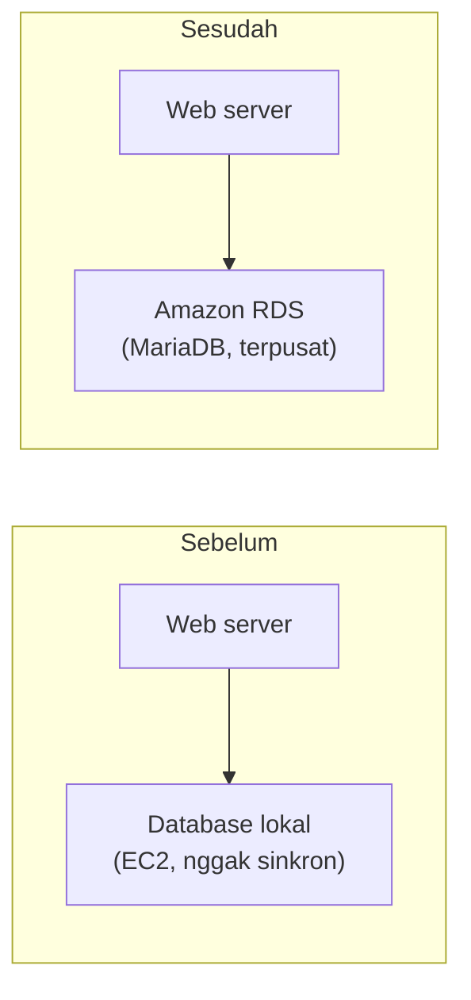
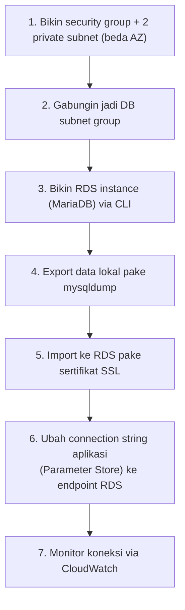
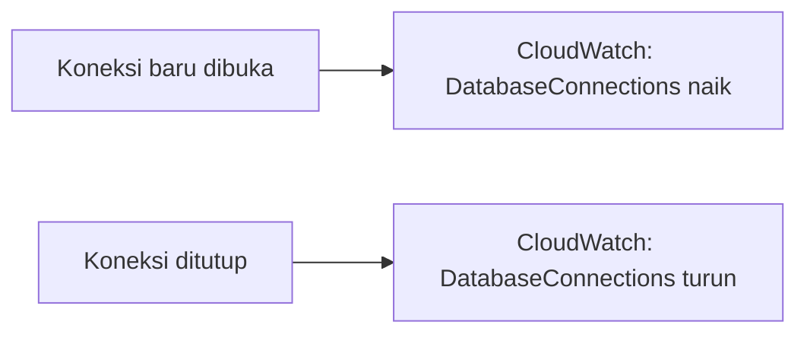

Lanjutan dari kasus café yang udah beberapa kali dipake buat lab sebelumnya. Masalahnya: database masih nempel lokal di tiap EC2 instance, jadi kalau instance-nya terminate atau di-failover, datanya ilang karena masing-masing instance punya database sendiri-sendiri yang nggak sinkron. Solusinya, migrasi ke **Amazon RDS** sebagai database layer terpusat.

## Kondisi Sebelum dan Sesudah



## Alur Migrasinya



## 1-2. Security Group dan Subnet Group via CLI

Semua langkah ini dikerjain lewat CLI, bukan console. Pertama bikin security group khusus database:

```bash
aws ec2 create-security-group \
  --group-name cafe-database-sg \
  --description "SG for cafe RDS" \
  --vpc-id <vpc-id>
```

Terus dibuka port 3306 (default MySQL/MariaDB), tapi sumbernya bukan `0.0.0.0/0`, melainkan **security group instance web/CLI** itu sendiri, biar RDS cuma bisa diakses dari layer yang emang butuh:

```bash
aws ec2 authorize-security-group-ingress \
  --group-id <cafe-database-sg-id> \
  --protocol tcp --port 3306 \
  --source-group <cafe-instance-sg-id>
```

Titik paling gampang salah di sini: jangan sampai kebalik antara "SG mana yang di-edit" sama "SG mana yang di-izinin masuk". Kalau kebalik, koneksinya nggak akan pernah nyambung walau kelihatannya command-nya "sukses".

RDS butuh minimal 2 subnet di 2 AZ berbeda buat subnet group-nya:

```bash
aws ec2 create-subnet --vpc-id <vpc-id> --cidr-block 10.20.2.0/24 --availability-zone <region>a
aws ec2 create-subnet --vpc-id <vpc-id> --cidr-block 10.20.3.0/24 --availability-zone <region>b

aws rds create-db-subnet-group \
  --db-subnet-group-name cafe-db-subnet-group \
  --db-subnet-group-description "Cafe RDS subnet group" \
  --subnet-ids <subnet-1-id> <subnet-2-id>
```

## 3. Bikin RDS Instance via CLI

```bash
aws rds create-db-instance \
  --db-instance-identifier cafe-db-instance \
  --db-instance-class db.t3.micro \
  --engine mariadb \
  --engine-version 10.11.13 \
  --allocated-storage 20 \
  --db-subnet-group-name cafe-db-subnet-group \
  --vpc-security-group-ids <cafe-database-sg-id> \
  --no-publicly-accessible \
  --master-username root \
  --master-user-password <password>
```

Beberapa hal yang ketemu pas nyoba:
- **Versi engine harus persis ada di daftar available**, kalau nembak versi yang udah deprecated (misal `10.11.11`), errornya nggak nemu versi cocok, harus dicek dulu versi yang tersedia (`aws rds describe-db-engine-versions`).
- `--no-publicly-accessible` penting, database ini private, cuma bisa diakses dari dalam VPC.
- Provisioning-nya makan waktu sekitar 15 menit sampe statusnya `available` dan dapet endpoint.

Selama nunggu, bisa dicek statusnya:

```bash
aws rds describe-db-instances \
  --db-instance-identifier cafe-db-instance \
  --query 'DBInstances[0].{Endpoint:Endpoint.Address,AZ:AvailabilityZone,Status:DBInstanceStatus}'
```

Ada juga **preferred backup window**, jam berapa RDS ngejalanin backup otomatis. Kalau nggak di-set eksplisit, defaultnya random, dan itu dalam **UTC**, jadi buat Indonesia (UTC+7) perlu dikonversi manual. Kalau proses backup itu ternyata makin lama dari window yang dialokasiin, prosesnya nggak dipotong paksa, tapi di-hold dan lanjut di jadwal backup berikutnya. Kecepatan backup ini dipengaruhi spek instance dan jenis storage (SSD lebih cepat).

## 4-5. Export dan Import Data

Dump database lokal jadi file SQL (istilahnya "dumping", bukan "backup" doang, tapi hasilnya sama aja file backup):

```bash
mysqldump -u root -p cafe_db > cafe_db_backup.sql
```

Import ke RDS wajib pake koneksi terenkripsi (SSL), jadi download dulu sertifikatnya:

```bash
curl -O https://truststore.pki.rds.amazonaws.com/global/global-bundle.pem
```

Baru import:

```bash
mysql -h <rds-endpoint> -u root -p --ssl-ca=global-bundle.pem cafe_db < cafe_db_backup.sql
```

Cara gampang inget arah panahnya: `>` (ke kanan) itu **export** (data keluar dari database jadi file), `<` (ke kiri) itu **import** (data masuk dari file ke database). Sepele tapi gampang ketuker.

Verifikasi dengan connect ke RDS dan cek datanya udah masuk:

```bash
mysql -h <rds-endpoint> -u root -p --ssl-ca=global-bundle.pem
USE cafe_db;
SELECT * FROM produk;
```

## 6. Ubah Connection String Aplikasi

Aplikasi masih nembak database lokal, jadi endpoint-nya perlu diganti. Karena connection info-nya disimpen di **Parameter Store** (bukan hardcode di kode), gantinya cuma tinggal edit value parameter-nya:

```bash
aws ssm put-parameter \
  --name /cafe/dbUrl \
  --value <rds-endpoint> \
  --type String \
  --overwrite
```

Ini yang disebut **soft-coded**, satu-satunya yang perlu diubah cuma nilai variabel parameternya, kode aplikasinya sendiri nggak disentuh sama sekali. Aplikasi langsung nembak RDS begitu parameter-nya di-refresh, downtime-nya minim banget.

## 7. Monitoring Koneksi via CloudWatch

RDS punya metric bawaan **DatabaseConnections** di CloudWatch, nunjukin berapa banyak koneksi aktif ke database. Kalau dicoba connect manual ke RDS, angkanya naik jadi 1, begitu koneksinya ditutup (`exit`), baliknya ke 0.



Kalau connection count-nya kelihatan penuh terus (database connection pool habis), itu tandanya butuh strategi tambahan, bisa pake **proxy** (misal RDS Proxy) atau nambah **read replica**, tergantung kebutuhan.

## Yang Perlu Diinget

- Database yang nempel lokal di tiap instance itu bahaya, gampang out-of-sync dan gampang ilang kalau instance-nya terminate. Solusinya database layer terpusat kayak RDS.
- Security group yang dipasang ke RDS sumbernya harus security group instance yang butuh akses, bukan `0.0.0.0/0`, dan jangan sampe kebalik SG mana yang diedit vs SG mana yang diizinin.
- Import ke RDS wajib pake sertifikat SSL, hafalin arah panah: export (`>`) vs import (`<`).
- Kalau aplikasi udah soft-coded (connection info di Parameter Store, bukan hardcode), migrasi endpoint database jadi nyaris zero-downtime.
- CloudWatch metric `DatabaseConnections` berguna buat mantau beban koneksi real-time.

## Referensi Resmi

- [Creating an Amazon RDS DB Instance](https://docs.aws.amazon.com/AmazonRDS/latest/UserGuide/USER_CreateDBInstance.html)
- [Importing Data into a MySQL or MariaDB DB Instance](https://docs.aws.amazon.com/AmazonRDS/latest/UserGuide/USER_MySQL.Procedural.Importing.html)
- [Using SSL/TLS to Encrypt a Connection to a DB Instance](https://docs.aws.amazon.com/AmazonRDS/latest/UserGuide/UsingWithRDS.SSL.html)
- [Monitoring Amazon RDS Metrics with CloudWatch](https://docs.aws.amazon.com/AmazonRDS/latest/UserGuide/monitoring-cloudwatch.html)
