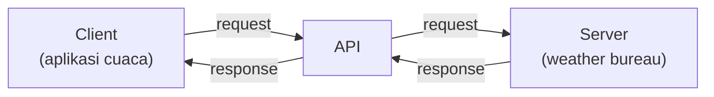
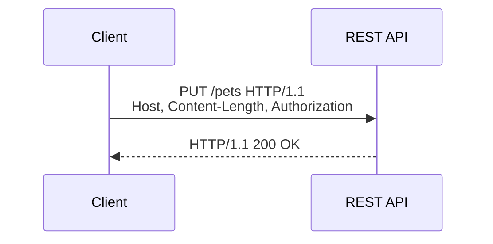

Awal minggu ke-4 udah masuk unit baru: Serverless and Containers. Dan yang pertama dibahas adalah fondasinya dulu, API dan REST, karena banyak service serverless (Lambda, API Gateway, dll) nempel di konsep ini.

## Apa Itu API

API (application programming interface) itu cara aplikasi ngasih akses program ke aplikasi lain tanpa perlu GUI. Client kirim request ke server, server balikin response. Contoh paling gampang: aplikasi cuaca di HP kita nembak API-nya BMKG (atau weather bureau versi luar), dapet data cuaca, ditampilin di UI aplikasi.

Bahkan konsol AWS sendiri, di balik layar setiap kita klik tombol, itu manggil API. Klik ini, manggil API ini, dapet data itu.

## REST: Salah Satu Varian API

Varian API yang sekarang ada beberapa: REST, HTTP API, sama WebSocket. REST (Representational State Transfer) yang paling umum dan paling sering dipake sampe sekarang. Fungsinya buat pertukaran informasi antar 2 sistem komputer secara aman lewat internet, komunikasinya di layer 7 OSI (application layer).

### 5 Prinsip Desain REST

1. **Uniform interface**: mau aplikasinya beda-beda, komunikasinya tetep lewat cara yang sama.
2. **Stateless**: komunikasi antar request nggak nyimpen informasi/state. Tiap request berdiri sendiri.
3. **Cacheable**: response REST bisa di-cache. Kalau request-nya sama, nggak perlu manggil ulang ke backend, tinggal balikin dari cache. Di API Gateway ini disebut API Gateway cache, dan ukurannya bisa diatur, tujuannya buat naikin cache hit ratio.
4. **Layered system**: bisa dipisah jadi beberapa layer, misal traffic API biasa dipisah dari traffic premium (kayak yang dilakuin Spotify buat bedain user premium vs biasa).
5. **Code on demand** *(opsional)*: server bisa ngirim kode yang dieksekusi di sisi client.

## Komponen REST

- **Client**: yang ngirim request (orang atau sistem).
- **Resource**: informasi yang disediain server (gambar, video, teks, angka, dll).
- **Request**: dikirim client ke server.
- **Response**: dibalikin server, isinya status (berhasil/gagal) plus data.

### Format Request

- **Endpoint**: bentuknya URL, bukan IP.
- **Method**: `GET` (baca), `POST` (bikin resource baru), `PUT` (update resource), `DELETE` (hapus resource).
- **Header**: metadata request, misal apakah data-nya dienkripsi.
- **Body**: data yang dikirim.

Contoh: bikin bucket S3 pake `PUT`. Method-nya `PUT`, host-nya endpoint S3, ada `Content-Length` (kalau isinya gede banget padahal cuma `PUT` doang, itu tanda ada yang aneh, bisa jadi packet injection), dan `Authorization` header yang isinya token buat validasi identitas request-nya.

Buat testing REST API, biasa dipake **cURL**: `curl -i -X POST -d @file.json -H "Content-Type: application/json" https://example.com/resource`. `-i` nampilin header response, `-X` metodenya, `-d` data yang dikirim, `-H` header tambahan.

## HTTP Status Code

Kode status itu penting buat troubleshooting, dibagi per grup:

| Grup | Arti |
|---|---|
| 1xx | Informational, request masih diproses |
| 2xx | Success |
| 3xx | Redirection (misal gateway error, redirect ke gateway lain) |
| 4xx | Client error (yang salah di sisi request, misal nggak punya izin) |
| 5xx | Server error |

## Yang Perlu Diinget

- REST itu salah satu gaya arsitektur API, bukan satu-satunya (ada juga HTTP API dan WebSocket).
- Stateless artinya server nggak nyimpen state antar request, itu bedanya sama session-based.
- Response REST bisa di-cache, dan itu salah satu alasan performa API bisa dioptimasi tanpa nyentuh backend.
- Status code 3 digit pertama nunjukin kategori: 1xx info, 2xx sukses, 3xx redirect, 4xx client error, 5xx server error.

## Referensi Resmi

- [What Is Amazon API Gateway?](https://docs.aws.amazon.com/apigateway/latest/developerguide/welcome.html)
- [HTTP Status Codes](https://developer.mozilla.org/en-US/docs/Web/HTTP/Status)
