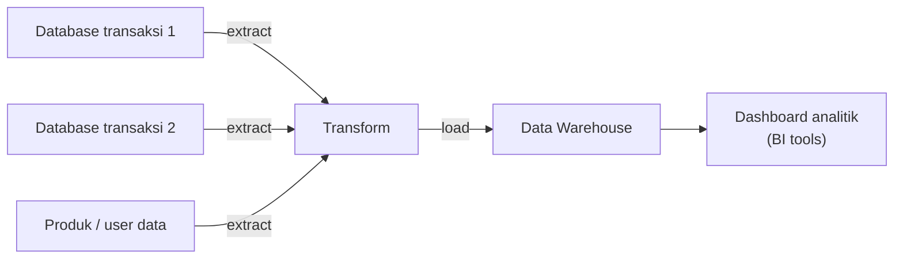

## Kenapa Analitik Nggak Boleh Langsung di Database Transaksi

Database yang dipake buat transaksi sehari-hari (OLTP, online transaction processing) itu didesain buat baca-tulis cepat dalam jumlah kecil per request. Kalau analitik berat (query gede, agregasi, join banyak tabel) dijalanin langsung di database itu, performanya bakal ngedrop, dan aplikasi yang lagi dipake user ikut kena dampaknya.

Solusinya: data dikonsolidasi ke **data warehouse**, repository terpusat khusus buat analitik (OLAP, online analytical processing). Prosesnya ETL: **Extract** (tarik data dari berbagai sumber), **Transform** (bersihin/format), **Load** (masukin ke warehouse).

## Arsitektur 3-Tier Data Warehouse

- **Top tier**: front-end, dashboard buat presentasi (Tableau, Power BI, dll).
- **Middle tier**: analytics engine, tempat query dijalanin (SQL-like, banyak varian query language).
- **Bottom tier**: infrastruktur, database server tempat data disimpan dan di-load, di sinilah proses ETL kejadian.

## Kolom vs Baris: Kenapa Format Storage-nya Beda

Database transaksi biasa nyimpen dan nge-query data per **baris** (row-based). Data warehouse/data lake sebaliknya, main di level **kolom** (columnar storage), soalnya analitik biasanya cuma butuh beberapa kolom tertentu dari jutaan baris (misal cuma "total penjualan per produk"), jadi jauh lebih efisien baca kolom itu doang dibanding scan seluruh baris. Format file yang biasa dipake: **Parquet** (paling umum), ORC, Avro (masih row-based).

## Apa Itu Redshift

Redshift itu **fully managed data warehouse service** dari AWS, didesain buat analytical query skala sangat besar (sampe petabyte), pake teknik **massively parallel processing**, kolom-oriented storage, dan caching di level lokal. Karena kerjanya di level kolom, performanya jauh lebih kenceng buat query analitik dibanding database SQL biasa yang row-oriented.

Redshift sekarang udah ada opsi **serverless**, jadi nggak perlu provisioning cluster manual (Shopee salah satu yang pake).

### Kenapa Pake Managed Service Kayak Redshift

- Setup lebih cepet, nggak butuh komitmen resource gede di awal (bisa eksperimen dulu).
- Maintenance lebih gampang karena fully managed.
- Fokus ke analisa data, bukan ngurusin infrastruktur di baliknya.
- Scaling kapasitas sesuai kebutuhan.
- Alternatif lain kayak Snowflake juga populer, tapi biasanya lebih mahal, dan kalau udah masuk ekosistem AWS, Redshift jadi pilihan yang lebih nempel.

## Yang Perlu Diinget

- Jangan pernah jalanin analitik berat langsung di database transaksi, itu bisa ngedrop performa aplikasi yang make database itu.
- Data warehouse punya arsitektur 3-tier: presentasi (top), analytics engine (middle), infrastruktur/ETL (bottom).
- Storage data warehouse/data lake itu kolom-oriented (bukan baris), makanya lebih efisien buat query analitik skala besar.
- Redshift itu fully managed data warehouse-nya AWS, sekarang ada opsi serverless juga.

## Referensi Resmi

- [What Is Amazon Redshift?](https://docs.aws.amazon.com/redshift/latest/mgmt/welcome.html)
- [Amazon Redshift Serverless](https://docs.aws.amazon.com/redshift/latest/mgmt/serverless-whatis.html)
