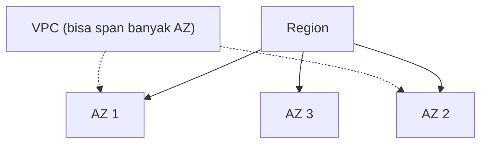

Masuk unit baru "AWS Networking Services Overview", ngebahas VPC lebih dalam lagi dari yang udah dipelajarin di [minggu pertama](/blog/vpc-manual-cidr-igw-nacl-security-group).

## Region, AZ, dan VPC: Urutan Cakupannya

Kalau masih suka ketuker: **Region dulu**, baru di dalamnya ada beberapa **Availability Zone**. VPC itu potongan yang hidup **di dalam satu Region**, dan bisa **mencakup semua AZ** di region itu (atau cuma sebagian, tergantung setting kita).

Aturannya: **VPC bisa span banyak AZ, tapi AZ nggak bisa span banyak VPC**. Satu VPC bisa nyakup maksimum sebanyak AZ yang tersedia di region itu (beda-beda tiap region, misal N. Virginia 6 AZ, Jakarta 3 AZ). Kalau butuh lebih, ada opsi ekstensi **Local Zone**, tapi ini berbayar.

Dua resource beda AZ tapi masih **satu VPC** tetap bisa saling konek pake IP privat, karena ada rute **local** bawaan di route table.

## CIDR Notation: Cara Bacanya

IP address itu terbagi jadi **network prefix** dan **host identifier**. Notasi `/n` nunjukin berapa bit dari kiri yang jadi network prefix, sisanya buat host.

| CIDR Block | Range Alamat |
|---|---|
| `10.50.1.0/24` | `10.50.1.0` – `10.50.1.255` |
| `10.50.1.0/27` | `10.50.1.0` – `10.50.1.31` |
| `10.50.1.132/32` | cuma satu alamat: `10.50.1.132` |
| `0.0.0.0/0` | semua alamat |

Pas bikin VPC, wajib pake range IP privat (RFC 1918): kelas A (`10.x.x.x`), kelas B (`172.16.x.x`), atau kelas C (`192.168.x.x`), dan CIDR block-nya harus antara `/16` sampe `/28`. Best practice-nya: **non-overlapping**, jangan sampe dua VPC yang bakal di-peering punya range IP yang tumpang tindih, soalnya itu bikin masalah di sisi routing.

## Reserved IP di Tiap Subnet

Tiap subnet punya beberapa IP yang direserve AWS dan nggak bisa dipake resource kita: alamat network itu sendiri, alamat buat router VPC, dua alamat buat DNS resolver dan cadangan masa depan, dan alamat broadcast. Makanya jumlah IP yang beneran usable di satu subnet selalu 5 lebih sedikit dari total hitungan `2^(32-prefix)`.

## Route Table: Gimana Traffic Diarahin

Tiap VPC otomatis dapet **router implisit** dan **default route table**, isinya cuma satu rule: traffic ke range IP VPC sendiri diarahin **local**. Kalau butuh subnet yang bisa akses internet, kita bikin **custom route table** dengan rule tambahan `0.0.0.0/0` diarahin ke internet gateway, terus asosiasiin ke subnet yang mau dijadiin publik.

Cara kerja pengecekan rule-nya: traffic yang masuk dicek dulu ke **main route table** (default), kalau ada rule yang cocok, jalan. Kalau nggak ketemu di main, baru dicek ke route table lain yang udah diasosiasiin ke subnet itu.

## Elastic Network Interface (ENI)

Tiap instance di VPC punya minimal satu **network interface** (NIC), yang disebut **primary network interface**, ini yang nggak bisa dilepas dari instance-nya. Tiap NIC punya IP privat sendiri, MAC address sendiri, dan security group sendiri.

Instance yang speknya lebih gede bisa punya **lebih dari satu ENI**, dan ENI tambahan ini bisa dilepas-pasang antar instance (asal masih di AZ yang sama). Kegunaannya: bikin NAT server/load balancer/proxy yang butuh beberapa IP sekaligus, atau misahin network interface buat manajemen (misal upload log, patch) dari interface yang ngehadap customer, biar bandwidth-nya nggak keganggu satu sama lain.

## Public IP: Nempel di Resource, Bukan di VPC

IP publik itu bukan "milik" VPC, tapi nempel ke **resource** tertentu di dalam VPC (EC2 instance, container, dll). Cuma instance yang di-deploy di **default VPC** yang otomatis dapet IP publik, kalau custom VPC, harus di-enable manual: lewat setting **auto-assign public IP** di level subnet, ATAU eksplisit dipilih pas launch instance-nya. IP publik dari auto-assign ini **dinamis**, beda sama Elastic IP yang statis (dan lebih mahal).

## DNS Options buat VPC

Defaultnya, VPC otomatis dikasih DNS server dari Amazon (**Route 53 Resolver**), yang resolve nama domain di dalam VPC sekaligus lookup ke internet buat domain di luar. Opsi lain: pake DNS server sendiri, atau pake **Route 53 private hosted zone**.

Pola menarik: **split-horizon DNS**, satu domain yang sama bisa resolve ke IP **berbeda** tergantung request-nya dari dalam VPC atau dari luar (internet). Contoh kasus: website internal dan eksternal yang pake nama domain sama persis.

## Yang Perlu Diinget

- Urutannya Region → AZ → VPC bisa span banyak AZ, tapi AZ nggak bisa span banyak VPC.
- CIDR block VPC wajib IP privat (RFC 1918), dan sebisa mungkin non-overlapping biar nggak masalah pas di-peering nanti.
- 5 IP di tiap subnet itu direserve AWS, nggak bisa dipake.
- ENI itu identitas jaringan instance, primary NIC nggak bisa dilepas, tapi bisa nambah NIC ekstra buat kebutuhan multi-IP.
- IP publik nempel ke resource (bukan ke VPC), dan cuma default VPC yang otomatis ngasih IP publik ke instance baru.

## Referensi Resmi

- [What Is Amazon VPC?](https://docs.aws.amazon.com/vpc/latest/userguide/what-is-amazon-vpc.html)
- [VPC and Subnet Sizing for IPv4](https://docs.aws.amazon.com/vpc/latest/userguide/subnet-sizing.html)
- [Elastic Network Interfaces](https://docs.aws.amazon.com/AWSEC2/latest/UserGuide/using-eni.html)
- [Using DNS with Your VPC](https://docs.aws.amazon.com/vpc/latest/userguide/vpc-dns.html)
