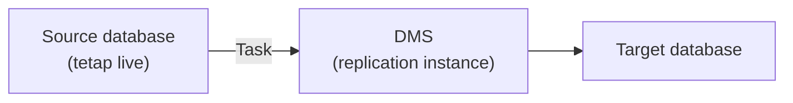
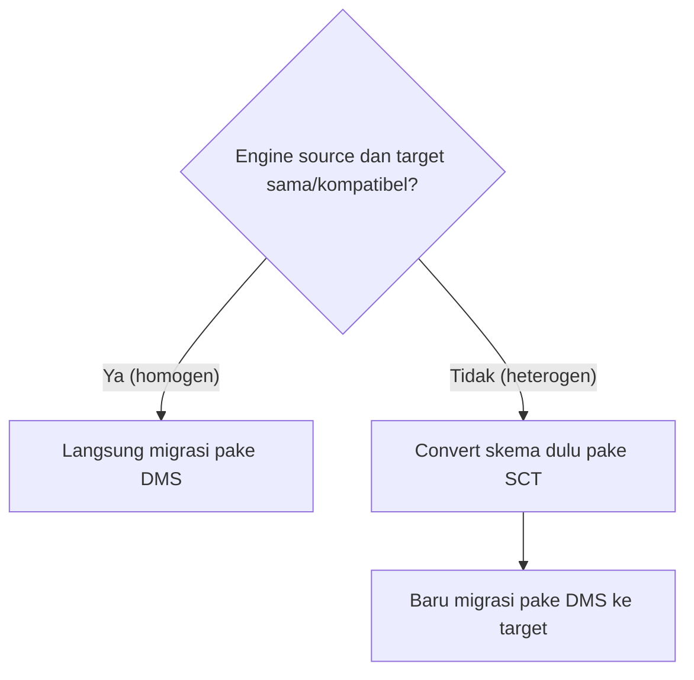
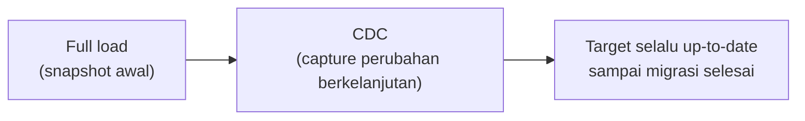

Lanjutan dari [migrasi RDS via CLI](/blog/migrasi-database-ke-rds-via-cli) kemarin, tapi sekarang naik level ke service khusus buat migrasi: **AWS DMS (Database Migration Service)**.

## Masalah yang Diselesaikan DMS

Cara migrasi manual (dump lalu import, kayak yang dipake di lab RDS kemarin) punya masalah kalau datanya gede: proses dump butuh waktu, dan di zaman dulu, migrasi database berarti aplikasinya harus **downtime** dulu, soalnya kalau tetep live pas migrasi, data yang berubah selama proses dump nggak keikut, ujung-ujungnya data korup atau nggak lengkap.

DMS nyelesain ini: source database tetep bisa beroperasi selama migrasi berlangsung, user nggak ngerasa lagi ada migrasi di baliknya.

## Homogen vs Heterogen

- **Migrasi homogen**: source dan target pake **engine yang sama atau kompatibel**. Contoh: MySQL ke MySQL, atau MySQL ke Aurora MySQL (kompatibel). Bisa langsung pake DMS.
- **Migrasi heterogen**: engine-nya **beda**. Contoh: MySQL ke Aurora PostgreSQL, atau Oracle ke Aurora. Butuh convert skema dulu sebelum data-nya dipindah.

Poin jebakan yang ditekenin instruktur: dua database yang sama-sama "SQL" belum tentu homogen kalau engine-nya beda (MySQL vs PostgreSQL tetep dianggap heterogen).

## SCT: Konversi Skema buat Migrasi Heterogen

**Schema Conversion Tool (SCT)** convert skema database dan object code (view, stored procedure) dari satu engine ke engine lain. Dipake khusus buat migrasi heterogen, karena target migrasi lewat SCT itu didesain buat menuju AWS (misal dari Oracle/Azure/IBM DB2 ke Aurora/Redshift/dll).

Baik DMS maupun SCT **bukan service gratis**.

## Kenapa Dumping Doang Nggak Cukup buat Data Gede

Proses dump itu butuh waktu, dan kalau ada perubahan data pas proses dump lagi jalan, perubahan itu **nggak ke-capture** di hasil dump-nya (karena dump itu snapshot di satu titik waktu doang). Untuk database kecil ini nggak masalah, tapi buat database gede (misal perbankan dengan jutaan baris), ini jadi resiko kehilangan data.

## CDC: Capture Perubahan Selama Migrasi

DMS punya fitur **CDC (Change Data Capture)**: begitu proses load awal (mirip dumping) selesai, DMS terus mantau dan nangkep perubahan data yang terjadi selama proses migrasi, terus nerusin perubahan itu ke target. Jadi datanya tetep konsisten walaupun source database-nya tetep aktif dipake selama migrasi.

## Komponen DMS

- **Replication instance**: EC2 instance di balik layar yang jalanin proses migrasi.
- **Task**: definisi kerjaan migrasi, isinya source endpoint dan target endpoint.
- **Job**: proses migrasi yang beneran jalan dari task itu.

## Yang Perlu Diinget

- DMS memungkinkan migrasi tanpa downtime, source database tetep bisa dipake normal selama proses migrasi.
- Migrasi homogen (engine sama/kompatibel) bisa langsung pake DMS. Migrasi heterogen (engine beda) butuh SCT buat convert skema dulu.
- Dumping manual beresiko kehilangan perubahan data yang terjadi selama proses dump, DMS nyelesain ini pake CDC.
- DMS dan SCT dua-duanya berbayar, bukan fitur gratis.

## Referensi Resmi

- [What Is AWS Database Migration Service?](https://docs.aws.amazon.com/dms/latest/userguide/Welcome.html)
- [What Is AWS Schema Conversion Tool?](https://docs.aws.amazon.com/SchemaConversionTool/latest/userguide/CHAP_Welcome.html)
- [Ongoing Replication (CDC) with AWS DMS](https://docs.aws.amazon.com/dms/latest/userguide/CHAP_Introduction.html)
