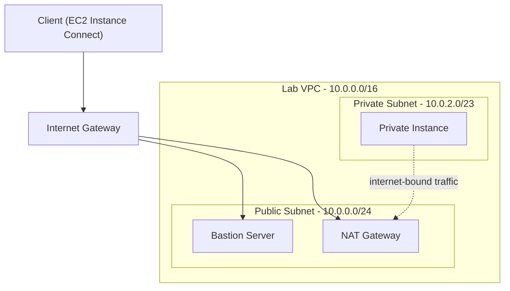
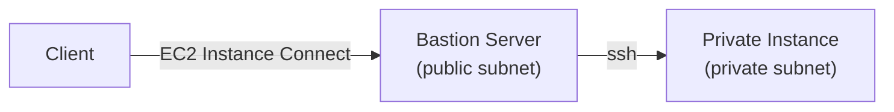

Lanjutan dari [materi VPC fundamentals](/blog/amazon-vpc-fundamentals-lanjutan) dan [connectivity options](/blog/vpc-connectivity-options), sekarang beneran praktek bikin VPC dari nol, lengkap sama bastion server dan NAT gateway.

## Arsitektur Lab



| Public Route Table | | Private Route Table | |
|---|---|---|---|
| Destination | Target | Destination | Target |
| `10.0.0.0/16` | Local | `10.0.0.0/16` | Local |
| `0.0.0.0/0` | Internet Gateway | `0.0.0.0/0` | NAT Gateway |

## 1. Bikin VPC

VPC dibikin manual, `10.0.0.0/16`. Satu hal yang wajib nggak boleh kelupaan: **enable DNS hostname**, defaultnya disabled pas VPC baru dibuat.

## 2. Bikin Public dan Private Subnet

- **Public Subnet**: `10.0.0.0/24`, AZ tertentu (jangan pilih "No preference", biar nggak random).
- **Private Subnet**: `10.0.2.0/23` (dua kali lebih besar dari public, soalnya kebanyakan resource emang harusnya di private, cuma yang beneran butuh internet-facing yang di public).

Auto-assign public IP di-enable di level subnet buat yang public. Tapi ingat, subnet nggak otomatis jadi "public" cuma karena namanya "Public Subnet", itu baru beneran public setelah ada internet gateway dan route table-nya di-setting.

## 3. Internet Gateway

Bikin IGW, attach ke VPC. Ini ngasih jalur *ke* internet, tapi belum otomatis dipake sebelum route table-nya di-setting.

## 4. Route Table

VPC otomatis dapet route table default (jadi **Private Route Table**, cuma ada rule local). Bikin route table baru buat public (**Public Route Table**), tambahin rule `0.0.0.0/0` → Internet Gateway, terus asosiasiin ke Public Subnet.

## 5. Bastion Server

**Bastion server** (jump box) itu EC2 instance di public subnet, fungsinya jadi "loncatan" buat akses instance di private subnet yang nggak bisa diakses langsung dari luar. Dikonfigurasi:
- Security group `Bastion Security Group`, inbound SSH dari `Anywhere`.
- Auto-assign public IP enabled.
- Nggak wajib pakai key pair kalau connect-nya lewat EC2 Instance Connect.

## 6. NAT Gateway

NAT gateway ditaruh di **public subnet** (bukan private!), pakai Elastic IP. Setelah itu, private route table di-edit: tambahin rule `0.0.0.0/0` → NAT Gateway, biar instance di private subnet bisa akses internet lewat NAT.

## Tantangan Opsional: Tes Koneksi dari Private Instance

Bikin instance baru di private subnet, security group-nya cuma boleh SSH dari range IP VPC (`10.0.0.0/16`), bukan `Anywhere`. Login-nya harus **loncat lewat bastion dulu**, nggak bisa langsung:



```bash
# di terminal bastion server
ssh 10.0.2.xxx
```

Setelah masuk ke private instance, tes koneksi internetnya:

```bash
ping -c 3 amazon.com
```

Kalau berhasil dapet response, itu artinya konfigurasi NAT gateway udah bener, karena satu-satunya cara private instance (yang nggak punya IP publik sama sekali) bisa nge-ping keluar itu lewat jalur NAT gateway → internet gateway.

## Insight Penting: Kenapa Private Instance Bisa Internet Tanpa IP Publik

Private instance nggak pernah punya IP publik sendiri, tapi tetep bisa akses internet karena dia **"numpang" IP publik NAT gateway**. Alurnya dua kali lompat gateway: private instance → NAT gateway (di public subnet) → internet gateway → internet. Ini beda konsep sama akses langsung yang cuma sekali lewat internet gateway.

Konsekuensi lain dari nggak ada NAT: private instance nggak bisa `yum update`/`apt update` sama sekali, karena package manager juga butuh akses internet buat narik update dari repository-nya.

## Yang Perlu Diinget

- Enable DNS hostname itu langkah yang gampang kelupaan pas bikin VPC baru, defaultnya disabled.
- NAT gateway selalu ditaruh di public subnet, walaupun yang dilayanin private subnet.
- Bastion server itu "pintu belakang" buat ngakses private subnet, bukan buat resource yang butuh diakses publik.
- Instance di private subnet nggak bisa direct diakses dari luar, dan nggak bisa update package tanpa NAT gateway yang jalan.
- User data script cuma jalan **sekali**, pas instance pertama kali dibuat, kalau lupa diisi pas launch, harus terminate dan bikin instance baru, nggak bisa di-inject ulang ke instance yang udah pernah nyala.

## Referensi Resmi

- [What Is Amazon VPC?](https://docs.aws.amazon.com/vpc/latest/userguide/what-is-amazon-vpc.html)
- [VPC CIDR Blocks](https://docs.aws.amazon.com/vpc/latest/userguide/vpc-cidr-blocks.html)
- [NAT Gateways](https://docs.aws.amazon.com/vpc/latest/userguide/vpc-nat-gateway.html)
- [Connect to Your Linux Instance Using EC2 Instance Connect](https://docs.aws.amazon.com/AWSEC2/latest/UserGuide/ec2-instance-connect.html)
