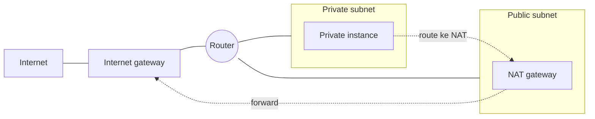
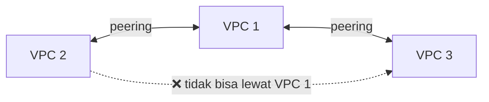
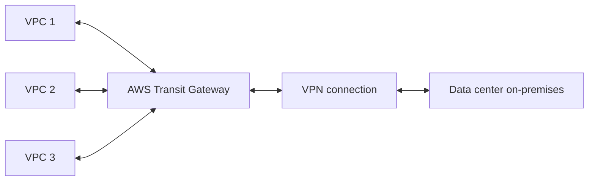

Lanjutan dari [materi VPC fundamentals](/blog/amazon-vpc-fundamentals-lanjutan), sekarang masuk ke opsi-opsi konektivitas: gimana caranya resource di VPC bisa konek keluar (internet, VPC lain, on-premises) dengan cara yang beda-beda sesuai kebutuhannya.

## Analogi: Pintu Depan vs Pintu Karyawan

Kalau butuh akses publik (internet), pakai **internet gateway**, analoginya pintu depan, semua orang boleh masuk (baik atau jahat, itu urusan security layer lain). Tapi kalau yang mau konek itu sesuatu yang "internal" (data center perusahaan, VPC lain), jangan lewat pintu depan, harus lewat "pintu karyawan" yang lebih terkontrol.

## NAT: Private Subnet Tetap Bisa ke Internet

Private subnet nggak punya IP publik, jadi nggak bisa langsung konek ke internet. Solusinya **NAT (Network Address Translation)**, ada dua opsi:

- **NAT gateway**: managed service AWS, serverless, auto scaling, tinggal pakai.
- **NAT instance**: EC2 instance yang difungsiin sebagai NAT server, kita yang urus OS-nya, auto scaling-nya, dll (manajemen overhead lebih tinggi).

Cara gampang inget posisi NAT gateway: dia **selalu ditaruh di public subnet**, meskipun yang dilayanin adalah private subnet. Kalau NAT gateway-nya ditaruh di private subnet, itu salah, karena NAT sendiri butuh akses internet lewat internet gateway.

Private instance yang lewat NAT ini **"numpang" IP publik NAT gateway**, jadi banyak instance di private subnet bisa share satu IP publik yang sama buat akses keluar, ini juga sekaligus penghematan biaya dibanding tiap instance punya IP publik sendiri-sendiri.

## VPC Peering: Koneksi 1-ke-1

**VPC peering** nyambungin dua VPC biar bisa saling route traffic pakai IP privat. Prosesnya butuh **request** dari satu pihak dan **accept** dari pihak lain (kalau beda akun AWS), mirip kerja sama, dua-duanya harus setuju dulu.

### Limitasi Peering: Nggak Transitif

Ini limitasi paling penting: kalau VPC 2 di-peering ke VPC 1, dan VPC 1 di-peering ke VPC 3, **VPC 2 tetep nggak bisa akses VPC 3** lewat VPC 1. Harus dibikin peering terpisah langsung antara VPC 2 dan VPC 3. Nggak ada "transit" otomatis.

Konsekuensinya: makin banyak VPC yang perlu saling konek, makin banyak koneksi peering yang dibutuhin. Buat 3 VPC yang semuanya saling konek, butuh 3 peering. Buat 4 VPC, butuh 6 peering. Ini yang bikin peering nggak scalable buat banyak VPC.

Limitasi lain: nggak boleh ada IP range yang overlap, nggak bisa NAT routing antar VPC, nggak ada resolusi DNS otomatis antar VPC yang di-peering.

## Transit Gateway: Hub buat Banyak Koneksi

Kalau kebutuhannya lebih dari 2 VPC (atau plus koneksi ke on-premises), solusinya **Transit Gateway**, jadi hub pusat, semua VPC dan koneksi on-premises nyambung ke satu Transit Gateway, bukan saling peering satu-satu.

Kapan pilih yang mana: kalau cuma butuh konek 2 VPC, peering lebih murah dan simpel (Transit Gateway jadi overkill). Tapi begitu jumlah VPC yang perlu saling konek makin banyak, Transit Gateway jauh lebih efisien dari sisi biaya dan manajemen.

## VPN dan Direct Connect: Konek ke On-Premises

- **AWS Site-to-Site VPN**: koneksi terenkripsi lewat internet publik, antara **virtual private gateway** (di VPC) dan **customer gateway** (di data center). Roating-nya pake **BGP (Border Gateway Protocol)**, dan AS number di kedua sisi harus sama biar bisa saling routing.
- **AWS Direct Connect**: koneksi privat dedicated pake fiber optic, nggak lewat internet publik. Lebih mahal (harga per kilometer), tapi koneksinya sendiri belum terenkripsi, biasanya di-pasangin sama VPN di atasnya buat keamanan (double cost: bayar Direct Connect + bayar VPN).

## VPC Endpoint: Akses Service AWS Tanpa Lewat Internet

Kalau butuh konek ke service AWS lain tapi nggak mau traffic-nya keluar dari jaringan AWS (tetep private), pakai **VPC endpoint**, ada dua tipe:

- **Gateway endpoint**: cuma buat 2 service, **Amazon S3** dan **DynamoDB**. Ditaruh sebagai target di route table.
- **Interface endpoint**: buat banyak service lain (lewat **AWS PrivateLink**), termasuk service pihak ketiga di AWS Marketplace atau service di VPC lain.

Ini poin yang sering jadi jebakan soal ujian: gateway endpoint itu terbatas cuma S3 dan DynamoDB, selain itu semua pakai interface endpoint.

## Yang Perlu Diinget

- NAT gateway/instance selalu ditaruh di public subnet, meski yang dilayanin private subnet.
- VPC peering itu 1-ke-1 dan nggak transitif, makin banyak VPC yang perlu saling konek, makin nggak scalable.
- Transit Gateway jadi hub pusat, lebih efisien kalau lebih dari 2 VPC yang perlu saling konek.
- Site-to-Site VPN pakai BGP dan AS number harus sama di kedua sisi. Direct Connect lebih mahal tapi private, biasanya dipasangin VPN buat enkripsi.
- Gateway endpoint cuma buat S3 dan DynamoDB, service lain pakai interface endpoint (via PrivateLink).

## Referensi Resmi

- [NAT Gateways](https://docs.aws.amazon.com/vpc/latest/userguide/vpc-nat-gateway.html)
- [VPC Peering](https://docs.aws.amazon.com/vpc/latest/peering/what-is-vpc-peering.html)
- [What Is AWS Transit Gateway?](https://docs.aws.amazon.com/vpc/latest/tgw/what-is-transit-gateway.html)
- [AWS Site-to-Site VPN](https://docs.aws.amazon.com/vpn/latest/s2svpn/VPC_VPN.html)
- [VPC Endpoints](https://docs.aws.amazon.com/vpc/latest/privatelink/vpc-endpoints.html)
