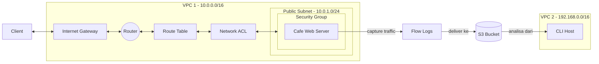
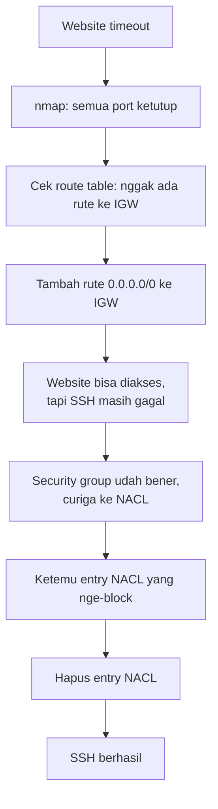

Kasusnya: Nikhil dan Sofía baru aja ubah konfigurasi VPC tempat web server café jalan (buat naikin security), tapi setelahnya customer malah nggak bisa akses website-nya sama sekali, dan mereka juga nggak bisa SSH ke instance-nya buat diagnosa. Dugaan awal: ada kesalahan konfigurasi jaringan yang mendasar.

## Arsitektur Lab



Instruksi dari senior (Mateo dan Olivia): cek route table, NACL, dan security group, terus bikin **VPC Flow Log** buat nangkep traffic IP di dalam VPC, dan analisa data flow log-nya buat nemuin akar masalahnya.

## Setup: Bikin VPC Flow Logs

Sebelum mulai debug, dibikin dulu S3 bucket dan flow log-nya, biar nanti pas proses troubleshooting berlangsung, semua percobaan koneksi ke-capture buat dianalisa belakangan:

```bash
aws s3api create-bucket --bucket flowlog###### --region 'us-west-2' \
  --create-bucket-configuration LocationConstraint='us-west-2'

aws ec2 create-flow-logs --resource-type VPC --resource-ids <vpc-id> \
  --traffic-type ALL --log-destination-type s3 \
  --log-destination arn:aws:s3:::<flowlog######>
```

Verifikasi flow log-nya aktif:

```bash
aws ec2 describe-flow-logs
```

## Challenge #1: Website Nggak Bisa Diakses

Instance web server-nya **running** (dicek via `describe-instances`), tapi halaman websitenya timeout. Diagnosa dijalanin murni via CLI (bukan console), pake **`nmap`** buat cek port apa aja yang kebuka di instance-nya:

```bash
sudo yum install -y nmap
nmap <WebServerIP>
```

Kalau `nmap` nggak nemu port yang kebuka sama sekali, itu tanda ada yang salah bukan di security group (security group biasanya masih nunjukin port yang di-allow, walau nyatanya nggak nyampe), tapi lebih ke arah **route table** subnet-nya:

```bash
aws ec2 describe-route-tables --route-table-ids 'VPC1PubRouteTableId' \
  --filter "Name=association.subnet-id,Values='VPC1PubSubnetID'"
```

Ternyata subnet yang harusnya public itu **nggak punya rute ke internet gateway**. Route-nya ditambahin manual:

```bash
aws ec2 create-route --route-table-id 'VPC1PubRouteTableId' \
  --gateway-id 'VPC1GatewayId' --destination-cidr-block '0.0.0.0/0'
```

Setelah route-nya dibenerin, halaman website-nya langsung bisa diakses.

## Challenge #2: Sudah Bisa Diakses Web, Tapi Masih Nggak Bisa SSH

Instance-nya udah kekonfirmasi nyala, route table udah dibenerin, dan security group udah kekonfirmasi ngizinin port 22. Tapi EC2 Instance Connect **masih gagal**. Kalau tiga hal itu semua udah bener, curiganya tinggal satu: **network ACL**.

```bash
aws ec2 describe-network-acls --filter "Name=association.subnet-id,Values='VPC1PublicSubnetID'" \
  --query 'NetworkAcls[*].[NetworkAclId,Entries]'
```

Ketemu entry NACL yang nge-block traffic yang seharusnya boleh lewat. Entry-nya dihapus:

```bash
aws ec2 delete-network-acl-entry --network-acl-id 'acl-id' --ingress --rule-number 40
```

Setelah entry itu dihapus, EC2 Instance Connect langsung berhasil.



Urutan diagnosanya ini yang penting: kalau semua "kelihatan bener" (instance nyala, security group udah benar) tapi tetep gagal, jangan lupa cek layer yang lebih jarang dicurigai kayak route table dan NACL.

## Analisa Flow Log

Setelah masalahnya kebenerin, data flow log yang udah ke-capture selama proses troubleshooting tadi diunduh dan dianalisa:

```bash
mkdir flowlogs && cd flowlogs
aws s3 cp s3://<flowlog######>/ . --recursive
gunzip *.gz
```

Struktur tiap baris log-nya: source IP (kolom ke-4), destination port (kolom ke-7), timestamp mulai/selesai, dan hasil action-nya (`ACCEPT` atau `REJECT`).

Cari semua traffic yang di-reject:

```bash
grep -rn REJECT .
```

Filter ke port 22 doang (port yang tadi sempet diblokir):

```bash
grep -rn 22 . | grep REJECT
```

Buat isolasi percobaan SSH sendiri, IP publik lokal dicari lewat trik "Add Rule" di security group console (pilih source **My IP**, terus lihat IP yang ke-generate otomatis, tapi rule-nya di-cancel, nggak beneran disave), lalu difilter:

```bash
grep -rn 22 . | grep REJECT | grep <ip-address>
```

Jumlah baris yang kefilter harusnya cocok sama berapa kali percobaan SSH yang gagal tadi. Timestamp Unix di tiap entry bisa dikonversi ke format yang kebaca:

```bash
date -d @1554496931
```

> Buat analisa flow log yang lebih niat (dashboard, reporting), lebih cocok pake **Amazon Athena** yang bisa nge-query log pake SQL, dibanding `grep` manual kayak di lab ini.

## Yang Perlu Diinget

- Kalau semua yang "biasa dicurigai" (instance status, security group) udah kekonfirmasi bener tapi masalah masih ada, cek juga route table dan network ACL, dua-duanya sering kelewat.
- `nmap` berguna buat ngecek dari luar port mana aja yang beneran kebuka, sebelum nebak-nebak di security group.
- VPC Flow Logs berguna banget buat forensik setelah masalah selesai, bisa ngonfirmasi berapa kali percobaan koneksi gagal dan kapan.
- Buat analisa log skala kecil, `grep` udah cukup. Skala besar/reporting rutin, lebih cocok pake Amazon Athena.

## Referensi Resmi

- [VPC Flow Logs](https://docs.aws.amazon.com/vpc/latest/userguide/flow-logs.html)
- [Querying Amazon VPC Flow Logs](https://docs.aws.amazon.com/athena/latest/ug/vpc-flow-logs.html)
- [AWS CLI Command Reference: create-route](https://docs.aws.amazon.com/cli/latest/reference/ec2/create-route.html)
- [AWS CLI Command Reference: delete-network-acl-entry](https://docs.aws.amazon.com/cli/latest/reference/ec2/delete-network-acl-entry.html)
