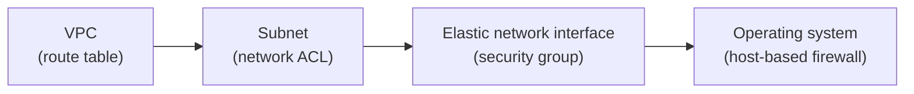
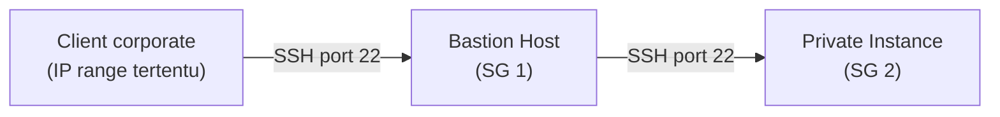

Lanjutan dari [VPC connectivity options](/blog/vpc-connectivity-options), sekarang masuk ke sisi keamanan dan troubleshooting-nya.

## Layered Defense: 4 Lapis Pengamanan VPC

Keamanan VPC itu berlapis, tiap lapis punya kontrolnya sendiri:

1. **Route table** (level VPC): nentuin traffic boleh ke mana.
2. **Network ACL** (level subnet): allow/deny traffic masuk-keluar subnet.
3. **Security group** (level network interface): allow/deny traffic ke instance.
4. **Host-based firewall** (level OS): lapisan terakhir di dalam instance-nya sendiri.

## NACL vs Security Group, Diulang Biar Makin Nempel

Ini konsep yang udah pernah dibahas [pas lab VPC manual minggu pertama](/blog/vpc-manual-cidr-igw-nacl-security-group), tapi worth diulang karena sering jadi jebakan soal:

| | Network ACL | Security Group |
|---|---|---|
| Level | Subnet | Network interface/instance |
| Sifat | **Stateless** | **Stateful** |
| Default | Bisa allow atau deny | Deny semua inbound, allow semua outbound |

**Stateless** artinya kalau rule NACL ngizinin traffic masuk, itu nggak otomatis ngizinin traffic balasannya keluar, harus di-declare eksplisit dua arah. **Stateful** di security group artinya kalau traffic masuk diizinin, response-nya otomatis boleh keluar tanpa perlu rule tambahan.

## Bastion Host: Pola Security Group yang Proper

Bastion host itu EC2 instance di public subnet, fungsinya jadi jump point buat akses resource di private subnet. Butuh key pair sendiri, plus key pair (atau kredensial) buat instance private yang mau diakses.

Pola security group yang bener buat setup ini:

- **SG 1** (bastion): inbound SSH cuma dari IP range korporat tertentu, bukan `0.0.0.0/0`.
- **SG 2** (private instance): inbound SSH cuma dari **SG 1** (di-reference by ID, bukan by IP range).

Efeknya: private instance nggak bisa diakses langsung dari internet sama sekali, satu-satunya jalur masuk ya lewat bastion, dan bastion sendiri dibatasin cuma bisa diakses dari IP korporat yang udah dikenal.

## Checklist Troubleshooting Koneksi

Urutan cek standar kalau ada masalah konektivitas:

1. Instance-nya nyala dan lolos **System Status Check** dan **Instance Status Check**.
2. **Security group** ngizinin protokol/port yang dibutuhin.
3. **Network ACL** di subnet-nya ngizinin traffic dari port/protokol yang sama.
4. **Route table** subnet-nya punya rule yang ngarah ke target yang bener.

### Kalau Nggak Bisa Konek Lewat Internet

- Cek IP publik/DNS name yang dipake udah bener.
- Instance-nya punya IP publik atau Elastic IP.
- Internet gateway udah attach ke VPC-nya.
- Route table subnet-nya punya rule `0.0.0.0/0` ke internet gateway.

### Kalau Nggak Bisa SSH

- IP/hostname bener.
- Kredensial (private key, atau username-password) bener.
- Bisa juga pake automation document bawaan AWS: `AWSSupport-TroubleshootSSH`.

### Kalau NAT Bermasalah

- Route table punya rule ke NAT instance/NAT gateway.
- Kalau pake **NAT instance** (bukan NAT gateway): pastiin **source/destination check di-disable**, ini beda dari instance biasa yang defaultnya enabled.

### Kalau VPC Peering Bermasalah

- Request peering-nya udah di-approve.
- Security group ngizinin traffic antar VPC yang di-peering.
- Network ACL nggak sengaja nge-block semua traffic eksternal.

## Yang Perlu Diinget

- Keamanan VPC itu berlapis: route table → NACL → security group → firewall OS, masing-masing level punya kontrol beda.
- NACL stateless (butuh rule dua arah eksplisit), security group stateful (response otomatis diizinin).
- Bastion host yang proper: security group-nya di-chain, private instance cuma boleh diakses dari security group bastion, bukan dari IP range mentah.
- Troubleshooting konektivitas selalu mulai dari cek status instance, baru security group, NACL, dan route table secara berurutan.

## Referensi Resmi

- [Control Traffic to Your AWS Resources Using Security Groups](https://docs.aws.amazon.com/vpc/latest/userguide/vpc-security-groups.html)
- [Network ACLs](https://docs.aws.amazon.com/vpc/latest/userguide/vpc-network-acls.html)
- [Linux Bastion Hosts on AWS](https://docs.aws.amazon.com/whitepapers/latest/build-a-secure-enterprise-vpn/linux-bastion-hosts-on-aws.html)
- [Troubleshooting Instances with Failed Status Checks](https://docs.aws.amazon.com/AWSEC2/latest/UserGuide/TroubleshootingInstances.html)
