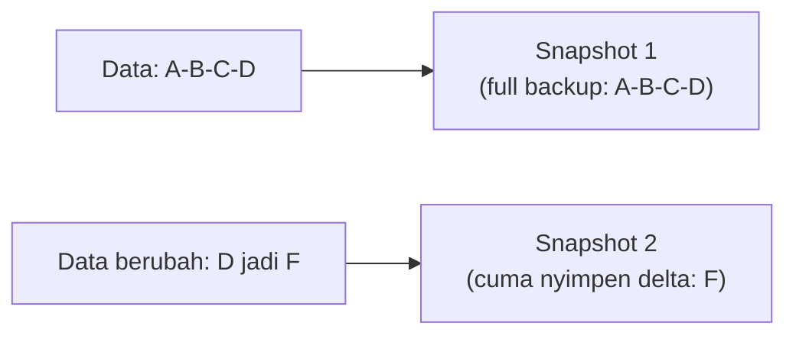
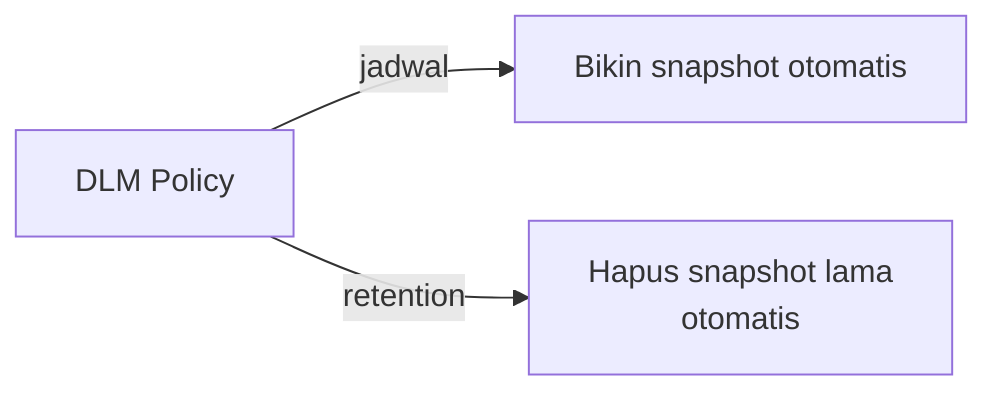

Lanjutan dari lab EBS kemarin, sekarang masuk teorinya lebih dalam: tipe-tipe volume, cara kerja snapshot, sampe manajemen retention.

## EBS itu Persistent Block Storage, Terikat AZ

EBS nawarin **persistent block storage volume**, dan otomatis direplikasi **di dalam satu AZ** (bukan span antar-AZ). Ini kenapa penting banget mastiin instance dan volume EBS-nya di AZ yang sama, kalau beda, nggak akan bisa nyambung.

Ukurannya gampang dinaikin (tinggal resize, langsung), tapi kalau mau diturunin, harus lewat snapshot dulu, bikin volume baru yang lebih kecil dari situ, nggak bisa langsung "diciutin".

EBS cuma cocok buat **EC2 instance** doang (bukan buat S3 atau service lain), dan meski RDS itu managed service, di baliknya tetap pakai EC2 + EBS juga.

## Tipe-Tipe Volume EBS

### SSD-based (buat workload yang butuh IOPS tinggi)

| Tipe | Cocok Buat |
|---|---|
| **gp3** (General Purpose SSD) | Default/all-rounder, speed balance, cocok buat kebanyakan use case, booting, dev/test |
| **io1 / io2** | Workload I/O-intensif, database relasional yang butuh query cepat, makin besar IOPS yang di-provision, makin mahal |
| **io2 Block Express** | Generasi terbaru, ukuran sampai 64 TB, IOPS sampai 256.000 |

### HDD-based (buat data yang jarang diakses, throughput tinggi)

| Tipe | Cocok Buat |
|---|---|
| **st1** (Throughput Optimized HDD) | Big data, data warehouse, log processing, butuh throughput konsisten tapi bukan latency rendah |
| **sc1** (Cold HDD) | Data yang beneran jarang diakses, storage termurah, tapi jangan harap cepat |

**Penting**: HDD (st1/sc1) **nggak bisa dipake buat boot volume**. Kalau maksain, boot time-nya bakal lama banget (analoginya kayak install Windows 11 di harddisk biasa, bisa setengah jam bootingnya).

## Snapshot: Ternyata Incremental, Bukan Full Backup Berulang

Ini poin yang sering disalahpahami. Snapshot **pertama** itu full backup. Tapi snapshot **kedua dan seterusnya** cuma nyimpen **perubahan (delta)** dari snapshot sebelumnya, bukan copy ulang semuanya.



Efeknya: snapshot jauh lebih efisien dari sisi storage dibanding full backup berulang-ulang. Datanya sendiri disimpan di S3 di balik layar, tapi makin banyak snapshot yang numpuk, makin tinggi juga biayanya, makanya butuh strategi retention (jangan nyimpen semua snapshot selamanya).

## Kenapa Harus Matiin Instance Dulu Sebelum Snapshot

Idealnya, instance **di-stop dulu** sebelum bikin snapshot. Alasannya: kalau instance masih nyala, ada proses/service yang lagi jalan dan "menolak" untuk di-copy di tengah aktivitasnya, resikonya data snapshot jadi korup. Snapshot pas instance nyala **bisa** dilakukan, tapi bukan best practice.

## Copy Snapshot Antar Region/AZ/Account

Snapshot bisa di-copy ke region, AZ, VPC, atau bahkan account lain. Tapi hati-hati: setiap kali di-copy, snapshot itu dapet **ID baru**, nggak akan sama dengan ID snapshot aslinya (sama kayak AMI, meski image-nya identik, beda region = beda ID).

## Manajemen Retention: Data Lifecycle Manager (DLM)

Daripada hapus snapshot lama secara manual, bisa dipake **Amazon Data Lifecycle Manager (DLM)**: fitur gratis buat otomasi pembuatan, retention, copy, dan penghapusan snapshot/AMI berdasarkan jadwal (harian, mingguan, atau cron expression).



Butuh 2 hal buat setup DLM: (1) **IAM role** dengan permission buat create/delete snapshot dan manage instance, (2) **JSON policy** yang isinya jadwal dan target resource-nya (berdasarkan tag).

## CLI Cheat Sheet

```bash
# bikin volume
aws ec2 create-volume --size 80 --availability-zone <az> --volume-type gp2

# attach ke instance
aws ec2 attach-volume --volume-id <vol-id> --instance-id <inst-id> --device /dev/sdf

# bikin snapshot
aws ec2 create-snapshot --volume-id <vol-id> --description "..."

# copy snapshot ke region lain
aws ec2 copy-snapshot --source-region <region-asal> --source-snapshot-id <snap-id> --description "..."

# restore volume dari snapshot
aws ec2 create-volume --snapshot-id <snap-id> --availability-zone <az>
```

## Yang Perlu Diinget

- EBS itu block storage yang terikat ke satu AZ, harus sama AZ-nya sama instance yang pakai.
- gp3 itu default all-rounder, io1/io2 buat IOPS tinggi (database), st1/sc1 buat throughput/cold storage (nggak bisa buat boot volume).
- Snapshot pertama full backup, snapshot selanjutnya cuma nyimpen delta (incremental), lebih efisien dari sisi storage.
- Idealnya instance di-stop dulu sebelum snapshot, biar nggak ada resiko data korup.
- Snapshot yang di-copy ke region/account lain selalu dapet ID baru.
- DLM itu fitur gratis buat otomasi retention snapshot/AMI, butuh IAM role + JSON policy.

## Referensi Resmi

- [Amazon EBS Volume Types](https://docs.aws.amazon.com/AWSEC2/latest/UserGuide/ebs-volume-types.html)
- [Amazon EBS Snapshots](https://docs.aws.amazon.com/AWSEC2/latest/UserGuide/EBSSnapshots.html)
- [Amazon Data Lifecycle Manager](https://docs.aws.amazon.com/AWSEC2/latest/UserGuide/snapshot-lifecycle.html)
