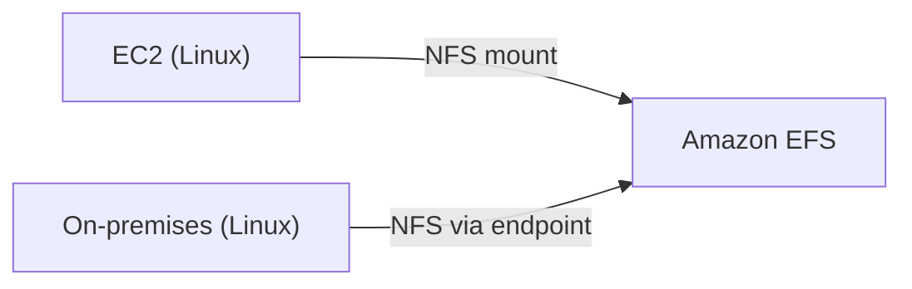
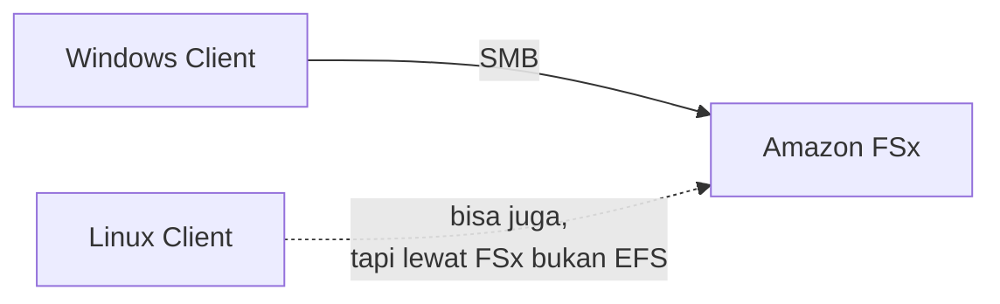

Storage cloud ada 3 jenis: object (S3), block (EBS/Instance Store), dan **file**. Sekarang bahas dua service file storage-nya AWS.

## Amazon EFS: File Storage buat Linux

EFS itu **fully managed elastic network file system**, bisa dipake dari resource di dalam AWS maupun **on-premises** (jadi hybrid solution juga). Protokolnya wajib **NFS**, dan best practice-nya khusus buat instance berbasis **Linux**.

### High Availability by Design

EFS otomatis bikin **mount target** di tiap AZ yang dipilih (minimal 2 AZ direkomendasikan). Tiap AZ butuh 1 ENI buat mount-nya, jadi makin banyak AZ yang dicakup, makin banyak juga ENI yang dibayar, walaupun file system-nya sendiri belum ada data.

### Dynamic Elasticity

EFS otomatis nambah/ngurangin kapasitas sesuai kebutuhan, nggak perlu di-provision manual kayak EBS. Tapi karena size-nya nggak dikontrol manual, makin banyak data yang numpuk, makin mahal juga tagihannya, jadi tetep perlu di-manage biar nggak kebablasan.

### Lifecycle Management

Sama kayak S3, EFS bisa diatur biar data yang nggak diakses dalam jangka waktu tertentu otomatis pindah ke storage class yang lebih murah (**infrequent access**), atau balik ke standard kalau diakses lagi.

## Amazon FSx: File Storage buat Windows (dan Lainnya)

Kalau butuh file sharing yang **campur OS** (Windows ketemu Linux), EFS bukan pilihannya, karena protokolnya beda (Windows pakai SMB, bukan NFS). Solusinya: **Amazon FSx**.

FSx cara kerjanya mirip **Samba server** (software yang dari dulu dipake buat file sharing lintas platform Windows-Linux). Endpoint-nya mirip SMB, jadi Windows bisa akses file sharing ini secara native.

## Kapan Pakai Yang Mana

| Kebutuhan | Service |
|---|---|
| File sharing sesama Linux | **EFS** |
| File sharing sesama Windows, atau campur Windows-Linux | **FSx** |

FSx biasanya **sedikit lebih mahal** dari EFS, karena overhead protokol Windows (SMB) itu lebih "berat" dibanding NFS.

## Storage Class dan Throughput Mode (EFS)

Sama seperti prinsip storage class di S3: pertanyaan pertama yang harus dijawab sebelum bikin EFS adalah **seberapa sering data ini bakal diakses?** Kalau jarang, storage class infrequent access bisa hemat sampai 60% biaya storage, tapi hati-hati, kalau ternyata data-nya lebih sering diakses dari perkiraan, kena **penalti biaya traffic**, jadi salah pilih kelas malah bikin lebih boros.

Ada juga opsi **One Zone**, deploy cuma di satu AZ (lebih murah, tapi mengorbankan high availability), dibanding **Standard/Regional** yang deploy di banyak AZ (lebih mahal, tapi lebih available). Ini trade-off klasik: **availability vs cost**, dan itu jadi salah satu tugas utama seorang solutions architect, cari titik tengah yang paling pas buat kebutuhan.

Throughput mode juga bisa diatur: **Elastic** (otomatis nyesuain), **Bursting** (kencang di awal, melambat kalau kredit habis, mirip kuota FUP), atau **Provisioned** (di-set manual, tetap segitu terus). Makin kencang throughput-nya, makin mahal.

## Penting: Resource yang Nggak Dipake Tetap Bayar

Kalau udah bikin file system EFS (meski belum diisi data apapun), itu **tetap kena biaya**. Jadi kalau nggak dipake lagi, harus di-delete manual, jangan dibiarin nganggur.

## Yang Perlu Diinget

- EFS itu buat Linux (protokol NFS), FSx itu buat Windows atau campuran OS (protokol SMB, mirip Samba server).
- EFS otomatis high-availability lewat mount target per AZ, tapi tiap AZ nambah biaya ENI.
- Prinsip storage class sama kayak S3: makin jarang diakses, makin murah storage-nya, tapi ada resiko penalti traffic kalau salah perkiraan.
- One Zone vs Standard/Regional itu trade-off klasik availability vs cost.
- File system yang dibuat tapi nggak dipake tetap kena biaya, harus di-delete manual kalau nggak butuh lagi.

## Referensi Resmi

- [What Is Amazon Elastic File System?](https://docs.aws.amazon.com/efs/latest/ug/whatisefs.html)
- [Amazon EFS Storage Classes](https://docs.aws.amazon.com/efs/latest/ug/storage-classes.html)
- [What Is Amazon FSx?](https://docs.aws.amazon.com/fsx/latest/WindowsGuide/what-is.html)
