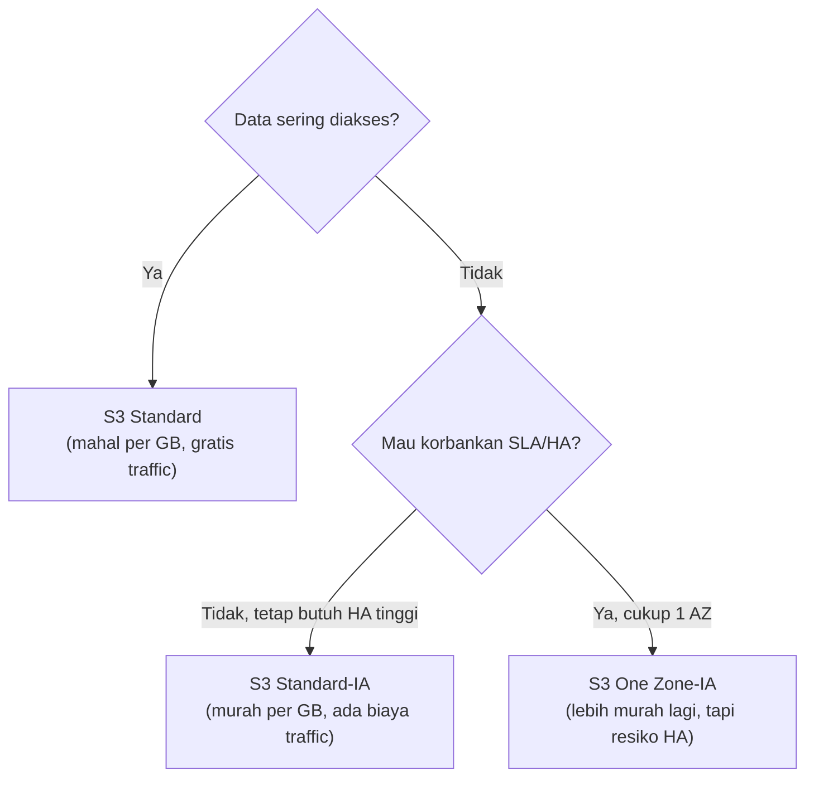
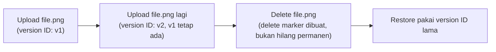

Materi S3 paling dalam sejauh ini, instruktur bilang ini salah satu topik yang paling sering keluar di ujian.

## Encapsulation: Kenapa File di S3 Nggak Bisa "Dibuka" Langsung

Data di S3 itu **di-encapsulate** jadi objek, gabungan dari data itu sendiri + metadata + key. Makanya kalau mau lihat isinya, nggak bisa langsung "buka" kayak file biasa, harus **download** dulu atau pakai **open** (yang cuma kasih link temporary buat lihat doang, bukan edit). Mau edit? Download, edit lokal, upload ulang.

## Storage Class: Decision Tree

Sebelum bikin bucket, pertanyaan pertama yang wajib dijawab: **seberapa sering data ini bakal diakses?**

- **S3 Standard**: mahal per GB, tapi **gratis** buat traffic akses. Cocok data yang sering dibuka.
- **S3 Standard-IA** (Infrequent Access): lebih murah per GB, tapi **kena biaya traffic** tiap kali diakses. Cocok data yang beneran jarang (sebulan sekali, bukan "jarang" ala orang Indonesia yang bisa berarti 3x seminggu).
- **S3 One Zone-IA**: sama kayak Standard-IA tapi cuma disimpan di **1 AZ** (bukan minimal 3), jadi lebih murah lagi, tapi resiko high availability-nya lebih rendah.

**Perangkap paling umum**: milih kelas murah (IA) padahal datanya ternyata sering diakses, ujung-ujungnya malah lebih mahal gara-gara kena penalti traffic berkali-kali. Jadi salah strategi "biar hemat" malah jadi boros.

### Glacier di Dalam S3 (Beda dari Layanan Standalone)

Selain 3 kelas di atas, ada juga varian Glacier yang integrasinya langsung di S3 (bukan service Glacier terpisah): **Instant Retrieval**, **Flexible Retrieval**, dan **Deep Archive**. Tiap tier ini beda banget di trade-off kecepatan retrieve vs harga:

| Tier | Retrieve | Biaya Retrieve |
|---|---|---|
| Glacier Instant Retrieval | Instan | Mahal, contohnya sekitar $10 per retrieval |
| Glacier Flexible Retrieval | Menit sampai jam | Sedang |
| Glacier Deep Archive | Sampai 2 hari | Paling murah |

### S3 Intelligent-Tiering: Kalau Malas Mikir Pola Akses

Kalau nggak yakin pola akses datanya bakal kayak gimana, ada **Intelligent-Tiering**: otomatis mindahin data antar tier berdasarkan pola akses yang dipelajari (pakai machine learning), tanpa perlu setting manual. Trade-off-nya: ada biaya monitoring per objek (dihitung per objek, bukan per ukuran data), jadi kalau objeknya banyak banget, biaya monitoring-nya juga bisa nambah.

## Basic Concepts: Bucket, Object, Key

- **Bucket**: kontainer/wadah buat objek.
- **Object**: data + metadata + key, unit fundamental yang disimpan.
- S3 itu **service-nya region**, tapi **penamaan bucket-nya global** (nggak boleh ada nama bucket yang sama di seluruh dunia, lintas akun sekalipun).
- **Key**: identifier unik objek di dalam bucket, kalau ada "folder", itu sebenarnya bagian dari key (misal `department/report.pdf`), S3 nggak beneran punya folder fisik, itu cuma prefix di key-nya.

## Versioning: Cegah Ketiban Tanpa Sadar

Default-nya, upload file dengan nama yang sama akan **langsung menimpa** file lama **tanpa peringatan** (mirip Linux). Solusinya: **enable versioning** di bucket, biar tiap upload dengan nama sama dapet **version ID** baru, versi lama tetap tersimpan.

Begitu versioning aktif, delete nggak beneran ngehapus, cuma bikin **delete marker** (mirip Recycle Bin), objeknya masih ada tapi "disembunyikan". Buat balikin, tinggal ambil dari version ID lama.

**Trade-off**: versioning itu gratis sebagai fitur, tapi makin banyak versi yang numpuk, makin banyak juga storage yang kepake (dan itu tetap dibayar, meski objeknya "ngumpet" sebagai delete marker). Solusinya: kombinasikan sama lifecycle policy buat auto-hapus versi lama setelah sekian hari.

## Presigned URL: Share Data Tanpa Kasih Kredensial

Buat share akses ke objek privat ke orang yang **nggak punya kredensial AWS**, pakai **presigned URL**: link temporary yang aktif dalam durasi tertentu (bisa cuma 1 menit sampai 12 jam / 720 menit), setelah itu link-nya mati otomatis.

## CORS (Cross-Origin Resource Sharing)

Kalau website static hosting dan asset-nya (gambar, dll) disimpan di **bucket yang beda**, browser butuh izin CORS biar bisa "numpang minta" resource dari bucket lain itu. Ada juga opsi **Requester Pays**: biar biaya traffic-nya dibebanin ke yang minta data, bukan ke pemilik bucket.

## Object Lock: Retention dan Legal Hold

- **Retention mode**: ada durasi waktunya (misal 1 tahun nggak bisa diapa-apain).
  - **Governance mode**: masih bisa di-override kalau user-nya punya permission tinggi.
  - **Compliance mode**: benar-benar nggak bisa diapa-apain oleh siapapun, termasuk root, sampai retention-nya habis.
- **Legal hold**: nggak ada durasi waktu, terkunci sampai eksplisit dibuka (biasanya urusan legal/hukum).

## Event Notification

Sama kayak yang udah dipraktekin di [lab file sharing vendor](/blog/s3-file-sharing-vendor-iam-event-notification): tiap ada kejadian di objek (create/delete), bisa trigger SNS, SQS, atau Lambda.

## Yang Perlu Diinget

- Data di S3 di-encapsulate jadi objek (data + metadata + key), nggak bisa langsung "dibuka" seperti file biasa.
- Storage class dipilih berdasarkan seberapa sering data diakses, salah pilih bisa kena penalti traffic yang bikin lebih mahal daripada rencana hemat.
- S3 itu regional service tapi nama bucket-nya global.
- Versioning bikin delete jadi "soft delete" (delete marker), bukan hilang permanen, tapi tetap dibayar selama masih tersimpan.
- Presigned URL buat share akses temporary tanpa kasih kredensial AWS.
- Object Lock punya 2 mode retention (governance bisa di-override, compliance benar-benar terkunci) plus legal hold yang nggak ada batas waktu.

## Referensi Resmi

- [Amazon S3 Storage Classes](https://aws.amazon.com/s3/storage-classes/)
- [Using Versioning in S3 Buckets](https://docs.aws.amazon.com/AmazonS3/latest/userguide/Versioning.html)
- [Sharing Objects Using Presigned URLs](https://docs.aws.amazon.com/AmazonS3/latest/userguide/ShareObjectPreSignedURL.html)
- [Using S3 Object Lock](https://docs.aws.amazon.com/AmazonS3/latest/userguide/object-lock.html)
