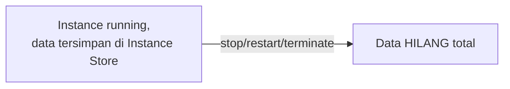
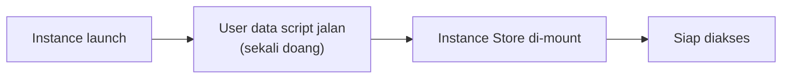

Lanjutan dari [materi EBS](/blog/amazon-ebs-volume-types-snapshot-dlm), sekarang bahas storage yang beda konsep total: Instance Store.

## Instance Store vs EBS

Bedanya paling mendasar: EBS itu nyambung lewat **network** (walaupun terasa cepet, tetep lewat jaringan), sedangkan Instance Store itu **nempel fisik langsung** ke hardware host tempat instance-nya jalan. Karena nempel fisik, latency-nya jauh lebih rendah, super cepet.

Tapi ada harga yang harus dibayar: Instance Store itu **temporary** dan **non-persistent**. Begitu instance-nya di-restart, di-stop, atau di-terminate, **semua data di dalamnya hilang**. Analoginya kayak cache, jangan pernah taruh data penting di sini.

## Nggak Semua Instance Type Punya Ini

Instance Store itu **fitur bawaan spesifikasi instance tertentu**, bukan sesuatu yang bisa ditambah-kurangin sendiri. Kalau tipe instance-nya emang udah include Instance Store (misal `m5d`), ya otomatis dapet, size dan tipenya (SSD atau HDD) udah paket sesuai spesifikasi instance-nya, nggak bisa "minta diskon" kalau nggak butuh.

> Catatan bahasa: "kebanyakan instance type punya Instance Store" itu bukan berarti **semua** punya. Selalu cek dokumentasi spesifikasi instance-nya buat mastiin.

## Cara Kerja: Block Device Mapping

Instance Store diakses lewat **block device mapping**, konsepnya mirip disk management/partisi di Windows. Device-nya punya nama sendiri (misal `sdb`, `sda` di Linux).

Penting: Instance Store **harus di-mount dulu** sebelum bisa diakses, nggak otomatis langsung kepake meski udah "nempel" secara virtual. Proses mounting bisa dilakukan **manual**, atau **semi-otomatis** lewat script di **user data** (dijalanin sekali doang, pas instance pertama kali boot).

AWS nyediain contoh script buat mounting ini, tapi karena kebutuhan tiap orang beda, best practice-nya ambil referensi template itu terus **di-custom sendiri**, bukan asal copy-paste.

## Kapan Pakai Instance Store

Cocok buat: **buffer, cache, data mentah sementara, atau konten temporary** yang emang didesain buat direplikasi ulang di banyak instance (misal di belakang load balancer). Karena gratis (nggak ada biaya tambahan kayak EBS) dan super cepet, ini jadi opsi menarik buat kebutuhan caching yang nggak butuh data-nya bertahan lama.

## Yang Perlu Diinget

- Instance Store nempel fisik ke hardware, jauh lebih cepet dari EBS, tapi datanya hilang total begitu instance stop/restart/terminate.
- Nggak semua instance type punya Instance Store, itu fitur bawaan spesifikasi tertentu, nggak bisa ditambah/dikurangin manual.
- Harus di-mount dulu sebelum bisa diakses, bisa manual atau semi-otomatis lewat user data script.
- Cocok buat cache/buffer/data sementara, bukan buat data yang harus persisten.
- Instance Store cuma ada di EC2, nggak ada di RDS.

## Referensi Resmi

- [Amazon EC2 Instance Store](https://docs.aws.amazon.com/AWSEC2/latest/UserGuide/InstanceStorage.html)
- [Instance Store Volume Types by Instance Family](https://docs.aws.amazon.com/AWSEC2/latest/UserGuide/InstanceStorage.html#instance-store-volumes)
