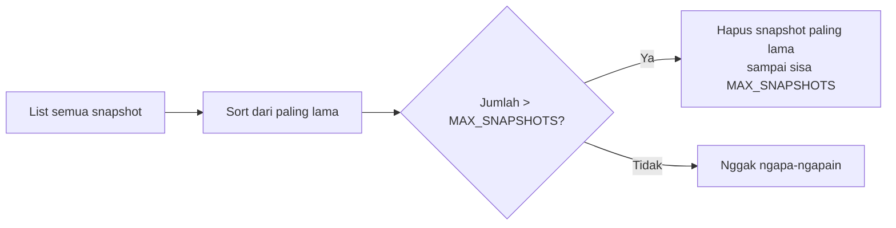
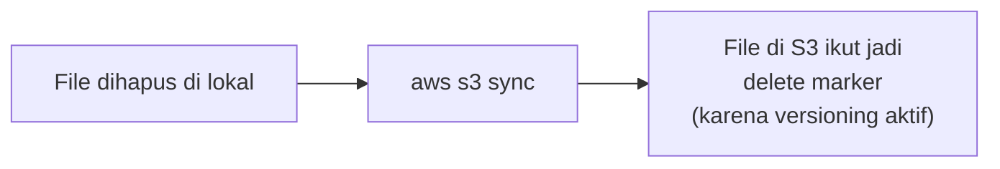

Lab ini nyakup dua bagian besar: manajemen EBS snapshot via CLI (termasuk otomasi retention pakai script), dan sinkronisasi file lokal ke S3 dengan versioning.

## Bagian 1: EBS Snapshot via CLI

### Cari Volume ID dan Instance ID

```bash
aws ec2 describe-instances --filters "Name=tag:Name,Values=Processor" \
  --query 'Reservations[*].Instances[*].BlockDeviceMappings[*].Ebs.VolumeId'

aws ec2 describe-instances --filters "Name=tag:Name,Values=Processor" \
  --query 'Reservations[*].Instances[*].InstanceId'
```

### Stop Instance Dulu Sebelum Snapshot

Alasannya udah dibahas di [materi EBS](/blog/amazon-ebs-volume-types-snapshot-dlm): biar nggak ada resiko data korup karena ada proses yang masih aktif nulis data pas di-snapshot.

```bash
aws ec2 stop-instances --instance-ids <instance-id>
aws ec2 wait instance-stopped --instance-ids <instance-id>
```

`aws ec2 wait` itu command yang berguna banget di CLI, karena beda dari console yang ada progress bar visual, CLI nggak nunjukin progress apapun. Command ini bikin terminal "nunggu" (kelihatan kayak hang, padahal cuma nunggu) sampai kondisi yang diminta terpenuhi (misal `instance-stopped`), baru balik ke prompt.

### Bikin Snapshot dan Tunggu Selesai

```bash
aws ec2 create-snapshot --volume-id <vol-id> --description "manual snapshot"
aws ec2 wait snapshot-completed --snapshot-ids <snapshot-id>
```

Setelah snapshot selesai, nyalain lagi instance-nya:

```bash
aws ec2 start-instances --instance-ids <instance-id>
```

## Bagian 2: Snapshot Terjadwal Pakai Cron

Buat simulasi retention policy, dibikin cron job yang jalanin snapshot **setiap menit** (di real case, biasanya per hari, di-set per menit di lab ini biar hasilnya cepet keliatan tanpa nunggu berhari-hari):

```bash
echo "* * * * * aws ec2 create-snapshot --volume-id <vol-id>" > cronjob
crontab cronjob
crontab -l   # cek cron yang lagi jalan
```

Setelah beberapa menit, snapshot numpuk banyak banget (satu snapshot per menit, dan tiap snapshot tetap kena biaya walau ukurannya kecil). Cron-nya dimatikan setelah cukup:

```bash
crontab -r
```

### Retention Otomatis Pakai Script Python

Daripada snapshot numpuk terus, dipakai script Python sederhana pakai library **boto3** buat auto-hapus snapshot lama, cuma nyisain sejumlah tertentu (misal 2 snapshot terbaru):

```python
import boto3

MAX_SNAPSHOTS = 2
ec2 = boto3.resource('ec2')
volume = ec2.Volume('<vol-id>')

snapshots = sorted(volume.snapshots.all(), key=lambda s: s.start_time)
if len(snapshots) > MAX_SNAPSHOTS:
    to_delete = snapshots[:-MAX_SNAPSHOTS]
    for snap in to_delete:
        snap.delete()
```

Logikanya: sort snapshot dari yang paling lama, kalau jumlahnya lebih dari batas maksimum, hapus yang paling lama sampai sisa sejumlah `MAX_SNAPSHOTS`.



## Bagian 3: Sync File ke S3 dengan Versioning

### Enable Versioning via CLI

```bash
aws s3api put-bucket-versioning --bucket <bucket-name> \
  --versioning-configuration Status=Enabled
```

### Sync: Beda dari Copy Biasa

`aws s3 sync` beda dari copy manual, karena dia **membandingkan** isi folder lokal dengan bucket, terus cuma proses yang beda-bedanya doang:

```bash
aws s3 sync ./file s3://<bucket-name>/file
```

Kalau file di lokal dihapus terus di-sync lagi, `sync` otomatis **ikut menghapus** file yang bersangkutan di S3 juga (muncul opsi `delete` di outputnya):



Karena versioning aktif, "delete" ini bukan hilang permanen, cuma bikin **delete marker** baru.

### Restore File yang Ke-delete

```bash
# cek semua versi objek, termasuk delete marker
aws s3api list-object-versions --bucket <bucket-name> --prefix file/

# ambil versi lama (bukan delete marker) berdasarkan version ID
aws s3api get-object --bucket <bucket-name> --key file/file1.txt \
  --version-id <version-id> downloaded-file1.txt
```

Setelah didownload ke lokal, tinggal `sync` lagi biar naik balik ke S3 (dengan version ID baru lagi).

### Fakta Penting: S3 Nggak Bisa Bedain Isi File dari Nama

S3 **nggak bisa** tahu apakah dua file dengan nama sama itu isinya identik atau beda, dia cuma bisa bedain lewat **version ID**. Jadi kalau upload ulang file dengan nama sama tapi isi beda, size-nya bakal keliatan berubah di listing, itu jadi salah satu cara ngecek "oh ini pernah ke-update" meski nggak bisa lihat isi persisnya tanpa download.

## Yang Perlu Diinget

- `aws ec2 wait` berguna buat nunggu status tertentu selesai di CLI, karena nggak ada progress bar seperti di console.
- Snapshot yang di-schedule per menit (buat testing) itu nggak realistis buat production, real case biasanya per hari, tapi tetap butuh retention policy biar nggak numpuk dan mahal.
- `aws s3 sync` membandingkan dan cuma proses bedanya, termasuk otomatis menghapus (delete marker) file yang udah nggak ada di sumber lokal.
- Versioning bikin delete jadi soft-delete, restore-nya tinggal ambil pakai version ID lama.
- S3 nggak bisa bedain isi file yang namanya sama, cuma bisa dibedain lewat version ID.

## Referensi Resmi

- [AWS CLI Waiters for Amazon EC2](https://docs.aws.amazon.com/cli/latest/reference/ec2/wait/)
- [aws s3 sync Command Reference](https://docs.aws.amazon.com/cli/latest/reference/s3/sync.html)
- [Retrieving Object Versions](https://docs.aws.amazon.com/AmazonS3/latest/userguide/RetrievingObjectVersions.html)
- [Boto3: EC2 Snapshot Resource](https://boto3.amazonaws.com/v1/documentation/api/latest/reference/services/ec2.html)
