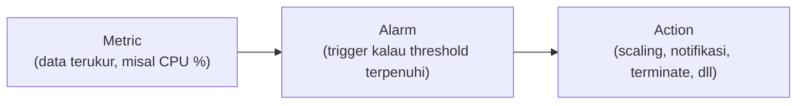

## Kenapa Monitoring Itu Wajib

Dua pertanyaan yang harus selalu bisa dijawab dari monitoring: (1) apakah workload kita berjalan sesuai rencana, dan (2) gimana caranya kita bisa otomatis nyesuain resource (misal auto scaling) begitu kebutuhannya ngelewatin kapasitas yang ada.

Tanpa monitoring, banyak yang kejadian salah kaprah: nyewa VPS murah spek kecil (misal dual-core), terus dihajar traffic tinggi, jadinya lemot/down, padahal kalau ada monitoring dari awal, masalah kapasitasnya bisa ketauan sebelum jadi insiden.

## Konsep Dasar CloudWatch

- **Metric**: data yang diukur (CPU utilization, network in/out, request count, dll).
- **Alarm**: kondisi threshold yang kalau terpenuhi, men-trigger sebuah action.
- **Event**: kejadian yang bisa dibagi 2 tipe:
  - **Event-based**: trigger berdasarkan kondisi tertentu (misal ada perubahan state).
  - **Time-based/scheduled**: trigger berdasarkan jadwal (misal jam 7 pagi, atau jam 12 malam).

> Catatan: "CloudWatch Events" sekarang namanya berubah jadi **EventBridge**.

### Basic vs Detailed Monitoring

- **Basic monitoring**: laporan tiap 5 menit, gratis (free tier).
- **Detailed monitoring**: laporan tiap 1 menit, lebih responsif, tapi ada biaya tambahan.

## Contoh Alarm dan Action-nya

Beberapa contoh kondisi alarm: CPU di atas 60% selama 5 menit, koneksi gagal berturut-turut lebih dari 10 kali per menit (indikasi brute force), atau jumlah host yang sehat di database replica kurang dari threshold tertentu.

Begitu alarm nyala, action-nya bisa macam-macam:

- **Terminate/reboot/recover** instance.
- **Scaling**: nambah atau ngurangin jumlah server.
- **Notifikasi**: kirim email/SMS lewat SNS topic.

## SES vs SNS: Beda Fungsi, Beda Harga

| | Amazon SES | Amazon SNS |
|---|---|---|
| Channel | Cuma email | Email, SMS, WhatsApp (via integrasi pihak ketiga), dll |
| Harga | Lebih murah | Lebih mahal (karena opsinya lebih banyak) |

Kalau butuhnya cuma notifikasi email doang, SES lebih murah. Kalau butuh banyak channel (misal WhatsApp buat notifikasi real-time), pake SNS, tapi siap-siap biayanya nambah, apalagi kalau integrasi ke WhatsApp butuh API key WhatsApp sendiri yang juga berbayar.

## Biaya Berdasarkan Event

Untuk event-based billing, logikanya: **ada event, ada biaya**. Nggak ada event, nggak ada biaya. Tapi biaya sebenarnya bukan cuma di event-nya doang, tapi juga di resource yang di-trigger (misal kalau event ngetrigger Lambda, ya Lambda-nya juga kena biaya sesuai eksekusinya).

## Namespace, Dimension, dan Period

- **Namespace**: cara ngelompokin metric jadi satu wadah, biar gampang dicari (misal namespace `AWS/S3` buat semua metric terkait S3).
- **Dimension**: kategori tambahan buat metric yang sama, misal metric CPU utilization bisa dibagi lagi per instance ID.
- **Period**: interval waktu pengumpulan metric. Makin cepat periodenya (misal per detik), makin mahal biayanya.

## Standard Metric vs Custom Metric

- **Standard metric**: bawaan CloudWatch, otomatis ada begitu resource dibuat (CPU, network, dll). Bisa diakses lewat console, CLI, atau API, dan history-nya bisa disimpen sampe 15 bulan ke belakang (makin lama disimpen, makin mahal karena butuh storage).
- **Custom metric**: metric yang kita definisiin sendiri, misal metric dari sisi aplikasi atau penggunaan RAM. RAM secara default **nggak** kelihatan di CloudWatch tanpa instalasi tambahan, butuh install **CloudWatch Agent** di instance-nya biar bisa baca dan publish metric RAM ke CloudWatch.

## Monitoring buat Security

CloudWatch juga bisa dipake buat monitoring dari sisi security, misal CPU disk activity yang nggak wajar (indikasi serangan), atau setting **billing metric alert** biar kejaga dari sisi budget, kalau nggak di-setting, resiko billing meledak tiba-tiba tanpa disadari.

## Tools Pihak Ketiga: Datadog

Datadog itu tools monitoring pihak ketiga (berbayar), fungsinya mirip stack **ELK (Elastic, Logstash, Kibana)** versi yang lebih siap pakai dan interaktif. Nggak wajib dipake, tapi banyak perusahaan yang milih ini buat observability yang lebih visual dibanding raw CloudWatch console.

## Yang Perlu Diinget

- Metric → Alarm → Action, itu alur dasar CloudWatch.
- Basic monitoring gratis (5 menit/laporan), detailed monitoring berbayar (1 menit/laporan).
- SES cuma email dan lebih murah, SNS multi-channel tapi lebih mahal.
- RAM nggak otomatis kelihatan di CloudWatch, butuh install CloudWatch Agent.
- Selalu setting billing metric alert biar nggak kena billing meledak tanpa disadari.

## Referensi Resmi

- [What Is Amazon CloudWatch?](https://docs.aws.amazon.com/AmazonCloudWatch/latest/monitoring/WhatIsCloudWatch.html)
- [Amazon CloudWatch Metrics](https://docs.aws.amazon.com/AmazonCloudWatch/latest/monitoring/working_with_metrics.html)
- [Creating a CloudWatch Alarm](https://docs.aws.amazon.com/AmazonCloudWatch/latest/monitoring/AlarmThatSendsEmail.html)
- [Amazon EventBridge (formerly CloudWatch Events)](https://docs.aws.amazon.com/eventbridge/latest/userguide/eb-what-is.html)
