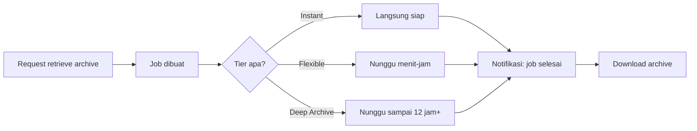

## Apa Itu S3 Glacier

Glacier itu salah satu storage class S3, khusus didesain buat data **archival**: disimpan lama, tapi jarang banget diakses (misal 1-2 kali setahun, atau cuma buat kebutuhan audit). Trade-off-nya jelas: makin cepet kita bisa retrieve datanya, makin mahal biayanya. Di antara semua storage class S3, Glacier itu yang paling murah buat penyimpanan (storage cost), tapi paling mahal/lama kalau butuh ambil datanya balik.

## 3 Tier Retrieval

| Tier | Waktu Retrieve | Cocok Buat |
|---|---|---|
| **Instant Retrieval** | Milidetik (langsung) | Data archive tapi kadang butuh akses cepat |
| **Flexible Retrieval** | Menit sampai jam | Data yang diakses 1-2 kali per tahun |
| **Deep Archive** | Sampai ~12 jam (bahkan bisa 2 hari) | Long-term retention & digital preservation, hampir nggak pernah diakses |

Makin "dalam" tier-nya (makin jarang diakses), makin murah storage-nya, tapi makin lama proses retrieve-nya. Kalau lagi butuh data dari Deep Archive dan internetnya lambat, bisa aja baru bisa didownload beberapa hari kemudian.

## Terminologi: Vault dan Archive

Terminologi Glacier beda dari S3 biasa, tapi konsepnya sama:

| S3 Biasa | S3 Glacier | Artinya |
|---|---|---|
| Bucket | **Vault** | Kontainer buat nyimpan |
| Object | **Archive** | Data itu sendiri (foto, video, dokumen) |

Tiap archive punya URI unik: `https://<region-endpoint>/<account-id>/vaults/<vault-name>/archives/<archive-id>`. Bedanya sama S3 object, archive nggak punya nama file biasa, tapi **archive ID** yang di-generate otomatis.

## Job: Cara Ambil Data dari Glacier

Buat retrieve archive, kita nggak langsung download, tapi bikin **job** dulu (mirip request), nanti hasilnya baru bisa didownload setelah job-nya selesai. Notifikasi job selesai bisa disetting biar kita tahu kapan datanya siap diambil.

Buat retrieve dari Glacier flexible tier, ada 3 opsi kecepatan: **Expedited** (1-5 menit, paling mahal), **Standard** (~5 jam), **Bulk** (~12 jam, paling murah).

## Fitur Keamanan

- **Enkripsi**: default udah terenkripsi otomatis (server-side), sama kayak S3 biasa, bisa juga pake KMS kalau butuh kontrol key lebih detail.
- **Vault Access Policy**: resource-based policy, bisa diedit kapan aja.
- **Vault Lock Policy**: begitu di-lock, **nggak bisa diedit lagi** sampe retention period-nya selesai (kecuali emang didesain buat governance/compliance yang butuh immutability).

## Batasan Ukuran

Satu archive di Glacier bisa sampe **40 TB** per item (jauh lebih gede dari S3 biasa yang mentok di 5 TB per object). Cocok buat backup data yang beneran raksasa.

## Contoh Kasus Pakai

Data medis pasien, yang secara natural jarang diakses (nggak ada orang yang pengen sering-sering ke rumah sakit), tapi wajib disimpan buat kebutuhan legal/audit dalam jangka panjang. Contoh lain: backup lama, log audit, arsip dokumen legal.

## Yang Perlu Diinget

- Glacier itu storage class S3 paling murah, tapi retrieve-nya bisa dari milidetik sampe berjam-jam tergantung tier.
- Terminologinya beda: bucket → vault, object → archive.
- Retrieve archive butuh job, nggak instan kayak S3 biasa (kecuali pake Instant Retrieval tier).
- Vault Lock Policy itu permanen begitu di-lock, beda dari Vault Access Policy yang masih bisa diedit.
- Satu archive bisa sampe 40 TB, jauh lebih gede dari limit object S3 biasa (5 TB).

## Referensi Resmi

- [Amazon S3 Glacier Developer Guide](https://docs.aws.amazon.com/amazonglacier/latest/dev/introduction.html)
- [S3 Glacier Storage Classes](https://aws.amazon.com/s3/storage-classes/glacier/)
