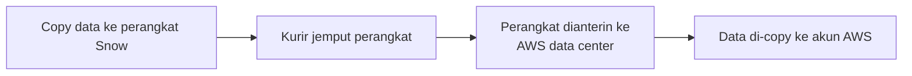

Lanjutan dari [Transfer Family dan DataSync](/blog/aws-transfer-family-datasync): kalau internetnya nggak cukup kenceng buat migrasi data raksasa dalam waktu terbatas, solusinya **AWS Snow Family**, migrasi data secara fisik, bukan lewat kabel.

## Kenapa Butuh Solusi Offline

Kalkulasi sederhana: data 100 TB, internet 100 Mbps, deadline seminggu, itu jelas nggak akan kekejar cuma pake internet. Di sinilah Snow Family masuk, datanya di-copy ke perangkat fisik, terus perangkatnya **dianterin lewat kurir** ke data center AWS, bukan ditransfer lewat internet sama sekali.

## Varian Snow Family

- **Snowcone**: paling kecil, portable.
- **Snowball Edge**: bentuknya kayak koper/laptop tapi lebih kuat (anti banting, "military grade"), kapasitas sampai ratusan terabyte, disewa **per hari**.
- **Snowmobile**: kontainer truk, buat migrasi skala exabyte, tapi sekarang udah jarang dipake (bahkan AWS sempat stop layanan ini), karena orang lebih milih beberapa unit Snowball daripada satu kontainer truk yang ribet logistiknya.

## Cara Kerjanya

1. Pesan perangkat Snow sesuai kapasitas kebutuhan.
2. Perangkat dianterin kurir ke lokasi kita.
3. Data di-copy ke perangkat itu (colok aja, mirip nyalin ke hardisk eksternal).
4. Begitu selesai copy, kurir dipanggil buat jemput (jangan nunggu sampai beres banget baru telepon kurir, biar nggak buang waktu).
5. Perangkat dianterin ke data center AWS, datanya di-copy ke akun kita.

Poin penting soal keamanan: **kurir sama sekali nggak dikasih akses ke data**. Dia cuma nganter perangkat fisiknya doang, nggak tau password atau kredensial apapun. Datanya sendiri udah **terenkripsi end-to-end**, jadi kalau perangkatnya kecurian di jalan pun, si pencuri nggak bisa buka datanya.

## Batasan Kecepatan Copy

Perangkat Snow disewa **per hari**, jadi ada batas waktu maksimal buat proses copy-nya, kalau kelewatan, prosesnya bisa dianggap gagal/di-hold. Makanya penting buat estimasi waktu copy dengan bener, dan proaktif hubungin kurir begitu proses copy hampir selesai, bukan nunggu bener-bener kelar.

## Fitur

- Enkripsi end-to-end, aman walaupun perangkatnya hilang di jalan.
- Bisa kirim data sampai **210 TB** dalam satu perangkat (tergantung varian).
- Logistiknya langsung dari AWS, nggak lewat kurir pihak ketiga biasa.

## Kapan Pakai Snow Family

- Lokasi dengan internet yang jauh dari memadai (daerah pesisir, pinggiran kota, dll).
- Data raksasa dengan deadline ketat yang nggak mungkin kekejar lewat internet.
- Ngumpulin data dari lokasi remote (misal shooting film di lokasi terpencil, terus mau upload hasil rekaman ke cloud).

## Yang Perlu Diinget

- Snow Family itu solusi migrasi **offline**, data dipindahin secara fisik lewat kurir, bukan lewat internet.
- Kurir cuma nganterin perangkat, nggak pernah dikasih akses ke data (datanya terenkripsi end-to-end).
- Sebelum migrasi data besar, selalu hitung dulu apakah internet yang ada cukup, kalau nggak, pertimbangin Snow Family daripada maksain lewat internet yang lambat.
- Perangkat disewa per hari, jadi rencanain proses copy-nya biar efisien dan nggak buang-buang waktu sewa.

## Referensi Resmi

- [AWS Snow Family](https://aws.amazon.com/snow/)
- [AWS Snowball Edge Device Types](https://docs.aws.amazon.com/snowball/latest/developer-guide/device-differences.html)
