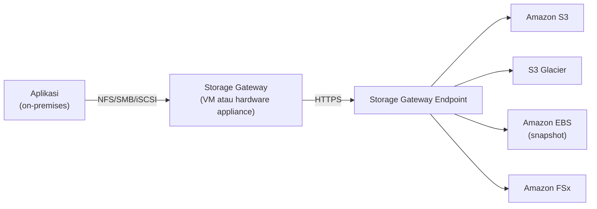

## Kenapa Butuh Storage Gateway

Kalau denger istilah "storage gateway" di ujian, itu biasanya ngerujuk ke **hybrid storage solution**. Skenarionya: perusahaan udah punya infrastruktur on-premises, tapi kekurangan storage, dan beli hardware (SSD/RAM) sekarang harganya nggak murah-murah amat (harga RAM aja lagi naik terus). Solusinya: manfaatin cloud storage tanpa harus migrasi total, cukup setengah-setengah.

Storage Gateway bisa dipake buat backup/archive, disaster recovery, cloud data processing (ETL di cloud terus hasilnya balik lagi ke on-premises), sampe tiering (data aktif tetep di on-premises, data yang jarang diakses dipindah ke cloud, atau kebalikannya).

## Cara Kerjanya

Alurnya: aplikasi on-premises nembak protokol standar (NFS, SMB, atau iSCSI) ke **gateway** yang di-install sebagai VM (atau hardware appliance khusus dari AWS yang disewa harian, biasanya lebih mahal dibanding pake VM sendiri). Gateway ini yang jadi "pengepul" data, terus ngirim ke storage service AWS yang dituju lewat koneksi HTTPS (udah terenkripsi in-transit secara default).

## 3 Tipe Storage Gateway

| Tipe | Protokol | Fungsi |
|---|---|---|
| **File Gateway** | NFS/SMB | Akses native file ke S3, kayak network drive biasa |
| **Volume Gateway** | iSCSI | Akses block storage sebagai volume, di-backup dalam bentuk snapshot EBS |
| **Tape Gateway** | VTL (Virtual Tape Library) | Backup/archive jangka panjang, disimpen sebagai virtual tape di S3 Glacier |

### File Gateway

Cocok buat file sharing biasa: aplikasi nembak endpoint gateway pake NFS/SMB, data-nya diteruskan ke S3 standar.

### Volume Gateway

Data disimpen sebagai block storage (volume), dan tiap ada aktivitas di volume itu, otomatis trigger AWS Backup buat bikin **EBS snapshot**. Jadi kalau butuh snapshot tapi datanya di cloud, ini opsinya.

### Tape Gateway

Buat kebutuhan backup/archive jangka panjang, disimpan sebagai **VTL (Virtual Tape Library)** yang ujung-ujungnya masuk ke **S3 Glacier**. Analoginya kayak tape backup fisik (LTO) jaman dulu, tapi versi virtual. Kecepatannya lambat dan traffic-nya wajib data yang jarang diakses, tapi harganya murah banget.

## Lifecycle Transition: Ngatur Biaya Otomatis

Data yang disimpen lewat Storage Gateway bisa diatur buat pindah otomatis antar storage class berdasarkan umur/waktu. Misal: data baru masuk ke S3 Standard, kalau 30 hari nggak diakses pindah ke S3 Standard-IA, kalau 60 hari lagi nggak diakses pindah ke Glacier. Aturan berapa harinya bisa disesuain sendiri.

## Fitur Lain

- Protokol standar (NFS, SMB, iSCSI) jadi nggak perlu ubah cara kerja aplikasi existing.
- Fully managed caching, biar akses data yang sering dipake tetep cepet walau storage utamanya di cloud.
- Transport data udah dioptimasi dan terenkripsi in-transit (HTTPS).
- Bisa dipake dalam bentuk VM (lebih murah, kita install sendiri) atau hardware appliance dari AWS (disewa per hari, lebih mahal).

## Yang Perlu Diinget

- Storage Gateway itu solusi hybrid: setengah on-premises, setengah cloud, cocok kalau nggak mau migrasi total.
- 3 tipe: File Gateway (NFS/SMB ke S3), Volume Gateway (iSCSI, snapshot ke EBS), Tape Gateway (VTL ke S3 Glacier).
- Traffic (data masuk/keluar) selalu dikenain biaya, jadi strateginya: pilih mana yang jadi primary (on-premises atau cloud), biar nggak boros traffic bolak-balik.
- Bisa diatur lifecycle transition otomatis biar data lama pindah ke storage class yang lebih murah.

## Referensi Resmi

- [What Is AWS Storage Gateway?](https://docs.aws.amazon.com/storagegateway/latest/userguide/WhatIsStorageGateway.html)
- [File Gateway](https://docs.aws.amazon.com/storagegateway/latest/userguide/WhatIsStorageGateway.html#storage-gateway-file-concepts)
- [Volume Gateway](https://docs.aws.amazon.com/storagegateway/latest/userguide/WhatIsStorageGateway.html#storage-gateway-volume-concepts)
- [Tape Gateway](https://docs.aws.amazon.com/storagegateway/latest/userguide/WhatIsStorageGateway.html#storage-gateway-vtl-concepts)
