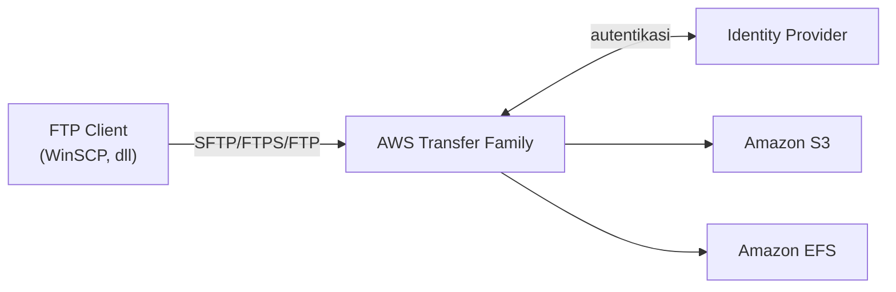
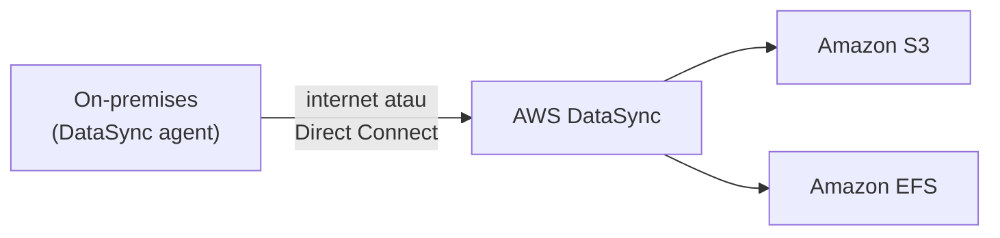

## AWS Transfer Family

Transfer Family itu service buat transfer file ke dalam/keluar storage AWS (S3, EFS) lewat protokol standar yang umum dipake industri, terutama **SFTP**.

### SFTP vs FTPS vs FTP: Jangan Ketuker

Tiga protokol ini keliatan mirip tapi cara kerjanya beda:

| Protokol | Kepanjangan | Port | Enkripsi |
|---|---|---|---|
| **FTP** | File Transfer Protocol (polosan) | 21 | Tidak ada |
| **FTPS** | FTP over SSL/TLS | 21 | Pakai sertifikat SSL/TLS |
| **SFTP** | SSH File Transfer Protocol | 22 | Pakai SSH |

Cara gampang bedain: SFTP itu "FTP yang dibungkus SSH" (makanya port-nya sama kayak SSH, 22), sedangkan FTPS itu "FTP yang dibungkus SSL/TLS" (port-nya tetep 21, tapi ada layer enkripsi sertifikat di atasnya). FTP biasa itu polosan, nggak ada enkripsi sama sekali.

### Cara Kerja Transfer Family

User butuh IAM permission buat akses lewat Transfer Family, terus dari sisi client tinggal pake software FTP client biasa (misal WinSCP), masukin endpoint/hostname dan kredensial, dan bisa langsung transfer data ke S3 atau EFS. Setelah data nyampe, bisa diproses lebih lanjut: archive, analytics, machine learning, atau content distribution.

## AWS DataSync

Kalau Transfer Family lebih ke arah "orang manual transfer file", **DataSync** itu buat **sinkronisasi otomatis** data antara on-premises dan AWS storage service, atau bahkan antar service AWS (misal S3 ke S3 lain, atau S3 ke EFS).

- Butuh install **DataSync agent** di sisi on-premises.
- Support protokol **NFS** dan **SMB**.
- Bisa lewat internet publik (lebih murah, tapi lebih lambat) atau Direct Connect (lebih cepat, tapi mahal banget per kilometer fiber).
- Dipake buat migrasi, archiving cold data, proteksi data, atau perpindahan data rutin buat cloud processing.

## Batasan Penting: Dua-duanya Bergantung Internet

Baik Transfer Family maupun DataSync **sama-sama sangat bergantung kecepatan internet**. Kalau internetnya lambat (misal di daerah yang jauh dari kota besar), dua opsi ini jadi kurang praktis buat data dalam jumlah besar, apalagi kalau ada deadline ketat.

## Kapan Harus Pertimbangkan Kecepatan Koneksi

Sebelum migrasi, harus dihitung dulu: seberapa besar datanya, berapa kecepatan internet yang tersedia, dan berapa lama waktu yang dikasih. Contoh: data 100 TB, internet cuma 100 Mbps, deadline 7 hari, kalkulasinya jelas nggak akan cukup. Kalau ketemu situasi kayak gini (data besar, internet lambat, deadline mepet), solusinya bukan Transfer Family atau DataSync, tapi **AWS Snow Family** (dibahas terpisah).

Migrasi juga bukan cuma soal "copy-paste data", tapi harus dipastiin datanya nggak korup dan konsisten setelah proses selesai, jadi butuh waktu ekstra buat verifikasi.

## Yang Perlu Diinget

- SFTP (port 22, SSH), FTPS (port 21, SSL/TLS), FTP (port 21, tanpa enkripsi), tiga hal yang beda meski namanya mirip.
- Transfer Family cocok buat transfer manual/terjadwal lewat client FTP biasa. DataSync cocok buat sinkronisasi otomatis dan berkelanjutan.
- Dua-duanya bergantung kecepatan internet, jadi nggak cocok buat data raksasa dengan deadline ketat atau lokasi dengan internet lambat.
- Sebelum migrasi, selalu hitung dulu: ukuran data ÷ kecepatan internet vs waktu yang tersedia.

## Referensi Resmi

- [What Is AWS Transfer Family?](https://docs.aws.amazon.com/transfer/latest/userguide/what-is-aws-transfer-family.html)
- [What Is AWS DataSync?](https://docs.aws.amazon.com/datasync/latest/userguide/what-is-datasync.html)
