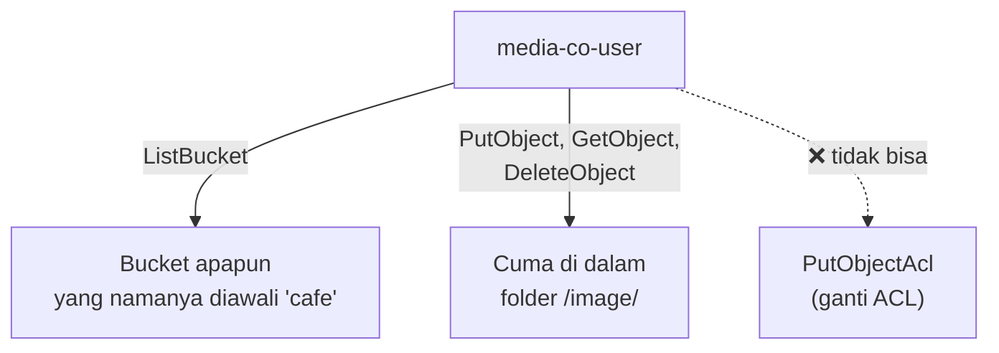
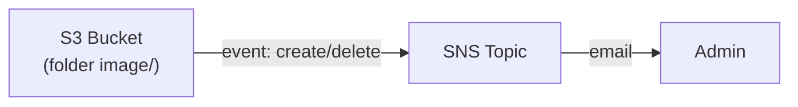

Kasusnya: café mau kerja sama sama vendor fotografer buat motoin produk (biar fotonya profesional, bukan hasil jepretan asal-asalan), terus vendor itu perlu diksih akses upload foto langsung ke S3, biar workflow-nya simple: foto masuk S3, admin dapet notifikasi, tinggal review terus posting ke website. Semua ini dikerjain pakai CLI, nggak pakai console.

## Kenapa S3 buat File Sharing

Foto produk biasanya ukurannya gede, jadi disimpen di S3 (object storage), bukan di database. Vendor dikasih akses **cuma ke folder tertentu**, nggak full akses ke seluruh bucket, apalagi ke resource AWS lainnya.

## Setup Awal

Bikin bucket dengan naming convention khusus (wajib ada kata `cafe` di namanya, biar konsisten sama IAM policy yang bakal dibikin nanti):

```bash
aws s3 mb s3://cafe-jakarta-88
```

Sync folder lokal ke bucket, sekaligus bikin folder `image`:

```bash
aws s3 sync ./initial-images s3://cafe-jakarta-88/image
```

Cek isi bucket, ada beberapa variasi output yang berguna:

```bash
aws s3 ls s3://cafe-jakarta-88/image                    # polosan (byte)
aws s3 ls s3://cafe-jakarta-88/image --human-readable    # ukuran lebih kebaca
aws s3 ls s3://cafe-jakarta-88/image --human-readable --summarize  # + rangkuman total
```

## IAM Policy: Full Control tapi Dibatasin Ketat

User IAM buat vendor (`media-co-user`) dibikin dengan policy custom yang **sangat spesifik**:



Poin pentingnya:
- Vendor bisa **list bucket** apapun asal namanya diawali kata `cafe`, ini kenapa naming convention di awal itu penting, kalau nama bucket-nya nggak sesuai pola, vendor nggak akan bisa lihat bucket itu sama sekali.
- Vendor bisa **full CRUD** (put, get, delete object) tapi **cuma di dalam folder `image/`**. Coba upload di luar folder itu, langsung ditolak.
- Vendor **nggak bisa** ubah ACL objek (`PutObjectAcl`), meski dia punya full control di dalam folder-nya.

Prinsip di balik ini: **least privilege**, jangan kasih full control ke vendor eksternal, bahaya kalau nanti dia bikin resource sembarangan yang ujung-ujungnya nambah tagihan cloud kita.

## Access Key buat Login CLI

Vendor login pake **access key** (bukan key pair SSH kayak `.pem`, itu beda konsep). Access key dan secret access key cuma bisa dilihat/didownload **sekali doang** pas dibuat, kalau kelewat, satu-satunya cara ya bikin access key baru.

```bash
aws configure
# masukin Access Key ID dan Secret Access Key milik media-co-user
```

## Verifikasi Permission

Login sebagai `media-co-user` (via console pake private window, atau CLI pake access key-nya), terus dites satu-satu:

- ✅ Bisa lihat isi folder `image/` di bucket yang namanya ada `cafe`-nya.
- ✅ Bisa upload foto baru ke folder `image/`.
- ❌ **Gagal** upload ke luar folder `image/` (misal langsung di root bucket).
- ✅ Bisa delete foto di dalam folder `image/`.
- ❌ **Gagal** ubah ACL objek (`put-object-acl`), karena permission-nya nggak nyakup itu.

Ini ngebuktiin policy-nya kerja sesuai desain, full akses tapi cuma di scope yang diizinin.

## Event Notification: Otomatis Kasih Tau Admin

Biar admin nggak perlu ngecek manual tiap saat, dibikin **event notification** di bucket: begitu ada file yang di-upload atau dihapus di folder `image/`, otomatis kirim notifikasi.



Setup-nya:

1. Bikin SNS topic (**wajib tipe Standard**, bukan FIFO, karena S3 event notification cuma support Standard topic).
2. Tambahin **access policy** ke SNS topic itu, ngizinin S3 buat publish ke topic-nya, dengan kondisi cuma dari bucket yang namanya `cafe*`.
3. Subscribe email ke topic, konfirmasi lewat link yang dikirim ke inbox.
4. Konfigurasi event notification di bucket (via CLI, pake file JSON konfigurasi) buat trigger ke SNS topic itu, khusus event `ObjectCreated` dan `ObjectRemoved` di folder `image/`.

```bash
aws s3api put-bucket-notification-configuration \
  --bucket cafe-jakarta-88 \
  --notification-configuration file://s3-notification.json
```

Setelah setup, tes upload foto baru dan delete foto lama, dua-duanya langsung masuk email notifikasi, lengkap sama detail siapa yang ngelakuin apa.

> Kalau format email notifikasi-nya kurang rapi, bisa ditambahin Lambda di antara S3 dan SNS buat format ulang pesannya sebelum dikirim, tapi konsekuensinya bayar dua service sekaligus (Lambda + SNS) cuma buat urusan rapiin tampilan.

## Yang Perlu Diinget

- Naming convention bucket bisa dipake sebagai bagian dari IAM policy (misal wajib prefix tertentu), jadi kontrol akses bisa di-scope berdasarkan pola nama, bukan cuma per-bucket.
- Full CRUD access bisa dibatasin ke folder tertentu doang, meski user-nya punya banyak permission di folder itu, bukan berarti bisa ngapa-ngapain di luar folder itu.
- Access key beda dari key pair SSH, dan secretnya cuma bisa dilihat sekali pas dibuat.
- S3 event notification cuma bisa nembak ke SNS topic tipe Standard, bukan FIFO.
- Event-driven notification (S3 → SNS → email) itu salah satu benefit paling kepake di cloud: nggak perlu polling manual, begitu ada kejadian langsung ke-trigger otomatis.

## Referensi Resmi

- [IAM Policies for Amazon S3](https://docs.aws.amazon.com/AmazonS3/latest/userguide/access-policy-language-overview.html)
- [Amazon S3 Event Notifications](https://docs.aws.amazon.com/AmazonS3/latest/userguide/NotificationHowTo.html)
- [Managing Access Keys for IAM Users](https://docs.aws.amazon.com/IAM/latest/UserGuide/id_credentials_access-keys.html)
