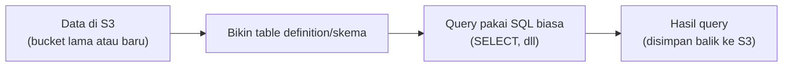

## Masalah yang Diselesaikan Athena

Kalau butuh query data besar di data engineering biasa, biasanya harus bikin **cluster** (Hadoop, Spark), dan itu resource-nya nggak main-main, harus disiapin dulu meski jarang dipake buat ETL. Athena nyelesain ini: **serverless**, nggak perlu provisioning cluster apapun.

## Cara Kerja

1. Taruh data di S3 (bucket lama atau baru, nggak masalah).
2. Bikin **table definition** (skema) yang menggambarkan struktur data-nya.
3. Query pakai **SQL** biasa (`SELECT`, dll), langsung dari console/CLI, hasilnya balik dalam hitungan detik.

Athena otomatis jalanin query secara paralel di balik layar, jadi meski nggak ada cluster yang di-manage manual, performanya tetap cepat.

## Model Harga: Bayar per Query

Beda dari cluster (Hadoop/Spark) yang bayar biaya server terus-terusan (kepake atau enggak), Athena bayarnya **per query yang dijalanin**. Makin banyak query, makin mahal, tapi kalau nggak query, nggak bayar apa-apa.

## Integrasi dengan Service Lain

Athena bisa langsung query dari berbagai sumber log AWS tanpa perlu setup cluster: **CloudTrail log**, **load balancer log**, **VPC Flow Log**, dan lain-lain. Juga bisa terintegrasi dengan **Redshift Spectrum** buat query data di Redshift.

## Kapan Pakai Athena

Cocok buat query data yang **jarang/sesekali** dibutuhkan (bukan proses ETL rutin skala besar yang butuh cluster dedicated). Kalau butuh proses ETL yang lebih detail dan strategi optimasi query yang dalam, itu materi khusus data engineering, bukan cakupan CCP.

## Yang Perlu Diinget

- Athena itu serverless, nggak butuh provisioning cluster (Hadoop/Spark) buat query data di S3.
- Bayarnya per query yang dijalanin, bukan biaya server terus-terusan.
- Bisa langsung query log dari CloudTrail, load balancer, VPC Flow Log, tanpa setup tambahan.
- Query-nya pakai SQL standar, jadi kalau udah bisa SQL biasa, langsung bisa pakai.

## Referensi Resmi

- [What Is Amazon Athena?](https://docs.aws.amazon.com/athena/latest/ug/what-is.html)
- [Querying Amazon VPC Flow Logs with Athena](https://docs.aws.amazon.com/athena/latest/ug/vpc-flow-logs.html)
