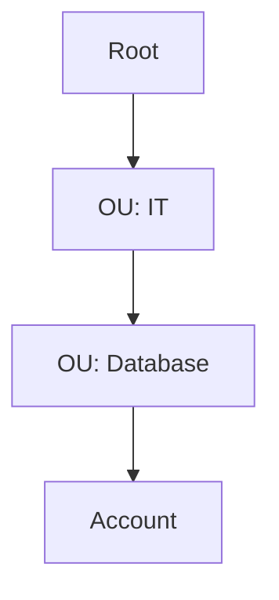
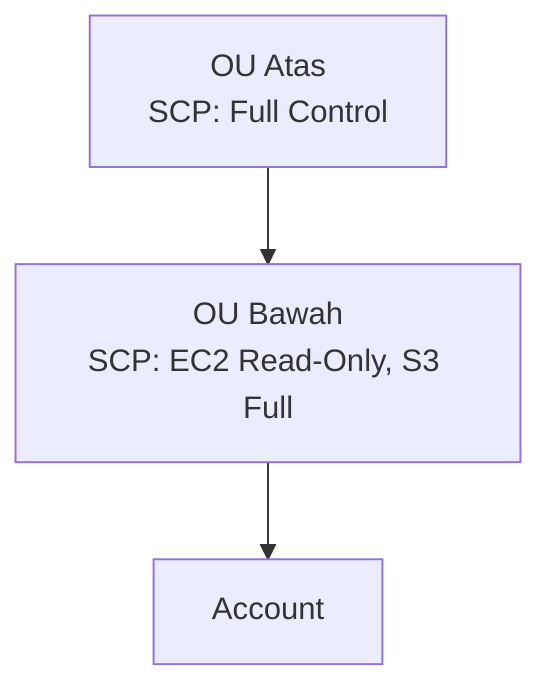

## Kenapa Butuh Organizations

Kalau punya banyak user yang tersebar, ngatur satu-satu jadi ribet. Solusinya: pisah jadi banyak **account** (bukan user!) berdasarkan spesialisasi, misal account khusus database, account khusus CI/CD, account khusus web server. Account-account ini dikumpulin dalam satu **Organization**.

Penting buat diinget: di AWS, **account itu bukan user**. Hierarkinya: di dalam satu account, ada banyak user. Organizations itu ngumpulin banyak **account**, bukan ngumpulin user langsung.

## Organizational Unit (OU): "Grup" buat Account

Account-account dikelompokin ke dalam **Organizational Unit (OU)**, semacam grup. Satu account "root" (bos) yang jadi pengatur, dan dari situ bisa nentuin account mana masuk OU mana.

### Nested OU: Grup di Dalam Grup

OU bisa punya OU lagi di dalamnya (**nested OU**), maksimal kedalaman **5 level** dihitung dari root.

## SCP (Service Control Policy) dan Inheritance yang Bikin Bingung

SCP itu policy-nya Organizations (setara IAM policy, tapi di level account/OU). Yang bikin ribet: SCP pakai konsep **inheritance**, dan aturan yang berlaku adalah yang **paling restriktif** di sepanjang hierarki, bukan yang paling akhir.

Contoh: OU atas kasih **Full Control**, tapi OU di bawahnya (yang jadi turunan) cuma kasih **EC2 read-only** dan **S3 full control**. Hasil akhirnya buat account di paling bawah: dia dapet **EC2 read-only doang**, S3-nya malah **nggak bisa diakses sama sekali**, meski OU-nya sendiri bilang "S3 full control". Kenapa? Karena inheritance-nya berlapis, dan tiap lapis restriksinya diambil yang paling kecil (irisan, bukan gabungan).

Analoginya: kayak "kekayaan 7 turunan", makin turun makin sedikit yang didapat kalau leluhurnya udah membatasi dari awal.

### SCP vs IAM Policy: SCP Menang

Kalau ada konflik antara SCP dan IAM policy di dalam account, **SCP yang menang**. Contoh: SCP cuma kasih akses S3, tapi IAM policy user itu bilang full control semua resource, hasilnya user itu tetap **cuma bisa akses S3**, karena SCP jadi batas atas (ceiling) yang nggak bisa dilewatin IAM policy di bawahnya.

## Consolidated Billing

Semua tagihan account anggota digabung dan dibayar oleh account **root**. Kenapa fitur ini penting? Karena AWS pakai **economies of scale**, makin banyak pemakaian gabungan, makin besar diskon yang didapat. Jadi perusahaan/vendor besar sengaja gabungin banyak account jadi satu organization, biar total billing-nya kena diskon volume, dibanding tiap account bayar sendiri-sendiri secara terpisah.

## Batasan Teknis

- Nama organization pakai karakter standar (bukan simbol aneh), maksimal 250 karakter.
- Dokumen SCP (format JSON) maksimal **5 KB**.
- Nested OU maksimal **5 level** dari root.
- Invitation ke account baru: maksimal 20 per hari.
- Bisa bikin sampai 5 account baru secara bersamaan.
- **SCP dan Organizations itu fitur gratis**, tapi fitur premium tambahan (audit, kontrol lanjutan) berbayar.

## Yang Perlu Diinget

- Account ≠ user. Organizations ngumpulin account, bukan user langsung.
- SCP pakai inheritance yang restriktif: hasil akhirnya selalu irisan (yang paling kecil) dari semua lapis di atasnya, bukan gabungan.
- Kalau SCP dan IAM policy konflik, SCP yang menang, jadi SCP itu "ceiling" buat semua permission di bawahnya.
- Consolidated billing bikin semua account anggota kena diskon volume dari economies of scale, dibayar oleh account root.
- SCP itu sendiri gratis sebagai fitur.

## Referensi Resmi

- [What Is AWS Organizations?](https://docs.aws.amazon.com/organizations/latest/userguide/orgs_introduction.html)
- [Service Control Policies (SCPs)](https://docs.aws.amazon.com/organizations/latest/userguide/orgs_manage_policies_scps.html)
- [Consolidated Billing for AWS Organizations](https://docs.aws.amazon.com/organizations/latest/userguide/orgs_manage_policies_scps.html)
