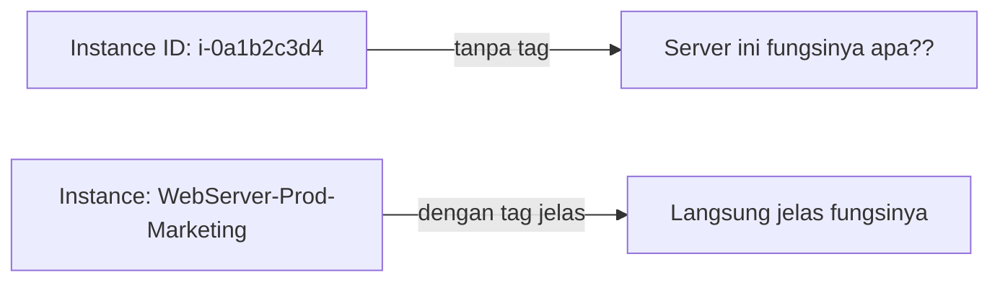
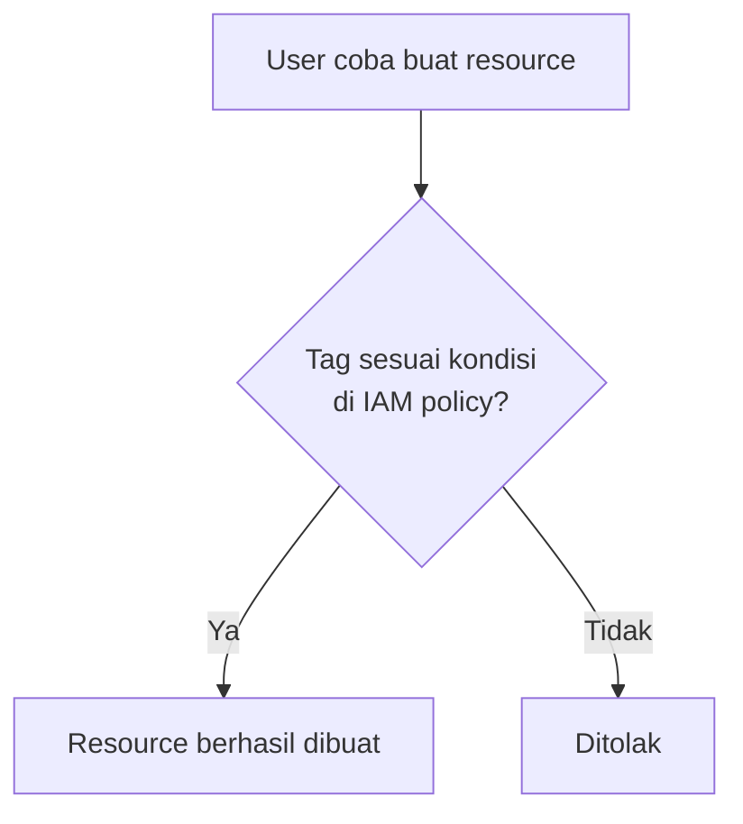

## Apa Itu Tag

Tag itu **key-value pair** yang bisa ditempel ke hampir semua resource AWS. Fungsinya buat identifikasi dan kategorisasi: resource ini punya siapa, divisinya apa, stage-nya apa (development/test/production), dan lain-lain.

**Tag itu gratis**, dan bisa nempel sampai **50 tag per resource**, jumlah tag nggak ngaruh ke harga resource-nya, jadi nggak ada alasan buat pelit ngasih tag.

## Kenapa Tanpa Tag Itu Bahaya

Tanpa tag, satu-satunya cara tau fungsi sebuah resource ya masuk cek manual satu-satu. Resiko paling parah: nggak sengaja terminate resource yang ternyata database production, padahal maksudnya cuma mau hapus server test.

### Stage/Environment Lifecycle

Biasanya tag mencerminkan tahapan: **development** (developer ngoding) → **test/QA** (dicek sama QA/tester, ada KPI-nya sendiri: pastiin nggak bug) → **production** (udah dipakai user beneran).

Instruktur nyeritain dinamika kerja developer vs QA: developer dikejar deadline dari manajemen/PM, QA harus mastiin nggak ada bug sebelum rilis, dua kepentingan ini sering "bentrok" tapi emang gitu desainnya biar ada cek dan ricek sebelum ke production.

## Enforcement: Wajibin Tag Lewat AWS Config atau IAM Policy

### Lewat AWS Config

Bikin rule `required-tags`, misalnya wajib ada tag `project` di semua resource. Kalau ada resource yang nggak sesuai (nggak punya tag itu), langsung kelihatan di dashboard sebagai **non-compliant**.

### Lewat IAM Policy

Bisa juga di-enforce di level permission: user cuma boleh bikin resource **kalau** tag-nya sesuai kondisi tertentu (misal wajib ada tag `department=accounting`). Kalau nggak sesuai, resource-nya nggak bisa dibuat sama sekali.

## Kegunaan Tag buat Automasi

Selain identifikasi, tag juga bisa dipake buat **automasi massal**. Contoh: matiin semua instance dengan tag `environment=development` sekaligus di akhir hari kerja (biar hemat biaya, nggak perlu manual satu-satu), atau matiin server tertentu pas hari libur.

## Cost Management dengan Tag

Tag jadi cara paling gampang buat breakdown biaya per divisi/proyek di **Cost Explorer**. Misal, mau tau berapa pengeluaran divisi development bulan ini, tinggal filter berdasarkan tag `division=development`. Ini juga jadi cara ngecek kecurangan: kalau ada user yang harusnya cuma boleh bikin resource dengan tag `development` tapi ternyata billing-nya gede dari tag lain, itu tanda ada yang nggak beres di permission-nya.

## Best Practice Tagging

- Gunakan format yang **konsisten** sesuai standar perusahaan (huruf besar/kecil, susunan key, dll), karena tiap perusahaan biasanya punya SOP sendiri.
- Lebih banyak tag lebih baik (gratis, nggak ada downside).
- Beberapa tag itu **built-in** dan nggak bisa dihapus (misal yang dibikin otomatis sama CloudFormation, kayak nama stack).
- Bisa dipakai `resource groups` buat otomasi berdasarkan tag.

## Yang Perlu Diinget

- Tag itu key-value pair gratis, sampai 50 per resource, dan jumlahnya nggak ngaruh ke harga.
- Tanpa tag, resource jadi sulit diidentifikasi, resiko salah terminate resource penting.
- Enforcement tag bisa lewat AWS Config (deteksi non-compliant) atau IAM policy (cegah pembuatan resource kalau tag nggak sesuai).
- Tag berguna buat automasi massal (matiin/nyalain server berdasarkan tag) dan breakdown biaya per divisi di Cost Explorer.
- Selalu ikutin standar tagging dari SOP perusahaan, karena tiap perusahaan punya konvensi sendiri-sendiri.

## Referensi Resmi

- [Tagging AWS Resources](https://docs.aws.amazon.com/general/latest/gr/aws_tagging.html)
- [AWS Config Managed Rule: required-tags](https://docs.aws.amazon.com/config/latest/developerguide/required-tags.html)
- [Using Cost Allocation Tags](https://docs.aws.amazon.com/awsaccountbilling/latest/aboutv2/cost-alloc-tags.html)
