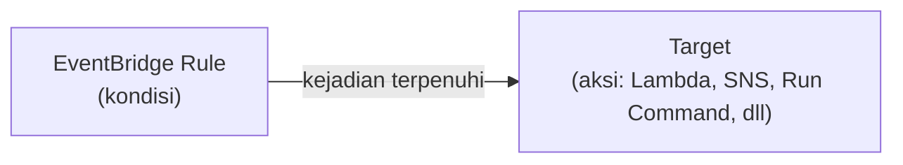
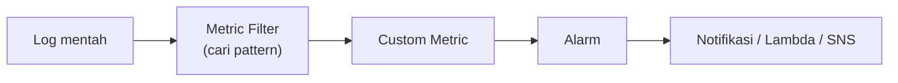
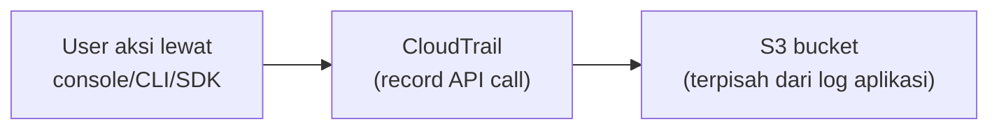

## EventBridge (Dulu CloudWatch Events)

Nama lamanya "CloudWatch Events" udah nggak dipake lagi, sekarang jadi **Amazon EventBridge**. Konsepnya simpel: bikin **rule** (kondisi), kalau kondisi itu kejadian, sistem ngejalanin **target** (aksi). Analoginya kayak "kalau atap bocor, tambal", kondisi jelas, aksi jelas.

Contoh: tiap kali Auto Scaling berhasil bikin instance baru (`EC2 Instance Launch Successful`), otomatis jalanin **Systems Manager Run Command** buat eksekusi script tertentu (support Windows maupun Linux).

## CloudWatch Logs: Kenapa Log Itu Harus "Suci"

Log itu **barang bukti**, dan barang bukti nggak boleh dimodifikasi **apapun alasannya**, mau itu manager sekalipun. Prinsipnya sama kayak **zero trust** di security: jangan percaya apapun, termasuk log yang keliatan udah diedit dikit doang. Kalau log bisa diedit, kita nggak bisa lagi yakin itu original atau enggak, dan itu ngerusak fungsinya sebagai bukti buat diagnosa masalah.

### Log Group: Ngumpulin Biar Nggak Berantakan

Semua log (misal dari EC2 instance) dikumpulin jadi satu **log group**. Tujuannya biar nggak berantakan pas dicari, karena baca log mentah itu udah pusing duluan, apalagi kalau berantakan nggak dikelompokin.

### Metric Filter: Cari Pola di Log

Metric filter dipake buat nyari **pattern** spesifik di dalam log stream, dan setiap match-nya dihitung jadi metric. Dari metric ini, kita bisa bikin **alarm**, dan begitu alarm nyala, bisa trigger notifikasi atau bahkan event-driven action (Lambda, SQS, SNS).

### CloudWatch Logs Insights: Query Log yang Lebih Presisi

Buat baca log yang lebih presisi dan gampang, ada **CloudWatch Logs Insights**, tapi ini **berbayar** (nggak gratis), karena mempermudah selalu ada harganya.

### Contoh Kasus: Alert Error 404

Bikin custom log filter dari web server Apache (`HTTP access log`): kalau ada error 404 muncul beberapa kali dalam satu menit, trigger notifikasi ke tim IT. Manfaatnya: tim IT jadi tahu real-time ada masalah, bukan baru sadar besoknya pas ditanya "tadi malam di-hack jam berapa?" dan nggak punya jawaban.

### Log Format: Baca Field-nya

Contoh format log Apache (`%h %l %u %t \"%r\" %>s %b`): `h` = hostname/IP, `l`/`u` = identity/user, `t` = waktu request, `r` = request-nya, status code, dan ukuran byte response.

**Analogi ukuran byte**: kalau beli kopi di Starbucks, size pesanannya masuk akal (satu cup kopi, bukan beli sejuta cup kopi sekaligus). Kalau ukuran response/request tiba-tiba nggak masuk akal gede-nya, itu bisa jadi indikasi **script injection** atau serangan lain.

## CloudTrail vs CloudWatch: Sering Ketuker

Ini yang paling sering jadi jebakan soal ujian:

| | CloudWatch | CloudTrail |
|---|---|---|
| Monitor apa | **Resource** (CPU, network, dll) | **Aktivitas akun** (siapa ngapain) |
| Contoh pertanyaan | "Server-nya lemot kenapa?" | "Siapa yang delete instance ini?" |

CloudTrail nge-record **API call** di hampir semua service AWS, baik dari console maupun CLI. Tapi CloudTrail **nggak** bisa track aktivitas **di dalam** instance (misal SSH masuk terus otak-atik file), dia cuma nyatet aksi level AWS API (misal "user X menghapus RDS instance Y jam sekian").

### Isi Log Entry CloudTrail

Contoh field yang di-record: **user identity** (siapa), **event time** (kapan, dalam UTC), **event source** (aksi apa, misal login), **response elements** (berhasil/gagal), dan **additional event data** (misal apakah login pakai MFA atau enggak).

### Kapan Butuh CloudTrail

Buat jawab pertanyaan detail kayak: siapa yang hapus instance tertentu? Siapa yang ubah security group? Ada aktivitas mencurigakan dari IP nggak dikenal? Tiba-tiba banyak resource baru dibuat (dan baru ketauan pas tagihan membengkak)?

## Yang Perlu Diinget

- EventBridge (dulu CloudWatch Events) itu rule + target: kondisi terpenuhi, aksi dijalankan.
- Log itu harus immutable (nggak boleh diedit), karena fungsinya sebagai barang bukti.
- Metric filter dipake buat cari pattern di log dan ubah jadi metric yang bisa di-alarm-kan.
- CloudWatch monitor resource, CloudTrail monitor aktivitas akun (siapa ngapain), dua-duanya beda fungsi meski sering ketuker di soal ujian.
- CloudTrail nggak track aktivitas di dalam instance (SSH dan seterusnya), cuma level API call AWS.

## Referensi Resmi

- [What Is Amazon EventBridge?](https://docs.aws.amazon.com/eventbridge/latest/userguide/eb-what-is.html)
- [Working with Log Groups and Log Streams](https://docs.aws.amazon.com/AmazonCloudWatch/latest/logs/Working-with-log-groups-and-streams.html)
- [Creating Metrics from Log Events Using Filters](https://docs.aws.amazon.com/AmazonCloudWatch/latest/logs/MonitoringLogData.html)
- [What Is AWS CloudTrail?](https://docs.aws.amazon.com/awscloudtrail/latest/userguide/cloudtrail-user-guide.html)
