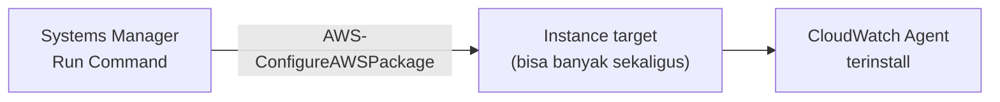
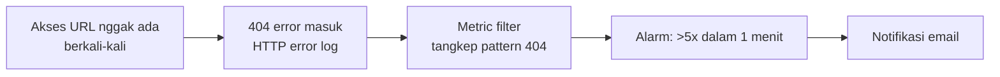
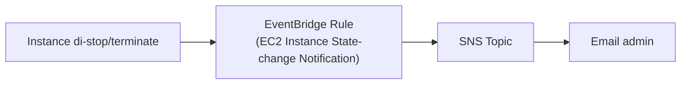

Lab paling lengkap sejauh ini soal monitoring: install agent tanpa remote manual, bikin alarm dari log aplikasi, notifikasi real-time perubahan infrastruktur, dan compliance checking.

## Task 1: Install CloudWatch Agent via Systems Manager (Tanpa SSH)

Daripada SSH manual ke tiap server buat install package, dipake **Systems Manager Run Command** dengan dokumen `AWS-ConfigureAWSPackage`.

Package yang tersedia lewat dokumen ini ada 3 pilihan: **CloudWatch Agent**, **Enhanced Network Adapter (ENA) driver**, atau **AWS PV driver**. Dipilih CloudWatch Agent.

### Install vs Uninstall-and-Reinstall

Ada 2 tipe instalasi: **in-place update** (langsung update di tempat, cocok buat aplikasi yang nggak berdampak ke OS/kernel, misal Zoom) vs **uninstall-and-reinstall** (hapus dulu bersih, baru install versi baru, lebih aman buat driver, karena driver sering "manja", kalau di-update di tempat suka korup atau blue screen).

Untuk CloudWatch Agent, rekomendasinya pakai **install** (versi `latest`), timeout 10 menit.

Kelebihan cara ini: bisa install ke ratusan/ribuan server sekaligus **tanpa perlu SSH satu-satu**, tinggal target berdasarkan tag.

## Task 2: Konfigurasi Agent via Parameter Store

Konfigurasi CloudWatch Agent (log apa yang diambil, metric apa yang dimonitor) disimpan sebagai **JSON** di Systems Manager Parameter Store, bukan file config lokal manual.

Isi konfigurasinya termasuk:
- **Log collection**: path log aplikasi (misal HTTP access log, HTTP error log) yang mau ditarik ke CloudWatch Logs.
- **Metric collection**: CPU (idle/user/system, per-core bukan digabung, `totalcpu: false`), disk usage (berapa persen kepake, berapa sisa, sesuatu yang **nggak bisa** dilihat CloudWatch biasa tanpa agent), memory usage dan swap.
- **Collection interval**: default 10 detik, bisa dipercepat (lebih responsif, lebih mahal) atau diperlambat.

Setelah parameter dibuat, agent-nya dijalankan lagi lewat Run Command (dokumen `AmazonCloudWatch-ManageAgent`), nunjuk ke parameter store yang barusan dibuat, sekali lagi tanpa perlu SSH manual.

## Task 3: Metric Filter dan Alarm dari Log Aplikasi

Simulasi: akses URL yang nggak ada (`/start`) berkali-kali biar muncul error 404 di HTTP error log. Log ini otomatis masuk ke **CloudWatch Logs** (log group custom yang tadi disetting).

Bikin **metric filter** di log group itu: pattern-nya nangkep IP, user, waktu, request, status code, dan ukuran response, khusus buat status **404**. Preview hasilnya bisa langsung dites (**Test Pattern**) sebelum disave, biar yakin filter-nya nangkep yang bener.

Metric filter ini dijadikan dasar **alarm**: kalau error 404 muncul **lebih dari 5 kali dalam 1 menit**, trigger notifikasi email lewat SNS.

Setelah error di-generate lebih dari 5 kali dalam satu menit, alarm nyala dan email masuk, isinya jumlah error yang beneran kejadian (misal 11 kali, ngelewatin threshold 5).

## Task 4: Monitoring Sistem Metric (RAM, Disk)

Metric bawaan CloudWatch **tanpa agent** nggak nyediain RAM dan disk usage. Setelah agent terinstall dan aktif, metric ini muncul di bagian **"CWAgent" custom namespace**, bukan di metric standar EC2 biasa. Dari sini bisa dicek: RAM kepake berapa persen, disk kepake berapa persen, dan seterusnya.

## Task 5: Real-Time Notification via EventBridge

Beda dari alarm berbasis metric/log, ini buat notifikasi **real-time perubahan infrastruktur**. Bikin EventBridge rule: kalau ada EC2 instance yang **stop atau terminate**, trigger SNS buat kirim email.

Setelah instance dimatiin buat testing, email masuk hampir instan, isinya perubahan state (`stopped`) dan waktu kejadiannya.

## Task 5 (Lanjutan): AWS Config buat Compliance

**AWS Config** beda lagi fungsinya dari EventBridge/CloudWatch: dia buat **standarisasi konfigurasi** resource biar seragam, bukan buat notifikasi kejadian atau monitoring performa.

### Setup

Config perlu S3 bucket sendiri buat nyimpen record, dan pilihan recording frequency:
- **Continuous**: real-time, tiap ada perubahan langsung ke-record. Lebih mahal.
- **Daily**: dikumpulin, dikirim sekali sehari (misal tengah malam). Lebih murah, tapi responsnya telat (kejadian pagi baru ketahuan malam).

### Bikin Rule: Required Tags

Rule `required-tags`: wajib ada tag tertentu (misal `project`) di semua resource. Setelah rule aktif, dashboard nunjukin berapa banyak resource yang **non-compliant** (nggak sesuai), di lab ini ketauan ada 17 resource yang belum di-tag.

### Bikin Rule Kedua: EBS Volume In-Use

Rule tambahan: `ebs-volume-in-use` (deteksi EBS volume yang statusnya `available` tapi nggak ke-attach ke instance manapun, alias mubazir kena biaya tanpa dipake). Dari rule ini ketauan ada satu volume 20 GB yang nggak kepake, langsung kelihatan resource mana yang perlu dibersihin atau di-attach.

## Beda 3 Service Ini

| Service | Fungsi |
|---|---|
| **EventBridge** | Trigger aksi kalau ada kejadian/perubahan infrastruktur |
| **AWS Config** | Standarisasi & audit konfigurasi resource (compliance) |
| **CloudWatch** | Monitoring resource (metric, log, alarm) |

Tiga-tiganya beda service yang saling melengkapi, bukan bagian dari satu sama lain.

## Yang Perlu Diinget

- Systems Manager Run Command bisa install/konfigurasi software di banyak instance sekaligus tanpa SSH manual, cukup target berdasarkan tag.
- RAM dan disk usage nggak muncul di CloudWatch metric standar, wajib install CloudWatch Agent dulu.
- Metric filter dari log custom bisa dijadiin dasar alarm, berguna buat monitor aplikasi third-party yang nggak native ke AWS.
- EventBridge buat notifikasi real-time perubahan state infrastruktur (bukan buat compliance atau metric monitoring).
- AWS Config buat audit konfigurasi resource biar seragam sesuai standar, beda fungsi dari CloudWatch dan EventBridge.

## Referensi Resmi

- [AWS-ConfigureAWSPackage Reference](https://docs.aws.amazon.com/systems-manager/latest/userguide/systems-manager-userguide.pdf)
- [Collecting Metrics and Logs from EC2 Instances with the CloudWatch Agent](https://docs.aws.amazon.com/AmazonCloudWatch/latest/monitoring/Install-CloudWatch-Agent.html)
- [Creating Amazon EventBridge Rules That React to Events](https://docs.aws.amazon.com/eventbridge/latest/userguide/eb-create-rule.html)
- [What Is AWS Config?](https://docs.aws.amazon.com/config/latest/developerguide/WhatIsConfig.html)
