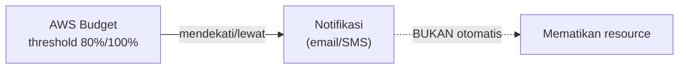

## Tools Cost Management

- **Cost and Usage Report**: laporan detail penggunaan dan tagihan bulanan, bisa dilihat service mana yang paling kontribusi ke billing.
- **Cost Explorer**: visualisasi dan analisa cost/usage over time, bisa dipakai buat prediksi tren cost ke depan, dan hasilnya bisa di-export ke CSV atau PDF buat presentasi ke manajemen.
- **AWS Budgets**: setting batas budget, dan dikasih notifikasi kalau mendekati (misal 80%) atau melebihi threshold.

## AWS Budgets Cuma Notifikasi, Bukan Circuit Breaker

Ini poin penting yang sering disalahpahami: **AWS Budgets nggak otomatis mematikan atau menghapus resource** begitu limitnya kelewat. Fungsinya murni notifikasi (kayak alarm), bukan kill-switch. Kalau mau ada aksi otomatis pas budget kelewat, itu harus di-setup terpisah (misal lewat CloudWatch alarm + Lambda).

Strategi praktis: kalau budget perusahaan misalnya 10 juta, jangan setting AWS Budget-nya pas 10 juta, tapi sedikit di bawahnya (misal 9 juta), biar ada buffer sebelum beneran kelewat batas asli.

## CloudWatch Billing Alarm

Billing alarm itu bagian dari CloudWatch, generate alert kalau estimated charge lebih dari threshold tertentu. Wajib di-setup dari region **US East (N. Virginia)**, karena semua data billing itu larinya ke region itu, apapun region resource yang dipakai.

## Kenapa IT Dianggap "Beban" Padahal Bukan

Banyak perusahaan masih nganggep biaya IT sebagai beban, padahal harusnya dianggap biaya operasional yang legit, sama kayak biaya marketing atau operasional lain. Salah kaprah ini bisa bikin manajemen maunya "matiin aja IT-nya" pas lagi ngirit, padahal itu keliru.

## Strategi Cost Reduction

- **Automation shutdown**: matiin resource yang nggak dibutuhin di luar jam kerja (development, test environment, DR environment) pakai script (konsep "stophyator").
- **Instance yang sesuai kebutuhan**: jangan asal pakai instance gede kalau kebutuhan aplikasinya kecil.
- **Manfaatin serverless**: Lambda cuma bayar pas trigger, nggak bayar pas idle.
- **Managed service**: ngurangin cost of ownership (biaya maintenance, backup manual, dll).
- **Trusted Advisor**: bisa nemuin idle resource yang tetep kena biaya walau nggak dipake (misal Elastic IP yang di-allocate tapi nggak ditempel ke resource apapun, tetap bayar).
- **Cost Explorer + Tagging**: cari cost yang terasosiasi ke project/inisiatif tertentu berdasarkan tag.

## Bukan Best Practice: Automation Pakai Lambda + Alarm buat Matiin Resource

Bisa aja pakai Lambda yang di-trigger alarm buat matiin resource, tapi ini **rawan complicated dan "fake alarm"** (alarm yang harusnya matiin A malah matiin B karena logic-nya campur aduk). Cara yang lebih benar: kalau ada alarm billing, investigasi dulu kenapa naik, biasanya masalahnya sepele (lupa matiin sesuatu, atau auto scaling yang salah konfigurasi).

## Yang Perlu Diinget

- AWS Budgets cuma ngasih notifikasi, nggak otomatis matiin/hapus resource.
- Billing alarm CloudWatch wajib disetup dari US East (N. Virginia).
- Setting budget sedikit di bawah budget asli perusahaan, biar ada buffer.
- Automation pakai Lambda buat matiin resource otomatis itu bisa, tapi bukan best practice karena rawan "fake alarm" dan logic yang complicated.

## Referensi Resmi

- [AWS Cost Explorer](https://docs.aws.amazon.com/cost-management/latest/userguide/ce-what-is.html)
- [Managing Your Costs with AWS Budgets](https://docs.aws.amazon.com/cost-management/latest/userguide/budgets-managing-costs.html)
- [Creating a Billing Alarm](https://docs.aws.amazon.com/AmazonCloudWatch/latest/monitoring/monitor_estimated_charges_with_cloudwatch.html)
