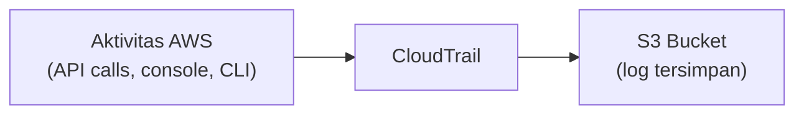
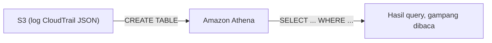
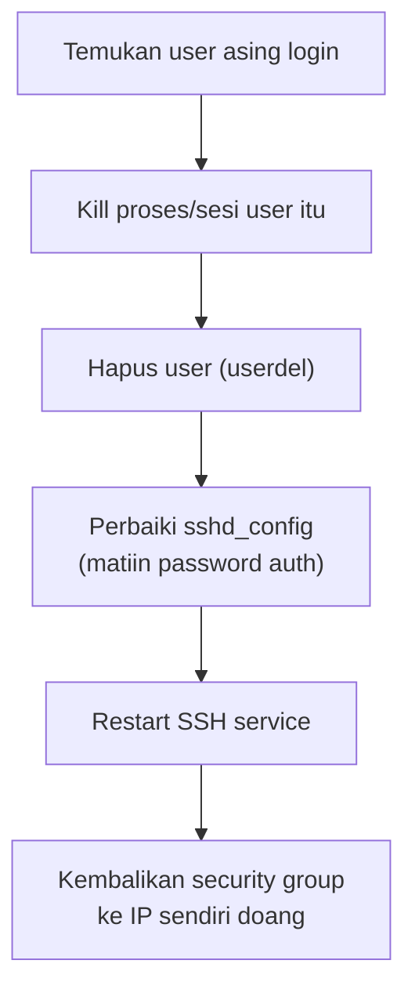

Lab paling seru sejauh ini: simulasi website café kena hack, dan kita harus investigasi dari nol pake CloudTrail sampe akhirnya nemu siapa pelakunya dan gimana caranya masuk.

## Setup Awal: CloudTrail

Sebelum kejadian "kena hack", dibikin dulu **CloudTrail** buat nge-log semua aktivitas di akun AWS: bucket S3 terpisah khusus buat log (wajib nama unik), KMS key buat enkripsi, dan **multi-region trail** biar semua region ke-cover.



Ada beberapa jenis event yang bisa dicatat, masing-masing kena biaya terpisah: **management event** (operasi di akun), **data event** (aktivitas level objek, misal S3 get/put), **insight event** (deteksi anomali). Makin banyak jenis yang diaktifkan, makin mahal.

## Website Kena Hack

Begitu CloudTrail selesai disetup, website tiba-tiba defaced, gambar produk berubah jadi gambar random dan ada pesan provokatif dari si penyerang.

## Investigasi Manual: Security Group Berubah

Dicek security group instance web server, ternyata **rule SSH yang tadinya cuma dibuka buat IP sendiri, berubah jadi terbuka ke `0.0.0.0/0`** (semua orang). Ini tandanya ada modifikasi nggak sah.

## Download dan Baca Log CloudTrail Manual

Log CloudTrail (format JSON) di-download dari S3 ke instance, lalu dibaca pake kombinasi tools Linux:

```bash
aws s3 cp s3://<bucket-log>/ ./logs --recursive
gunzip AWSLogs/.../*.json.gz
cat <file>.json | python3 -m json.tool   # rapiin format JSON biar kebaca
```

Investigasi manual ini **melelahkan** karena data set-nya besar dan berantakan, meski udah di-rapihin lewat pipe `python -m json.tool`. Dari sini ditemukan IP mencurigakan yang login bukan lewat console (`ConsoleLogin`), tapi kemungkinan besar lewat **access key** (CLI).

```bash
aws cloudtrail lookup-events --lookup-attributes AttributeKey=EventName,AttributeValue=ConsoleLogin
```

## Ganti Metode: Pakai Amazon Athena

Karena investigasi manual pake `grep`/`jq` itu berat buat dataset besar, dicoba pendekatan lain: **import log CloudTrail ke Athena**, terus di-query pake SQL biasa, jauh lebih presisi dan gampang.



Setup-nya: bikin table Athena yang nunjuk ke lokasi S3 log, terus tinggal `SELECT * FROM cloudtrail_logs LIMIT 30`. Dari sini ketemu event `UpdateInstanceInformation` lewat **SSM (Systems Manager)**, yang artinya si penyerang manfaatin SSM buat ngirim command ke instance, bukan cuma modif security group manual.

> Proses ini sebenarnya **ETL** (Extract, Transform, Load): dari log JSON yang berantakan, di-extract dan di-transform jadi tabel yang rapi, terus di-load ke Athena biar bisa di-query pake SQL. ETL itu bukan "ngubah log jadi data", tapi nyederhanain data kompleks jadi bentuk yang gampang dibaca dan di-query.

## Menendang Penyerang

Dari log, ketauan ada user OS asing (`chaos` misalnya) yang lagi login lewat SSH ke instance:

```bash
w                          # cek siapa yang lagi login
sudo kill -9 <PID>         # matiin proses/sesi user asing
sudo userdel -r <username> # hapus akun user asing
```

Setelah user-nya dihapus, dicek juga konfigurasi SSH (`/etc/ssh/sshd_config`), ternyata `PasswordAuthentication` diubah jadi `yes` (bukan best practice, harusnya cuma pakai key). Setting-nya dikembalikan ke `no`, service SSH di-restart, dan security group dikembalikan ke cuma boleh diakses dari IP sendiri.



## Perbaiki Website (Undo Deface)

Untung ada backup lokal file website (`index.php` dan asset gambar aslinya), jadi tinggal restore dari backup buat undo deface-nya.

## Refleksi: Bahkan di Cloud Bisa Kena Hack

Poin penting dari lab ini: **cloud bukan berarti otomatis aman**. Anggapan "kalau udah di cloud pasti aman" itu keliru, keamanan tetap tanggung jawab kita di setiap layer (aplikasi, OS, network, akses). Menariknya, dalam skenario ini si penyerang kemungkinan besar dapet kredensial dari sisi client (misal celah keamanan OS lokal instruktur), bukan dari sisi AWS-nya.

## Yang Perlu Diinget

- CloudTrail wajib disetup **sebelum** kejadian, bukan sesudah, karena butuh log historis buat investigasi.
- Investigasi manual pake grep/jq bisa dilakukan tapi berat, Athena jauh lebih efisien buat query log besar.
- Cek security group, user OS asing, dan konfigurasi SSH itu 3 hal pertama yang wajib dicek kalau curiga ada akses nggak sah.
- Cloud bukan jaminan otomatis aman, keamanan tetap tanggung jawab kita di semua layer.

## Referensi Resmi

- [Working with CloudTrail Log Files](https://docs.aws.amazon.com/awscloudtrail/latest/userguide/cloudtrail-working-with-log-files.html)
- [Querying AWS CloudTrail Logs with Amazon Athena](https://docs.aws.amazon.com/athena/latest/ug/cloudtrail-logs.html)
- [Best Practices for Securing SSH Access](https://docs.aws.amazon.com/AWSEC2/latest/UserGuide/ec2-key-pairs.html)
