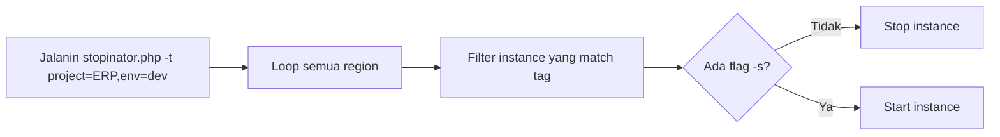
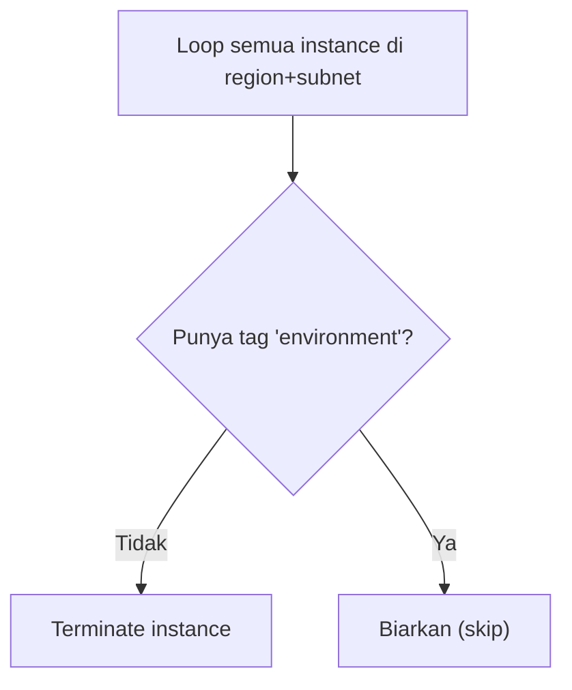

Lanjutan dari [materi tagging](/blog/aws-tagging-cost-management), sekarang praktek manage resource berdasarkan tag pake CLI (bukan console kayak lab sebelumnya).

## Filter Instance Berdasarkan Tag

Data instance dengan tag `project=ERP`, `version`, dan `environment` (development/staging/production) di-filter pake `describe-instances`:

```bash
aws ec2 describe-instances \
  --filters "Name=tag:project,Values=ERP" \
  --query "Reservations[].Instances[].InstanceId"
```

### JMESPath: Query Presisi

`--query` di AWS CLI pakai bahasa **JMESPath**, mirip cara kerja query di JSON. Semakin spesifik query-nya, semakin presisi hasilnya, nggak perlu scroll manual cari informasi di output yang panjang.

```bash
aws ec2 describe-instances \
  --filters "Name=tag:project,Values=ERP" "Name=tag:environment,Values=development" \
  --query "Reservations[].Instances[].{ID:InstanceId,AZ:Placement.AvailabilityZone,Env:Tags[?Key=='environment'].Value|[0]}"
```

Kombinasi beberapa filter tag sekaligus (`project` + `environment`) bisa dipakai buat nyari instance yang spesifik banget, misal "instance ERP yang lagi development doang".

## Script `stopinator.php`: Matiin/Nyalain Server Berdasarkan Tag

Ada script PHP siap pakai buat matiin atau nyalain instance berdasarkan value tag tertentu:

```bash
php stopinator.php -t project=ERP,environment=development
php stopinator.php -t project=ERP,environment=development -s   # nyalain lagi (start)
```

- `-t`: tag yang jadi kriteria filter.
- Kalau nggak ada flag `-s`, defaultnya **stop** instance yang match.
- Kalau ada flag `-s`, dia **start** instance yang match.



Script ini loop ke **semua region**, jadi walau resource-nya tersebar, satu command cukup buat handle semuanya.

## Terminate Instance Tanpa Tag `environment`

Skenario kedua: instance yang **tag `environment`-nya dihapus** (baik sengaja atau nggak sengaja) dianggap "nggak sesuai standar" dan otomatis di-terminate lewat script:

```bash
php terminate-instance.php --region <region> --subnet-id <subnet-id>
```

Logikanya: cek tiap instance, kalau **nggak punya tag `environment`**, langsung terminate. Kalau ada tag `environment`-nya (apapun value-nya), dibiarin.



Script ini butuh scope yang jelas (region + subnet ID spesifik), biar nggak salah terminate instance yang namanya sama tapi beda scope.

## Kenapa Tagging Itu Penting Banget

Tanpa tag, kita bakal kebingungan pas ngelihat instance ID `i-0123456789abcdef` doang, nggak tau itu server apa, punya siapa, buat apa. Dengan tag yang konsisten (project, environment, version), semua jadi jelas dan bisa di-manage secara massal lewat script, bukan klik-klik manual satu-satu.

## Yang Perlu Diinget

- JMESPath (`--query`) di AWS CLI itu tool wajib buat presisi filter output, apalagi kalau resource-nya banyak.
- Script otomasi (stopinator) berbasis tag bisa handle banyak resource di banyak region sekaligus, jauh lebih efisien daripada manual.
- Kebijakan "kalau nggak punya tag environment, terminate" itu strategi enforcement biar semua resource wajib ditag, mencegah resource "siluman" yang nggak diketahui.
- Automation lewat script/CLI itu awal dari automation yang lebih canggih pake event-driven trigger (misal EventBridge + Lambda).

## Referensi Resmi

- [JMESPath Tutorial](https://jmespath.org/tutorial.html)
- [Filtering CLI Output](https://docs.aws.amazon.com/cli/latest/userguide/cli-usage-filter.html)
- [Tagging AWS Resources](https://docs.aws.amazon.com/tag-editor/latest/userguide/tagging.html)
