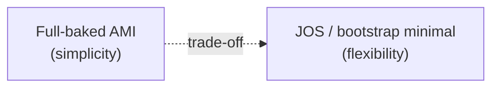

## Dua Pendekatan Bikin AMI

Setelah instance-nya "matang" (semua ke-install dan dikonfigurasi), ada dua opsi lanjutan: langsung jadiin AMI baru dari situ, atau tambahin user data lagi buat modifikasi tambahan sebelum jadi AMI final.

Trade-off utamanya: **simplicity vs flexibility**.

- **Simplicity (full-baked)**: semua (OS, aplikasi, runtime, security, logging) udah dibungkus jadi satu image matang. Instance baru tinggal nyala, langsung siap pakai. Ini yang paling sering dipraktekin karena paling gampang di-manage.
- **Flexibility (JOS - "just an OS")**: image cuma sampe level OS doang (mirip laptop tanpa OS zaman dulu, atau install Linux dari nol), aplikasinya dipasang terpisah secara dinamis pas boot. Lebih fleksibel buat gonta-ganti aplikasi, tapi lebih ribet manage-nya (contoh masalah dunia nyata: driver hardware yang harus dicari manual kalau OS-nya "polos").

Hybrid AMI ada di tengah: OS + runtime udah matang, tapi aplikasinya dipisah dan di-deploy terpisah.

## Kenapa AMI Nggak Gratis

Bikin AMI itu **berbayar**, karena di baliknya nyimpen snapshot di S3. Makin gede image-nya (misal 8 GB, 20 GB), makin gede juga biayanya per bulan. Makanya penting punya strategi retention buat hapus AMI lama yang udah nggak dipake.

## Copy AMI Antar Region

AMI itu **region-scoped**, kalau butuh di region lain, harus di-copy secara eksplisit (via console atau CLI). Instance sumbernya disarankan direboot dulu sebelum di-snapshot, biar konsistensi datanya terjaga.

## Windows AMI: Sysprep

Buat bikin AMI Windows, ada proses **Sysprep** (System Preparation), semacam "driver pack solution" versi AWS, tujuannya generalisasi image (menghapus identitas spesifik mesin) sebelum di-clone jadi AMI baru. Catatan menarik: penggunaan Windows di cloud itu sebenarnya minoritas (sekitar 2%), kebanyakan workload cloud jalan di Linux.

## Launch Template: Recap

Launch template itu paket konfigurasi (AMI, instance type, subnet, key pair, dll) yang dipake berulang buat launch instance konsisten. Bisa punya banyak versi, dan salah satu versi bisa di-set jadi **default** (biasanya versi yang udah paling matang/stabil, biar nggak bikin masalah pas production).

## Yang Perlu Diinget

- Trade-off utama bikin AMI: simplicity (full-baked, gampang manage) vs flexibility (JOS, lebih ribet tapi lebih fleksibel).
- AMI itu berbayar (nyimpen snapshot di S3), makin gede image-nya makin mahal, butuh strategi retention.
- AMI itu region-scoped, harus di-copy eksplisit kalau butuh di region lain.
- Launch template bisa punya banyak versi, dan versi default sebaiknya yang paling matang/stabil.

## Referensi Resmi

- [Creating an AMI from an Amazon EC2 Instance](https://docs.aws.amazon.com/AWSEC2/latest/UserGuide/creating-an-ami-ebs.html)
- [Copying an AMI](https://docs.aws.amazon.com/AWSEC2/latest/UserGuide/CopyingAMIs.html)
- [Launch Templates](https://docs.aws.amazon.com/AWSEC2/latest/UserGuide/ec2-launch-templates.html)
