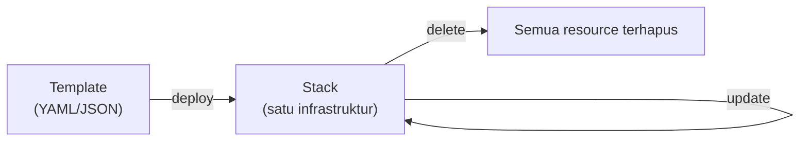
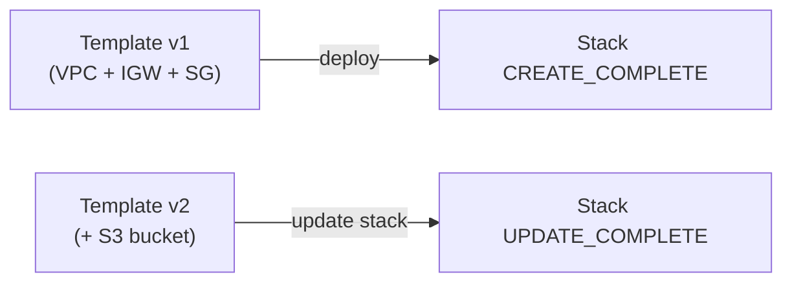

Lanjutan dari [materi IaC dan JSON/YAML](/blog/infrastructure-as-code-json-yaml), sekarang praktek langsung bikin, update, dan hapus stack CloudFormation.

## Istilah Dasar: Template dan Stack

- **Template**: file YAML/JSON yang mendefinisikan resource apa aja yang mau dibuat.
- **Stack**: hasil deploy dari template, gampangnya bisa disebut **satu infrastruktur** (kumpulan resource yang dikelola sebagai satu unit).



## Anatomi Template

- **Parameters**: variabel input yang bisa diubah tiap deploy/update (misal CIDR block, key pair name).
- **Resources**: bagian utama, definisi resource yang mau dibuat (VPC, subnet, security group, dll).
- **Outputs**: nilai yang di-return setelah stack selesai dibuat (misal ID security group, URL website).

Contoh potongan template:

```yaml
AWSTemplateFormatVersion: '2010-09-09'
Parameters:
  LabVpcCidr:
    Type: String
    Default: 10.0.0.0/20
Resources:
  LabVPC:
    Type: AWS::EC2::VPC
    Properties:
      CidrBlock: !Ref LabVpcCidr
      EnableDnsSupport: true
      EnableDnsHostnames: true
      Tags:
        - Key: Name
          Value: LabVPC
  LabIGW:
    Type: AWS::EC2::InternetGateway
  VPCtoIGW:
    Type: AWS::EC2::VPCGatewayAttachment
    DependsOn: [LabIGW, LabVPC]
    Properties:
      InternetGatewayId: !Ref LabIGW
      VpcId: !Ref LabVPC
```

### `!Ref`: Reference, Bukan Hardcode

`!Ref` dipake buat ngerefer ke parameter atau resource lain di template. Efeknya: kalau nilai parameter diubah, semua tempat yang ngerefer ke situ otomatis ikut berubah, nggak perlu edit manual di banyak tempat (soft-coding).

### `DependsOn`: Urutan Pembuatan Resource

Default-nya, CloudFormation bikin semua resource **secara paralel** sekaligus. Kalau ada resource yang butuh resource lain udah selesai duluan (misal attachment IGW butuh IGW dan VPC-nya udah ada), pakai `DependsOn` biar resource itu nunggu dulu sampai dependency-nya beres, biar nggak error.

## Deploy Jadi Stack

Lewat console: **CloudFormation → Create Stack → upload template → isi parameter → review (change set) → submit**. Change set itu fitur preview, nunjukin apa yang bakal dibuat/diubah sebelum beneran dieksekusi, biar nggak asal deploy tanpa tau dampaknya.

Setelah stack `CREATE_COMPLETE`, semua resource yang dibuat otomatis dapet **tag CloudFormation** (nama stack-nya), jadi gampang dibedain mana resource yang dibuat manual vs lewat CloudFormation.

## Update Stack: Nambah Resource

Kalau butuh nambah resource (misal S3 bucket), template-nya di-edit (tambahin resource baru), terus **update stack** dengan template baru itu. Ada 2 opsi: langsung update, atau lewat change set dulu buat preview perubahannya.



## Nambah EC2 Instance: Pakai Parameter Store buat AMI ID

Daripada hardcode AMI ID (yang beda-beda tiap region), template-nya ngerefer ke **SSM Parameter Store** yang udah punya AMI ID Amazon Linux terbaru secara otomatis:

```yaml
Parameters:
  LatestAmiId:
    Type: AWS::SSM::Parameter::Value<AWS::EC2::Image::Id>
    Default: /aws/service/ami-amazon-linux-latest/al2023-ami-kernel-default-x86_64
```

Ini disebut teknik **pseudo parameter**, bikin template fleksibel banget, bisa dipake di region manapun tanpa perlu edit AMI ID manual.

## Delete Stack

Delete stack itu satu klik, semua resource yang dibuat dari stack itu otomatis dihapus bareng. Ini yang bikin CloudFormation "game changer" dibanding manual: bikin infrastruktur kompleks dan hapusnya sama-sama cepat, nggak perlu klik satu-satu.

## Kapan Boleh Edit Manual di Luar Template?

**Nggak boleh** kalau udah pakai IaC. Kalau edit manual (misal ganti security group lewat console), itu bikin kondisi resource beda dari template-nya, yang disebut **drift**, dan bisa bikin masalah pas mau update stack lagi nanti (dibahas lebih detail di lab troubleshooting berikutnya).

## Yang Perlu Diinget

- Template = definisi, Stack = hasil deploy (satu infrastruktur).
- `!Ref` buat soft-coding, referensi ke parameter/resource lain, bukan hardcode nilai.
- `DependsOn` penting kalau ada resource yang butuh resource lain selesai duluan (default-nya paralel).
- Change set itu preview sebelum deploy/update, best practice biar nggak asal submit.
- Delete stack sekali klik hapus semua resource yang terkait, jauh lebih cepat dari manual.
- Edit manual di luar template itu bikin drift, dan itu bukan best practice.

## Referensi Resmi

- [Working with AWS CloudFormation Stacks](https://docs.aws.amazon.com/AWSCloudFormation/latest/UserGuide/stacks.html)
- [Intrinsic Function Reference](https://docs.aws.amazon.com/AWSCloudFormation/latest/UserGuide/intrinsic-function-reference.html)
- [Using Public Parameters (SSM)](https://docs.aws.amazon.com/systems-manager/latest/userguide/parameter-store-public-parameters.html)
