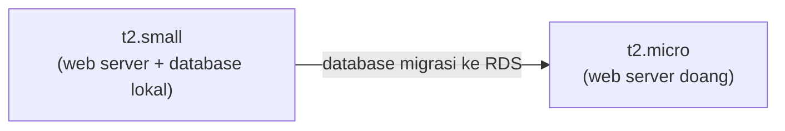

Lab ini nyambungin dua hal yang udah pernah dikerjain sebelumnya: [migrasi database café ke RDS](/blog/migrasi-database-ke-rds-via-cli), dan sekarang **rightsizing** instance-nya setelah database lokalnya nggak dipake lagi.

## Kenapa Perlu Rightsizing

Setelah database MariaDB lokal di-uninstall dari instance web server (karena udah migrasi ke RDS), beban komputasi instance itu otomatis turun jauh. Instance yang tadinya di-provision buat nanggung web server + database sekarang cuma nanggung web server doang. Jadi spek instance-nya kebesaran (over-provisioned), buang-buang duit.



## Langkah Rightsizing

1. **Stop service database** dan **uninstall** MariaDB dari instance (kalau di real case, harus dipastikan datanya udah beres di-backup/migrasi dulu sebelum uninstall).
2. **Stop instance-nya** (wajib stop dulu sebelum ubah instance type, nggak bisa langsung diubah pas nyala).
3. **Modify instance attribute**, ganti instance type dari `t2.small` ke `t2.micro`.
4. **Start instance lagi**, catat public IP/DNS baru-nya (karena berubah tiap kali restart, kecuali pake Elastic IP).
5. Tes aplikasinya masih jalan normal di spek yang lebih kecil.

```bash
aws ec2 stop-instances --instance-ids <id>
aws ec2 modify-instance-attribute --instance-id <id> --instance-type t2.micro
aws ec2 start-instances --instance-ids <id>
```

## Verifikasi: Aplikasi Tetap Jalan

Setelah instance nyala lagi dengan spek baru, website café dites, dan berjalan normal tanpa masalah. Ini konfirmasi bahwa spek `t2.small` sebelumnya emang berlebihan buat beban kerja web server doang.

## Hitung Penghematan Pakai AWS Pricing Calculator

Estimasi biaya dihitung pake [AWS Pricing Calculator](https://calculator.aws), yang enaknya nggak perlu bayar buat sekadar estimasi:

- **Before**: `t2.small` (2 vCPU, 2 GB RAM) + EBS 40 GB (20 GB buat OS, 20 GB buat database yang sekarang udah nggak dipake).
- **After**: `t2.micro` + EBS 20 GB.

Hasilnya: penghematan sekitar **$9 per bulan untuk satu server**. Kelihatan kecil, tapi kalau dikali 10 atau 100 server dengan pola yang sama, jadi signifikan.

## Kenapa Ini Penting buat Karier

Hasil rightsizing kayak gini bisa dijadiin bahan laporan efisiensi ke manajemen (di-export jadi CSV atau PDF dari Pricing Calculator). Momen dan cara nyampein-nya penting: sampaikan ke atasan langsung, bukan ke sesama rekan kerja, biar kreditnya jelas dan nggak jadi rebutan.

## Yang Perlu Diinget

- Instance harus **di-stop dulu** sebelum ganti instance type, nggak bisa diubah pas lagi running.
- IP/DNS publik instance berubah tiap kali restart, kecuali pake Elastic IP.
- AWS Pricing Calculator berguna buat estimasi before/after tanpa perlu bayar, hasilnya bisa di-export buat laporan.
- Penghematan kecil per server bisa jadi signifikan kalau dikali banyak instance dengan pola serupa.

## Referensi Resmi

- [Modifying the Instance Type](https://docs.aws.amazon.com/AWSEC2/latest/UserGuide/ec2-instance-resize.html)
- [AWS Pricing Calculator](https://calculator.aws/)
