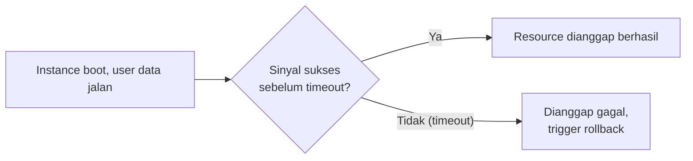

Lanjutan dari [lab CloudFormation pertama](/blog/cloudformation-deploy-first-stack), sekarang bahas fitur-fitur template yang lebih dalam.

## Parameter: AllowedValues dan Constraint

Selain `Default`, parameter bisa punya `AllowedValues`, daftar nilai yang **cuma boleh** dipilih dari situ, selain itu error. Ini berguna buat batasin input biar nggak sembarangan (misal instance type cuma boleh `t2.micro` atau `t3.micro`, nggak boleh yang lain).

## Intrinsic Function: Lebih dari Sekadar `Ref`

`Ref` itu salah satu **intrinsic function** (fungsi bawaan CloudFormation), tapi ada banyak lagi:

- **`Fn::Select`**: ambil elemen dari list berdasarkan index (mulai dari 0). Contoh: `!Select [0, !GetAZs '']` ambil AZ pertama dari region yang lagi dipake.
- **`Fn::GetAtt`**: ambil attribute dari resource lain (misal DNS name dari load balancer).
- **`Fn::Join`**: gabungin beberapa string jadi satu.
- **`Fn::FindInMap`**: lookup nilai dari mapping table (dibahas di bawah).

```yaml
AvailabilityZone: !Select [0, !GetAZs '']
```

### Pseudo Parameter: Bawaan Template, Nggak Perlu Didefinisikan

Selain parameter yang kita buat sendiri, ada juga **pseudo parameter** yang udah otomatis tersedia dari CloudFormation, contohnya `AWS::Region`, `AWS::StackName`, `AWS::AccountId`. Manfaatnya: template jadi fleksibel banget, kalau di-deploy di region berbeda, otomatis nyesuain tanpa perlu hardcode.

```yaml
!Sub "arn:aws:s3:::my-bucket-${AWS::Region}"
```

## Mapping: Alternatif buat Lookup Table

`Mappings` itu section buat bikin lookup table statis (misal AMI ID per region). Tapi ini kurang praktis dibanding pakai **SSM Parameter Store** (yang otomatis update AMI ID terbaru), jadi Mapping cuma worth dipake kalau butuh custom AMI yang nggak ada di Parameter Store.

```yaml
Mappings:
  RegionMap:
    us-east-1:
      AMI: ami-0abcdef1234567890
    ap-southeast-1:
      AMI: ami-0987654321fedcba0
```

## `DependsOn` Sudah Dibahas, Sekarang `AWS::CloudFormation::Init`

Selain user data biasa, ada juga **cfn-init** (`AWS::CloudFormation::Init`), user data versi CloudFormation yang nempel langsung di dalam definisi resource. Bedanya sama user data biasa yang refer ke file eksternal:

| | User Data Eksternal | cfn-init (Embedded) |
|---|---|---|
| Kalau error | CloudFormation nggak tau, dianggap sukses (cuma manggil file doang) | Bisa terdeteksi, bikin stack gagal (lebih terkontrol) |
| Kemudahan edit | Lebih gampang, terpisah | Nempel di template, agak lebih ribet |
| Kontrol | Kurang | Lebih detail dan bisa dimanage |

## Wait Condition: Nunggu Sinyal Sukses

`WaitCondition` dipake buat "membungkus" proses instalasi (user data) yang butuh waktu, dan CloudFormation nunggu sampai dapet sinyal sukses (`cfn-signal`) atau **timeout**. Kalau nggak dapet sinyal sampai batas waktu, dianggap gagal.



Best practice buat timeout: **5-10 menit**, jangan kelamaan (1 jam itu berlebihan), biar kalau ada masalah cepet ketahuan daripada nunggu lama sia-sia.

## Rollback: Behavior Default dan Alternatifnya

Default-nya, kalau ada resource yang gagal dibuat, **semua resource di stack itu di-roll back (dihapus)**, walau cuma satu yang error. Ini bisa dimatiin dengan `--on-failure DO_NOTHING`, biar resource yang udah kebuat tetap ada (masih bayar), supaya bisa investigasi log-nya sebelum diapus. Ini teknik penting buat troubleshooting (dibahas lebih lanjut di lab).

## Yang Perlu Diinget

- Intrinsic function itu banyak (Ref, Select, GetAtt, Join, FindInMap), bukan cuma Ref doang.
- Pseudo parameter (`AWS::Region`, dll) bikin template fleksibel tanpa hardcode.
- Mapping berguna buat lookup table statis, tapi kalah praktis dibanding SSM Parameter Store buat AMI ID.
- cfn-init (embedded) lebih terkontrol error-nya dibanding user data eksternal, tapi lebih ribet nulisnya.
- Default rollback itu hapus semua resource kalau ada satu yang gagal, bisa dimatiin (`DO_NOTHING`) buat keperluan debug.

## Referensi Resmi

- [Intrinsic Function Reference](https://docs.aws.amazon.com/AWSCloudFormation/latest/UserGuide/intrinsic-function-reference.html)
- [Pseudo Parameters Reference](https://docs.aws.amazon.com/AWSCloudFormation/latest/UserGuide/pseudo-parameter-reference.html)
- [cfn-init Helper Script](https://docs.aws.amazon.com/AWSCloudFormation/latest/UserGuide/cfn-init.html)
- [Creating a Wait Condition](https://docs.aws.amazon.com/AWSCloudFormation/latest/UserGuide/aws-properties-waitcondition.html)
