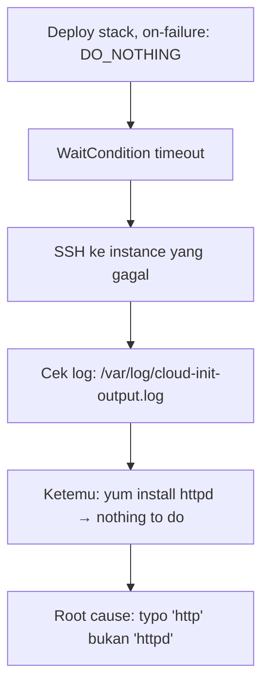
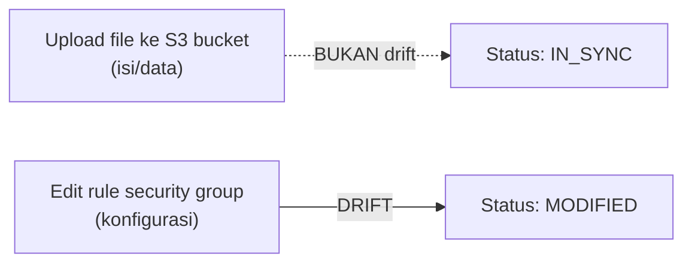
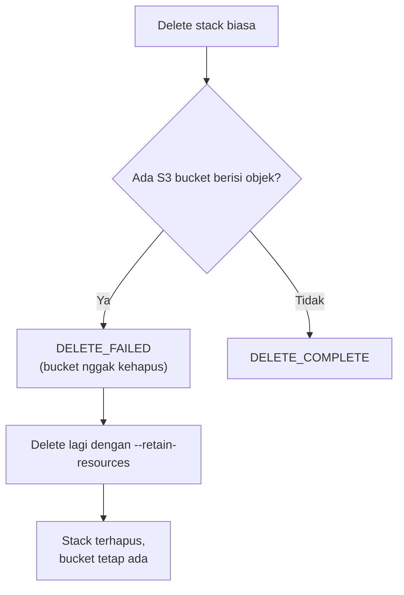

Lab paling berharga soal CloudFormation: gimana caranya debug stack yang gagal, dan gimana cara kerja drift detection.

## Bug Pertama: Timeout karena Typo

Stack pertama dijalanin dengan `on failure: DO_NOTHING` (sesuai [materi rollback](/blog/cloudformation-parameters-intrinsic-functions)), dan ternyata **gagal** di `WaitCondition`, timeout.



### Cara Nyari Root Cause

1. **`describe-stack-events`**, cari event dengan status `CREATE_FAILED`, ternyata yang gagal itu resource `WaitCondition`.
2. Karena `WaitCondition` cuma bilang "gagal", nggak bilang **kenapa**, harus masuk lebih dalam: SSH ke instance yang bermasalah.
3. Di dalam instance, log user data ada di `/var/log/cloud-init-output.log` (Linux) atau folder `cfn` (Windows).
4. Ketemu baris: `yum install http` → `nothing to do` (paket bernama `http` nggak ada, harusnya `httpd`).

**Root cause**: typo di user data, nulis `http` padahal harusnya `httpd` (paket Apache). Satu huruf doang, tapi bikin seluruh stack gagal.

### Fix dan Redeploy

Template diedit, typo dibenerin, stack lama (yang gagal) di-delete, terus deploy ulang dengan template yang udah benar. Kali ini `CREATE_COMPLETE`.

## Kenapa `on-failure: DO_NOTHING` Penting buat Debug

Kalau pakai rollback default, begitu `WaitCondition` gagal, **semua resource langsung dihapus otomatis**, dan kita nggak sempet masuk ke instance buat cek log-nya (keburu ke-terminate). Dengan `DO_NOTHING`, resource yang bermasalah tetap ada (masih kena biaya), tapi kita bisa investigasi dulu sebelum bersih-bersih manual.

## Drift Detection: Ngedeteksi Perubahan Manual

Setelah stack berhasil, security group-nya diedit manual lewat console (bukan lewat template), ngubah rule SSH dari `my IP` jadi `0.0.0.0/0`. Ini yang disebut **drift**.

```bash
aws cloudformation detect-stack-drift --stack-name <name>
aws cloudformation describe-stack-drift-detection-status --stack-drift-detection-id <id>
aws cloudformation describe-stack-resource-drifts --stack-name <name> --stack-resource-drift-status-filters MODIFIED
```

### Temuan Menarik: Nggak Semua Perubahan Ke-detect sebagai Drift

Dua perubahan dilakukan bareng: (1) edit security group rule, dan (2) upload file baru ke S3 bucket yang dibuat dari stack itu. Hasil drift detection cuma nunjukin **satu** resource yang "MODIFIED" (security group-nya), sedangkan bucket S3 tetap "IN_SYNC" meski udah ada file baru di dalamnya.

**Kesimpulannya**: upload/tambah/hapus **isi (data)** di dalam resource (misal objek di S3) itu **bukan drift**, karena bukan bagian dari konfigurasi resource. Tapi kalau yang berubah itu **konfigurasi** resource-nya sendiri (misal rule security group), itu baru dianggap drift.



## Nggak Bisa Update Stack Selama Masih Drift

Setelah drift terjadi, dicoba update stack pakai template lama (mau "force" balikin ke kondisi semula lewat CloudFormation), tapi **gagal**, karena stack lagi dalam kondisi drift. Solusinya cuma satu: **balikin manual dulu** (edit lagi security group-nya kembali ke setting semula), baru CloudFormation bisa dipake normal lagi.

Prinsipnya kaku banget: **kalau udah pakai IaC, semua perubahan wajib lewat template, titik**. Nggak ada pengecualian.

## Delete Stack tapi Isi S3 Bucket Nggak Mau Hilang

Pas nyoba delete stack, ada resource yang **gagal dihapus**: S3 bucket. Alasannya: **CloudFormation nggak mau menghapus bucket yang masih ada isinya** (objek di dalamnya), ini fitur pengaman biar data nggak ke-delete nggak sengaja.

### Solusi: Delete Stack dengan Retain Resource

```bash
aws cloudformation delete-stack --stack-name <name> \
  --retain-resources <LogicalResourceId-bucket>
```

Dengan `--retain-resources`, stack-nya tetap dihapus, tapi bucket S3 spesifik itu **dibiarkan tetap ada** (nggak ikut kehapus), termasuk semua isinya.



## Praktek JMESPath Sebelum Lab

Sebelum masuk lab utama, dilatih dulu query JMESPath pake data JSON contoh (list dessert dengan nama dan harga), belajar cara ambil elemen by index, filter by value, dan wildcard (`*`). Ini mirip [teknik query di lab tagging](/blog/resource-tagging-management-cli-jmespath) sebelumnya, cuma latihan konsepnya doang sebelum dipake beneran buat query stack resource CloudFormation.

## Yang Perlu Diinget

- `WaitCondition` yang gagal cuma bilang "gagal", root cause-nya harus dicari manual di dalam instance (log `cloud-init-output.log`).
- `on-failure: DO_NOTHING` penting buat debugging, biar resource yang error nggak keburu ke-rollback sebelum sempat diinvestigasi.
- Perubahan **data/isi** resource (upload file ke S3) itu bukan drift, tapi perubahan **konfigurasi** resource (edit security group rule) itu drift.
- Stack yang lagi drift nggak bisa di-update sampai kondisi manualnya dibalikin dulu ke settingan asli.
- S3 bucket yang masih ada isinya nggak bisa ke-delete otomatis dari stack, harus pakai `--retain-resources` atau dikosongin dulu manual.

## Referensi Resmi

- [Detecting Unmanaged Configuration Changes to Stacks (Drift)](https://docs.aws.amazon.com/AWSCloudFormation/latest/UserGuide/using-cfn-stack-drift.html)
- [Deleting a Stack While Preserving Resources](https://docs.aws.amazon.com/AWSCloudFormation/latest/UserGuide/troubleshooting.html#troubleshooting-errors-delete-stack-fails)
- [Troubleshooting AWS CloudFormation](https://docs.aws.amazon.com/AWSCloudFormation/latest/UserGuide/troubleshooting.html)
