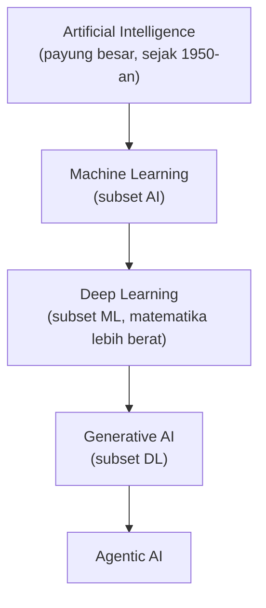
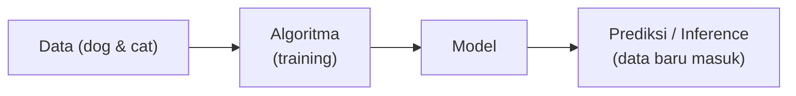

Masuk unit AI (minggu terakhir program). Hari pertama full teori, kenalan sama konsep dasar dulu sebelum masuk service-nya.

## Hierarki: AI itu Payung Besar

- **AI**: istilah/bidang luas, kumpulan teknik supaya mesin bisa ngerjain tugas yang biasanya butuh kecerdasan manusia (computer vision, dll).
- **ML**: subset AI. Teknik pakai data yang ada buat training model matematik, biar model bisa nyari pola dan prediksi akurat pas ketemu data baru.
- **Deep Learning**: subset ML, matematikanya jauh lebih berat (turunan, matriks, diferensiasi).
- **Generative AI**: subset deep learning.

## Evolusi Nama (Rebranding)

Machine Learning itu sebenarnya "rebranding" dari nama-nama lama:

| Era | Nama | Catatan |
|---|---|---|
| Lama | Statistik | dulu dianggap "cuma ngitung" |
| ~pra-2019 | Data Mining | materinya cuma ada di S2 |
| Sekarang | Machine Learning | isinya tetep statistik, regresi, KNN, dll |

Dulu data science pakai bahasa **R**, sekarang geser ke **Python**. Terus muncul tools no-code (KNIME, RapidMiner), terus drag-and-drop, sekarang tinggal prompting doang jadi dashboard/analitik.

## Output: Model vs Foundation Model

- AI / ML / Deep Learning → output-nya **model**.
- Generative AI / Agentic AI → output-nya **Foundation Model (FM)**.

Bedanya: model biasa ukurannya kecil (dulu 600 MB aja udah canggih), Foundation Model ukurannya gede banget (ada yang 9 GB, 13 GB, bahkan model frontier bisa sampe hitungan TB). Jenis FM banyak: **LLM** (Large Language Model), **Stable Diffusion** (buat gambar), dll.

## Alur Dasar Machine Learning

Analoginya kayak ngajarin balita: "ini kucing, ini anjing". Nanti dikasih gambar anjing pakai kostum, dia tetep bisa jawab "anjing". Kemampuan jawab bener pas ketemu data baru ini namanya **generalisasi**.

## Menghafal ≠ Belajar (Generalisasi)

Model yang di-training itu "belajar", bukan "menghafal". Bedanya:

- **Menghafal**: jawaban pasti, tapi kalau ketemu kasus yang nggak sesuai "textbook", bingung.
- **Belajar**: bener-bener paham fondasinya, jadi bisa adaptasi ke kasus baru (generalisasi).

Konsep ini penting karena nanti ada istilah **overfitting** (model kayak "menghafal" data training, jelek pas ketemu data baru) dan **underfitting** (model belum belajar cukup).

## 3 Metode Pembelajaran ML

| Metode | Cara Kerja | Contoh |
|---|---|---|
| **Supervised learning** | Dipandu, kita kasih data training berlabel yang bagus (ini anjing, ini kucing) | Klasifikasi gambar |
| **Unsupervised learning** | Nggak dipandu, model nyari pola sendiri, lebih susah | Clustering |
| **Reinforcement learning** | Fokus dapet reward sebesar-besarnya, punishment serendah-rendahnya | Autopilot Tesla (deteksi objek, ambil keputusan belok) |

## Inference

**Inference** itu proses model ngeluarin output dengan cara ngeapply apa yang dipelajarin pas training, ke data/pertanyaan baru. Waktu kita nanya ke ChatGPT terus dia jawab, itu inference.

Dari sisi engineering, inference itu urusan backend juga: soal latency, response time, dan gimana AI-nya tetep cepet walau di-hit jutaan user bareng.

## Knowledge Cut-off

Model punya batas waktu terakhir dia di-training (**knowledge cut-off**). Contoh: model yang di-training terakhir 2024 nggak tau presiden Indonesia yang sekarang, dan bisa **halusinasi** (jawab yakin tapi salah). Solusinya: model baru yang di-training ulang dengan data terbaru. Alur biar model terus up-to-date ini disebut **CT (Continuous Training)**, mirip konsep CI/CD tapi buat model.

## Yang Perlu Diinget

- Hierarki: AI > ML > Deep Learning > Generative AI > Agentic AI.
- Gen AI dan Agentic AI output-nya Foundation Model (gede), bukan model biasa (kecil).
- Generalisasi = kemampuan model jawab bener pas ketemu data baru, ini bukti model "belajar" bukan "menghafal".
- 3 metode ML: supervised (dipandu, paling gampang), unsupervised (nyari pola sendiri), reinforcement (reward vs punishment).
- Inference = proses model ngeluarin output. Knowledge cut-off = batas waktu data training model, penyebab halusinasi soal info terbaru.

## Referensi Resmi

- [What Is Artificial Intelligence?](https://aws.amazon.com/what-is/artificial-intelligence/)
- [What Is Machine Learning?](https://aws.amazon.com/what-is/machine-learning/)
- [What Is Generative AI?](https://aws.amazon.com/what-is/generative-ai/)
