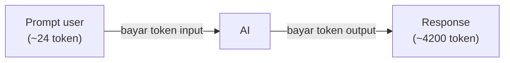

## Kenapa Perusahaan Gede Bikin Model AI Sendiri

Kenapa nggak pakai model yang udah ada aja?

- **Copyright**: contohnya Adobe punya AI sendiri di Photoshop (edit foto lewat prompt), nggak perlu numpang model orang lain.
- **Lebih murah dan lebih fresh** dari sisi bisnis (jangka panjang).
- **Business fit**: model existing bisa "bloon" untuk kebutuhan spesifik (contoh: model lama nggak tau presiden terbaru), perusahaan butuh AI yang pinter dan sesuai konteks bisnisnya.
- **AI sekarang mandatori, bukan fitur**: perusahaan yang nggak bisa adaptasi sama AI ketinggalan. Microsoft, Google, AWS, Adobe semua bakar duit demi AI.

## Data Types Roles (Data Engineer, Scientist, Analyst)

| Role | Fokus |
|---|---|
| **Data Engineer** | Struktur data, kualitas, kecepatan, kerapian (fokus data) |
| **Data Scientist** | Ambil data dari engineer, bikin model ML, kejar akurasi tertinggi |
| **Data Analyst** | Bikin dashboard, presentasi ke direksi ("tukang dongeng" yang bacain chart) |

Sekarang tiga peran ini sering digabung jadi satu jabatan (**"full stack data scientist"**), lowongan data analyst minta skill ketiganya sekaligus.

## Ekonomi Inference: Token Masuk dan Keluar Kena Biaya

Kalau deploy AI di cloud (pake managed API), **token yang masuk dibayar, token yang keluar juga dibayar**.

Contoh: prompt pendek (~24 token) tapi output panjang (~4200 token) itu boros, karena bayarnya proporsional sama jumlah token. Kalau banyak user nanya, tinggal dikali kumulatif.

Instruktur bilang: buat deploy AI serius (misal chatbot skala perusahaan besar), budget minimal ~5 miliar rupiah, plus cadangan 2-3 miliar buat antisipasi kalau di-abuse (di-hit sama yang bukan user asli).

## Spek Infra buat Model Besar (Local Deployment)

Buat jalanin model frontier (kelas GPT-5, Claude, dll) secara lokal, minimal:

- **~500 core CPU**
- **~1 TB RAM**
- **VGA dengan VRAM ~512 GB** (contoh: NVIDIA Tensor A100, VRAM 80-160 GB per unit)

Proses inference pake **CPU + GPU bareng**: kalau cuma CPU, response-nya lambat banget (bisa 1 jam cuma buat satu jawaban). GPU (khususnya NVIDIA) mempercepat/akselerasi jawaban.

Ini alasan kenapa harga GPU (dan komponen PC secara umum: RAM, SSD, storage) lagi naik terus, semua perusahaan AI rebutan supply NVIDIA. NVIDIA sendiri jadi salah satu perusahaan dengan valuasi terbesar di dunia.

## Alternatif: Sewa GPU per Jam vs Bayar Token

Daripada bayar per token, bisa juga **sewa GPU per jam** (misal RTX 4090 ~$0.38/jam buat small/medium model, B200 buat yang lebih besar). Ini lebih murah kalau volume penggunaannya tinggi.

> Catatan hati-hati: beberapa layanan sewa GPU pakai sistem "kredit per jam" (misal 708 kredit/jam), yang kemungkinan berarti ada token limit tersembunyi, bukan murni sewa waktu. Jadi "harga murah tapi ada batasan tersembunyi". Cek dulu detailnya sebelum commit, terutama buat fine-tuning yang butuh GPU besar.

## Storage buat Model AI

Model AI butuh storage besar (LLM ada yang 13 GB, model frontier bisa hitungan TB). Ini juga bikin harga storage naik. Opsi paling murah buat backup: **LTO tape** (bentuknya kaset, 2.5 TB cuma ~Rp400 ribu), tapi lambat banget dan rawan korup kalau kena baret/jatuh, jadi cuma cocok buat archive.

## Yang Perlu Diinget

- Perusahaan bikin model sendiri buat copyright, cost jangka panjang, business fit, dan karena AI sekarang mandatori.
- Deploy AI via API: token input DAN output kena biaya, output panjang = boros.
- Model frontier butuh infra raksasa (500 core, 1 TB RAM, VRAM 512 GB), inference pake CPU+GPU bareng.
- Sewa GPU per jam bisa lebih murah dari bayar token kalau volume tinggi, tapi hati-hati sistem "kredit" yang bisa jadi token limit tersembunyi.

## Referensi Resmi

- [Amazon Bedrock Pricing](https://aws.amazon.com/bedrock/pricing/)
- [Amazon SageMaker Pricing](https://aws.amazon.com/sagemaker/pricing/)
- [Amazon EC2 P5 Instances (NVIDIA H100)](https://aws.amazon.com/ec2/instance-types/p5/)
