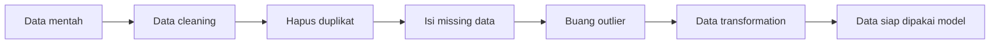
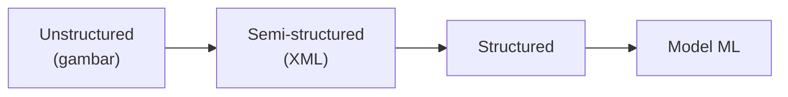

## Kapan Pakai ML, Kapan Nggak

ML itu mahal implementasinya dibanding pendekatan tradisional. Jadi kalau masalahnya bisa diselesain dengan cara lebih sederhana, jangan pakai ML:

- Kalau bisa pakai **kondisi/rule hard-coded** → pakai itu.
- Kalau **variabel terbatas** dan cukup pakai model statistik (rata-rata, median, modus, standar deviasi) → pakai itu.

ML baru masuk kalau: datanya banyak, trending, high quality, butuh level akurasi/transparansi/kecepatan tertentu, organisasinya punya kemampuan + resource buat custom solution, dan cost ML-nya sepadan sama dampak masalahnya.

## GIGO: Garbage In, Garbage Out

Prinsip paling dasar: **kalau data training-nya sampah, output-nya sampah**. Model yang dikasih gambar salah label (dibilang "anjing" padahal monyet) bakal jawab salah. Data yang bagus itu: cukup jumlahnya, kualitas tinggi (bersih, nggak ada anomali/outlier), dan nggak bias.

## Data Bias / Imbalanced

Data **bias** artinya porsinya nggak seimbang atau berat sebelah (istilah lamanya "imba", istilah sekarang "OP"). Contoh: kalau data buat model penyakit isinya 95% pasien sehat dan 5% sakit, prediksinya bakal ngaco karena datanya nggak mewakili proporsi yang sebenarnya. Tugas praktisi ML: bikin datanya nggak bias.

## Data Vetting / Feature Engineering

Proses "bersih-bersih" data:

| Di data science disebut | Di ML disebut |
|---|---|
| Data preparation | Feature engineering |

Namanya beda tapi konsepnya sama (kayak martabak vs terang bulan).

## Breakdown Waktu Data Scientist

| Fase | Porsi | Isinya |
|---|---|---|
| Data prep / cleansing | ~50% | Paling lama dan membosankan, tapi krusial (GIGO) |
| R&D / trial-error algoritma | ~40% | Cari akurasi tertinggi, coba-coba setting algoritma |
| Finishing | ~10% | Bikin PPT, laporan, meeting sama direksi |

Orang dengan background matematika murni lebih cepet di fase R&D, karena bisa langsung nentuin setting algoritma yang pas. Yang bukan background matematika harus bikin range dan coba-coba (`untuk parameter x dari 0.001 sampai 0.1, cari yang akurasinya tertinggi`).

## HPO = HPT (Hyperparameter Optimization/Tuning)

Tiap algoritma punya **hyperparameter** (setting). Nyari kombinasi setting yang menghasilkan akurasi tertinggi itu disebut **Hyperparameter Optimization (HPO)** atau **Hyperparameter Tuning (HPT)**, dua istilah beda buat hal yang sama (optimize = cari yang terbaik, tuning = ngubah-ubah biar lebih baik, ujungnya sama).

## 3 Tipe Data dan Cara ML Ngolahnya

| Tipe | Contoh | Cara ML ngolahnya |
|---|---|---|
| **Structured** | SQL (baris & kolom, skema jelas) | Langsung diproses algoritma |
| **Semi-structured** | JSON, XML, CSV, Parquet | Perlu data prep dulu jadi structured |
| **Unstructured** | Gambar, video, audio, clickstream | Convert ke semi-structured dulu, baru ke structured, baru ML |

Contoh nyata (skripsi instruktur, 2019): 1000 gambar anjing + 1000 gambar kucing, di-convert ke XML lewat object annotation (crop, bersihin noise), diatur jadi data terstruktur, baru di-fit ke CNN (neural network). Training-nya makan waktu **2 minggu** di spek 4-core 4 GB DDR3 tanpa GPU.

> Catatan: aturan "unstructured → semi → structured → ML" ini berlaku buat ML klasik. Generative AI nggak ngikutin aturan ini.

## Yang Perlu Diinget

- Jangan pakai ML kalau masalahnya bisa diselesain pakai rule hard-coded atau model statistik sederhana.
- GIGO: kualitas data training nentuin kualitas output.
- Data bias/imbalanced bikin prediksi ngaco karena datanya nggak mewakili proporsi sebenarnya.
- Feature engineering (di ML) = data preparation (di data science), konsepnya sama.
- ~50% waktu data scientist habis di data prep, ~40% di R&D algoritma, ~10% finishing.
- HPO = HPT, sama-sama nyari setting algoritma terbaik.
- Unstructured data harus dikonversi bertahap (→ semi → structured) sebelum masuk ML klasik.

## Referensi Resmi

- [Data Preparation for Machine Learning](https://docs.aws.amazon.com/sagemaker/latest/dg/data-prep.html)
- [Automatic Model Tuning (Hyperparameter Optimization)](https://docs.aws.amazon.com/sagemaker/latest/dg/automatic-model-tuning.html)
