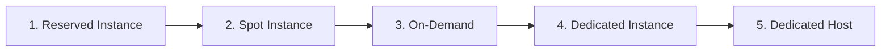
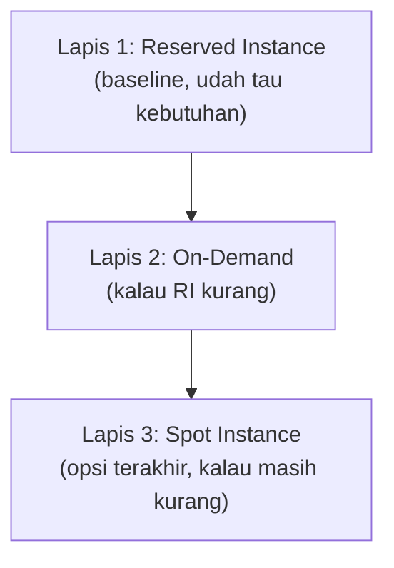

Rangkuman konsep-konsep yang direview berulang selama sesi latihan soal, dikumpulin di satu tempat biar gampang dibaca ulang sebelum ujian. Post ini bakal ditambah kalau ada sesi latihan soal berikutnya.

## EC2 Pricing Model: Urutan Termurah ke Termahal

Kalau ketemu soal "mana yang paling murah / paling hemat", urutannya (termurah ke termahal):

### Kapan Pakai Yang Mana

| Model | Kapan dipakai |
|---|---|
| **Reserved Instance (RI)** | Udah tau workload-nya dan durasinya (misal butuh 3 server selama 1 tahun). Kayak reservasi restoran, harus tau kebutuhan di depan. Kalau nggak kepake penuh, tetep bayar penuh. |
| **On-Demand** | Kebutuhan jangka pendek. Per jam mahal, jangan dipakai buat beban 24/7. |
| **Spot Instance** | Kapasitas RI orang lain yang lagi nggak kepake, dijual murah (hemat sampai 90%). **Jangan taro database di spot** (bisa di-reclaim sewaktu-waktu). |
| **Dedicated Instance** | Hardware nggak di-share sama customer lain. |
| **Dedicated Host** | Wajib kalau ada masalah **software licensing yang terikat ke physical server** (CPU-bound, contoh Oracle). Kalau soal nyebut "physical server" atau "software licensing" → jawabannya Dedicated Host, bukan Dedicated Instance. |

### RI Standard vs Convertible

- **RI Standard**: harga paling hemat, tapi **nggak bisa diubah spek-nya**, jadi nggak bisa autoscaling. Kalau butuh scale, harus nambah On-Demand (billing-nya kepisah).
- **RI Convertible**: bisa ditukar ke instance family/type lain, lebih fleksibel tapi diskonnya lebih kecil.

### Strategi 3 Lapis Autoscaling (buat Solutions Architect)

Sisa RI yang nggak kepake bisa dijual ke **RI Marketplace** (legal), atau jadi pool spot buat orang lain.

## IAM: Roles Nggak Bisa Nempel ke Group

- **IAM Policy** → bisa nempel ke User, Group, atau Role.
- **IAM Role** → nempelnya ke **service/resource** atau di-**assume** oleh user/aplikasi, **bukan** ke Group. Kalau dipaksa nempel role ke group, nggak bisa.
- 3 tipe identity: User, Group, Role. Policy itu **bukan** identity, tapi dokumen aturan.

### Struktur IAM Policy: Principal vs Action

- **Principal** → siapa (user/account) yang diizinkan. Dipakai di resource-based policy (misal bucket policy).
- **Action** → tindakan apa yang diizinkan (misal `s3:GetObject`).
- **Effect** → Allow atau Deny.
- **Resource** → resource mana yang kena aturan.

## 4 Scope Resource AWS

Tiap resource AWS punya "jangkauan" (scope) yang beda:

| Scope | Contoh Resource |
|---|---|
| **Global** | IAM (user, group, role, policy), Route 53, CloudFront |
| **Region** | EC2 (AMI, instance), S3 bucket (nama global tapi datanya di 1 region), DynamoDB, VPC |
| **VPC** | Security Group, Internet Gateway, Route Table |
| **Subnet / AZ / Resource** | Subnet (1 AZ), EBS volume (1 AZ), ENI (1 subnet), Instance Store |

Ini sering jadi jebakan soal (misal "bisa nggak security group dipakai lintas VPC?" → nggak, security group itu VPC-scoped).

## Service yang Gampang Ketuker

| Service | Fungsinya |
|---|---|
| **CloudWatch** | Monitor **resource** (CPU, network, metric, alarm) |
| **CloudTrail** | Log **aktivitas akun / API call** (siapa ngapain kapan) |
| **Trusted Advisor** | Rekomendasi / helper best practice arsitektur (kayak konsultan virtual) |
| **AWS Config** | Standarisasi & audit konfigurasi resource (compliance) |
| **Amazon Connect** | **Customer service / contact center** (sama sekali bukan networking) |
| **CloudFront** | CDN, cache konten global di edge location |
| **AWS Artifact** | Cuma dokumentasi compliance/agreement, bukan config, bukan report keamanan |

## OpenSearch = Elasticsearch

Amazon OpenSearch itu fork dari Elasticsearch, **cara kerjanya sama aja** (search & analytics engine, sering dipake buat log analytics, mirip stack ELK). Kalau soal nyebut Elasticsearch, konsepnya sama dengan OpenSearch.

## ETL: Extract, Transform, Load

**ETL** = Extract, Transform, Load. Dari data berantakan → masuk proses ETL → jadi data rapi biar gampang dibaca/dianalisa. **Bukan** "ngubah log jadi data", tapi nyederhanain data yang kompleks jadi bentuk yang bisa di-query. Contoh: import log CloudTrail (JSON berantakan) ke Athena lewat `CREATE TABLE`, itu proses ETL biar bisa di-`SELECT` pake SQL.

## Networking Ingat-Ingat

- **Load balancer wajib minimal 2 AZ**.
- **WAF (Web Application Firewall)** berdiri di **depan/luar** VPC (sebelum request masuk), sedangkan security group, NACL, route table itu di dalam AWS.
- **AWS Outposts** = hardware AWS yang disewa dan ditaruh di data center sendiri (extend VPC ke on-premises). Beda dari **Direct Connect** (koneksi fiber optic dedicated) dan **Amazon Connect** (customer service).

## Yang Perlu Diinget

- Urutan pricing termurah: RI → Spot → On-Demand → Dedicated Instance → Dedicated Host.
- "Physical server" / "software licensing" di soal → Dedicated Host.
- IAM Role nggak bisa nempel ke Group, cuma Policy yang bisa.
- Security Group itu VPC-scoped, EBS/subnet itu AZ-scoped, IAM itu global.
- CloudWatch (resource) vs CloudTrail (aktivitas akun) vs Config (konfigurasi) vs Trusted Advisor (rekomendasi) vs Amazon Connect (CS).

## Referensi Resmi

- [Amazon EC2 Instance Purchasing Options](https://docs.aws.amazon.com/AWSEC2/latest/UserGuide/instance-purchasing-options.html)
- [IAM Identities (Users, Groups, Roles)](https://docs.aws.amazon.com/IAM/latest/UserGuide/id.html)
- [AWS Service Endpoints and Scoping](https://docs.aws.amazon.com/general/latest/gr/aws-service-information.html)
- [AWS Certified Cloud Practitioner Exam Guide](https://aws.amazon.com/certification/certified-cloud-practitioner/)
