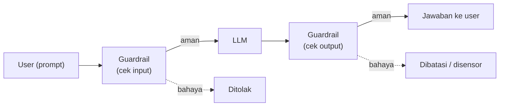

## Prinsip Responsible AI

AI bisa berdampak negatif serius kalau nggak dipake dengan bertanggung jawab. Prinsip yang harus jadi inti di banyak sistem AI:

- **Akurat**: output-nya bener.
- **Adil (fair)**: nggak bias, nggak mengarah ke ketidakadilan pas decision making.
- **Aman & bisa diamankan (safe/secure)**: data orang tetep aman.
- **Explainable & transparan**: ada mekanisme validasi dan audit apa yang terjadi di balik layar, output-nya bisa dijelasin alasannya.
- **Bisa diatur & dikontrol**: kita harus punya kendali penuh atas sistem AI-nya.

Contoh kasus nyata dampak buruk: algoritma aplikasi kesehatan yang bias di rekomendasi treatment, pengacara yang nerima kutipan hukum palsu ("halusinasi") dari AI.

## "No Free Lunch": Data Kita Jadi Produk

Prinsip penting: **AI itu di-training dari data yang ada di internet**, termasuk yang kita posting/upload di sosial media. "Sosmed itu gratis, tapi kita jadi produknya."

Waktu kita nanya ke AI (ChatGPT, Gemini, Claude, DeepSeek, model apapun), secara default kita **setuju data kita dipakai buat training model berikutnya**, dan kita nggak punya hak nuntut balik. Pakai versi premium pun nggak ngubah ini, premium cuma ngasih model terbaru + token limit lebih longgar, datanya tetep ke-training. Mode incognito/private browsing juga nggak ngefek.

## Hijack Prompting / Prompt Injection

Bahaya buat yang suka "vibe coding" (ngandelin AI buat ngoding): kalau kamu paste kode aplikasi ke AI buat minta fix, kamu ngasih **struktur aplikasi kamu** ke AI, dan itu ke-training.

Dari kode yang di-paste, orang bisa "mancing" info arsitektur: bahasa/framework yang dipake, database (PostgreSQL/Prisma/dll), auth (JWT/Redis), containerization (Docker), storage (S3), struktur tabel, alur transaksi, cara validasi API. Ini yang disebut **hijack prompting**, hacking lewat jalur nanya AI tanpa sadar.

> Jangan pernah paste kredensial (access key, secret, password) ke AI, itu sama aja ngasih celah.

## Guardrails: Filter di Depan LLM

**Guardrail** itu layer filter yang berdiri di depan LLM. Alurnya:

1. Prompt user dicek dulu di guardrail (input filtering). Kalau bahaya, ditolak sebelum sampai ke LLM.
2. LLM ngasih jawaban, dicek lagi di guardrail (output filtering). Kalau bahaya, jawabannya dibatasi/disensor.

### Yang Bisa Diatur di Guardrail

- **Kategori konten**: hate, sexual, violence, misconduct, prompt attack, masing-masing bisa di-set threshold-nya (best practice: setinggi mungkin).
- **Denied topics**: topik yang di-block (misal pembahasan politik, agama).
- **Kata sensitif / word filter**: daftar kata yang di-block.
- **PII filter**: blok data pribadi sensitif.

Ini jawaban kenapa model kayak Grok bisa "dibatasi" jawabannya untuk topik tertentu, ada guardrail di depannya.

## Context Engineering (dulu Prompt Engineering)

Istilah **prompt engineering** sekarang jadi **context engineering**. Fitur "temporary chat" di AI itu sebenarnya bagian dari context management: gimana AI mempertahankan konteks obrolan (history, session) supaya jawabannya tetep nyambung.

## Yang Perlu Diinget

- Responsible AI: akurat, adil, aman, explainable/transparan, bisa dikontrol.
- Nanya ke AI = data kamu ke-training, premium/incognito nggak ngelindungin ini.
- Hijack prompting: paste kode ke AI bisa bocorin arsitektur aplikasi tanpa sadar. Jangan paste kredensial.
- Guardrail = filter 2 arah (cek input sebelum ke LLM, cek output sebelum ke user), bisa atur kategori konten, denied topics, word filter, PII filter.
- Prompt engineering sekarang disebut context engineering.

## Referensi Resmi

- [Responsible AI at AWS](https://aws.amazon.com/machine-learning/responsible-ai/)
- [Amazon Bedrock Guardrails](https://docs.aws.amazon.com/bedrock/latest/userguide/guardrails.html)
- [Prompt Injection Security](https://docs.aws.amazon.com/bedrock/latest/userguide/prompt-injection.html)
