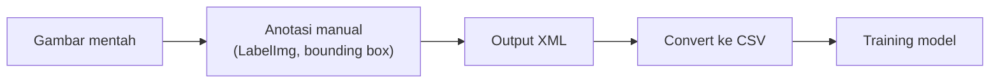

## Kenapa Data Labeling Penting

Data labeling itu proses ngasih tag informatif ke data mentah (image, teks, video) biar bisa dipakai ngetrain model machine learning. Ini yang bikin **supervised learning** disebut "supervised": kita yang manual nandain di belakang layar, ini gambar anjing, ini gambar kucing.

Disarankan banget labeling dengan benar, karena kalau labelnya ngaco, hasil modelnya juga ikut ngaco. Data bagus aja hasilnya bisa jelek, apalagi kalau datanya jelek dari awal.

## Dua Teknik Labeling Gambar

### 1. Hierarki Folder

Teknik paling sederhana: bikin folder per kelas. Folder "anjing" isinya gambar anjing semua, folder "kucing" isinya gambar kucing semua. Nama file di dalamnya nggak masalah (mau 1, 2, 3), yang penting jangan sampai ada gambar kucing nyasar ke folder anjing, karena itu bakal ngerusak proses training.

### 2. Data Annotation

Teknik yang dipakai instruktur pas tugas akhir D3 tahun 2019: setiap gambar di-download satu-satu, terus dikasih **bounding box** (kotak) buat nandain posisi objeknya. Contoh, ada gambar anjing, dibikinin kotak yang pas ngelilingin badan anjingnya.

Prinsipnya: makin rapat kotaknya (makin presisi), makin bagus. Kalau kotaknya kelewat lebar, ikut kebawa elemen lain (misal rumput di sekitar anjing), itu jadi noise yang bikin data kurang akurat.

Tools yang dipakai namanya **LabelImg**, hasil anotasinya berupa file XML. Dari XML ini baru di-convert ke CSV, dan barulah CSV ini yang dipakai buat training model. Alurnya:

CSV hasil konversi ini bisa dipakai ulang, nggak perlu labeling dari nol lagi kalau mau nambah kelas baru (tinggal gabungin CSV baru).

### Kelemahan Anotasi

Meski udah dicrop serapat mungkin, tetap ada noise (misal rumput ikut kecrop). Ini yang bikin akurasi rata-rata di bawah 95%, karena ada elemen yang sebenarnya nggak dibutuhkan tapi ikut kebawa.

## Komposisi Data Harus Seimbang

Kalau data anjing 1000 gambar, data kucing juga harus sekitar 1000 gambar, jangan sampai timpang (misal anjing 1000 tapi kucing cuma 800). Komposisi yang nggak seimbang bakal ngerusak akurasi model.

## Studi Kasus: Skripsi Deteksi Masker (2019)

Instruktur cerita skripsi S1-nya soal deteksi masker pakai CNN:

- Dataset: 1900 foto wajah pakai masker, 1900+ foto tanpa masker, dari paper publik peneliti (Jonggwan dkk).
- Alasan pakai dataset publik: nggak mau ribet bikin manual, dan dataset publik udah dijadiin benchmark di penelitian lain, jadi ada pembanding yang solid.
- Preprocessing: cropping wajah otomatis pakai algoritma bounding box, distandarisasi ke ukuran 254x150x248.
- Split data: 80% training, 20% testing, random state 42.
- Hyperparameter: learning rate 0.00001, epoch 20, batch size 32.
- Hasil: akurasi deteksi masker 99%, tanpa masker cuma 88%. Alasannya, variasi warna kulit (item, kuning, sawo matang, putih) bikin gradasi warna beda-beda secara pixel, dan itu ngaruh ke akurasi model.

Soal metodologi, instruktur juga sempat nyinggung: skripsi itu bagusnya pakai dataset publik yang udah ada papernya (udah jadi benchmark), biar penelitian punya pembanding yang jelas pas sidang.

## Object Detection vs Image Segmentation

Object detection (yang dipakai di studi kasus di atas) itu nentuin posisi objek pakai bounding box, tapi karena bentuknya kotak, pasti ada noise dari elemen sekitar.

Level yang lebih tinggi namanya **image segmentation**: bener-bener nge-treat sampai level piksel, bukan cuma kotak kasar. Hasilnya jauh lebih presisi, tapi prosesnya jauh lebih berat dan makan waktu lebih lama, butuh spek komputasi (terutama GPU) yang lebih tinggi.

## Yang Perlu Diinget

- Data labeling itu fondasi supervised learning, kualitas label nentuin kualitas model.
- Dua teknik: hierarki folder (simpel, buat klasifikasi) dan data annotation (bounding box, buat object detection).
- Alur data annotation: gambar → anotasi (XML) → convert CSV → training.
- Komposisi data antar kelas harus seimbang biar akurasi nggak bias.
- Object detection pakai bounding box (ada noise), image segmentation lebih presisi tapi lebih berat.

## Referensi Resmi

- [What Is Computer Vision?](https://aws.amazon.com/what-is/computer-vision/)
- [Amazon Rekognition](https://aws.amazon.com/rekognition/)
