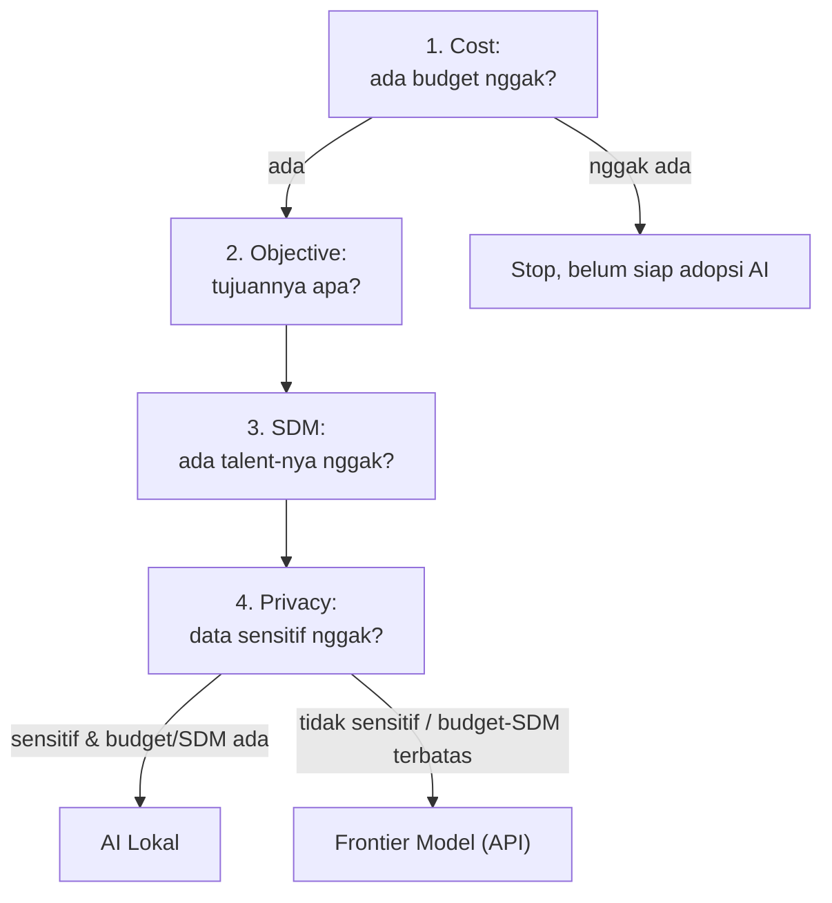

Pertanyaan yang sering muncul: kalau perusahaan mau adopsi AI, mulai dari mana? Instruktur kasih framework sederhana, 4 pertanyaan yang harus dijawab urut, dari yang paling gampang eliminasi sampai yang paling teknis.

## 1. Cost: Ada Budget Nggak?

Ini pertanyaan gerbang pertama, dan harus ditanya duluan sebelum ngomongin apapun soal AI. Adopsi AI itu selalu ada biaya tambahan. Kalau budget-nya nggak ada, ya nggak usah lanjut mikirin AI dulu, daripada nyesel belakangan.

## 2. Objective: Tujuannya Apa?

Dari sini, tim bisa mapping mau pakai ML sederhana, deep learning, atau Generative AI (foundation model). Kalau kebutuhannya cuma prediksi sederhana, nggak perlu paksa pakai Generative AI yang mahal.

Analoginya: itu kayak "bunuh nyamuk pakai nuklir". Kalau ML sederhana udah cukup buat jawab kebutuhan, ya pakai itu aja, nggak perlu foundation model versi paling canggih sekalipun.

## 3. SDM: Ada Talent-nya Nggak?

Pertanyaan realistis: apakah ada orang di tim yang sanggup ngerjain ini? Kondisi umum di lapangan, banyak developer backend yang "dipaksa" belajar ML dari nol, atau satu orang IT diharapkan jadi serba bisa. Kalau SDM-nya belum ada, opsinya hire orang baru atau training tim internal dulu, dan itu semua balik lagi ke pertanyaan nomor 1 (cost).

## 4. Privacy: Data Sensitif Nggak?

Pertanyaan terakhir, dan ini yang nentuin arsitektur akhir:

- **Kalau data sensitif** (dan budget serta SDM tersedia): pakai **AI lokal**. Data nggak perlu keluar infra sendiri, jadi lebih aman dari sisi privasi.
- **Kalau data nggak sensitif**, atau budget/SDM terbatas: pakai **frontier model** lewat API (provider besar kayak model-model tercanggih yang tersedia).

**Frontier model** itu istilah buat model paling canggih/terbaru yang ada saat ini, dan biasanya belum open source (contoh: model-model generasi terbaru dari provider-provider besar).

## Kenapa Urutannya Begini

Urutan ini penting karena tiap pertanyaan mengeliminasi opsi yang nggak realistis lebih dulu. Banyak perusahaan yang loncat langsung ke pertanyaan privasi atau teknis lainnya, padahal belum jelas budget-nya ada apa nggak. Instruktur cerita, di lapangan banyak yang ikut seminar dan penuh formula, tapi begitu ditanya cost-nya berapa, langsung mundur otomatis.

## Yang Perlu Diinget

- Urutan pertanyaan: Cost → Objective → SDM → Privacy.
- Cost adalah gerbang pertama, kalau nggak ada budget, adopsi AI belum realistis.
- Objective nentuin level teknologi yang dipakai (ML sederhana vs Generative AI), jangan overkill.
- SDM nentuin perlu hire/training tambahan atau nggak.
- Privacy nentuin pilihan akhir: data sensitif + budget/SDM ada → AI lokal, data nggak sensitif / budget-SDM terbatas → frontier model (API).
