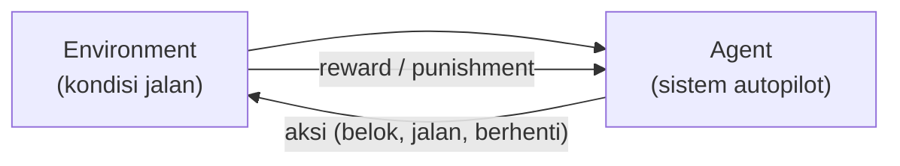

Materi hari pertama AI udah bahas 3 metode pembelajaran ML secara garis besar (supervised, unsupervised, reinforcement). Hari kedua ini bedah lebih dalam tiap metodenya.

## Supervised Learning: Klasifikasi

Klasifikasi itu nentuin kategori data berdasarkan fitur-fiturnya. Contoh: dari data transaksi (item, lokasi, dll), tentuin apakah itu fraud atau bukan.

Klasifikasi dibagi 2:

| Jenis | Penjelasan | Contoh |
|---|---|---|
| **Binary classification** | Cuma 2 kemungkinan hasil | Fraud atau tidak |
| **Multi-class classification** | Lebih dari 2 kemungkinan hasil | Klasifikasi decile 1-10 (misal segmentasi nasabah BSI) |

## Supervised Learning: Regresi

Regresi juga dibagi 2, dan ini yang sering bikin ketuker karena kelihatan mirip di bahasa Indonesia: **estimasi** dan **prediksi**.

- **Estimasi**: berhubungan sama waktu. Contoh: estimasi proyek selesai berapa lama, estimasi galian selesai kapan. Algoritmanya biasanya pakai time series (contoh ARIMA).
- **Prediksi**: bukan soal waktu. Contoh: prediksi siapa yang menang pertandingan, prediksi stok barang, prediksi harga. Tipe datanya kontinu, tapi algoritmanya beda sama time series.

Analoginya kayak kata "established" (EST, ada di plang restoran) yang artinya "sejak tahun sekian", itu present-nya kata "estimasi". Sementara prediksi lebih ke arah kira-kira tanpa embel-embel waktu pasti.

## Unsupervised Learning: Clustering dan Anomaly Detection

Data di sini nggak punya label, jadi modelnya harus nyari pola atau hubungan tersembunyi sendiri (dulu nama bidang ini "data mining"). Dua metode utamanya:

- **Clustering**: pengelompokan data jadi beberapa cluster tanpa label sebelumnya.
- **Anomaly detection**: nyari pola yang aneh/beda dari kebiasaan. Biasa dipakai buat deteksi fraud, deteksi hacking, analisa spending pattern.

## Reinforcement Learning: Reward vs Punishment

Konsepnya reward dan punishment, dan itu tergantung dari environment-nya. Contoh paling gampang: autopilot mobil (kayak Tesla). Kalau dia nabrak, itu kena punishment, sistemnya belajar dari situ.

Di belakang layarnya, autopilot pakai image segmentation buat ngukur jarak dan ngenalin objek (garis jalan, mobil lain, dll), lalu ambil keputusan (jalan, belok, berhenti) berdasarkan hasil deteksi itu.

Menariknya, instruktur cerita sistem kayak gini susah diterapkan optimal di Indonesia, karena kebiasaan berkendara beda jauh sama data training-nya (yang kebanyakan dari Amerika): lampu sein nyala kanan tapi belok kiri, jalan nggak rata, ada odong-odong dan bajaj yang nggak ada di dataset training. Makanya full self-driving di jalan umum Indonesia masih jauh dari feasible, beda cerita kalau di jalan tol yang formatnya lebih konsisten.

## Rangkuman: 5 Tujuan Machine Learning

Menurut instruktur, tujuan ML itu sebenarnya cuma 5:

1. Estimasi
2. Prediksi
3. Klasifikasi
4. Klastering (clustering)
5. Asosiasi

Supervised learning nyari kesimpulan yang bisa berupa estimasi, prediksi, atau klasifikasi. Unsupervised learning nyari klastering atau asosiasi. Balik lagi ke kebutuhan: mau ngapain, itu yang nentuin metode mana yang dipakai.

## Yang Perlu Diinget

- Klasifikasi: binary (2 hasil) vs multi-class (lebih dari 2 hasil).
- Regresi: estimasi (soal waktu) vs prediksi (bukan soal waktu), algoritmanya beda.
- Unsupervised: clustering (pengelompokan) dan anomaly detection (deteksi pola aneh, buat fraud/hacking).
- Reinforcement learning: belajar dari reward/punishment sesuai environment, contohnya autopilot mobil.
- Konteks lokal ngaruh banget ke performa model (autopilot yang bagus di Amerika belum tentu jalan di Indonesia).

## Referensi Resmi

- [What Is Machine Learning?](https://aws.amazon.com/what-is/machine-learning/)
- [What Is Reinforcement Learning?](https://aws.amazon.com/what-is/reinforcement-learning/)
