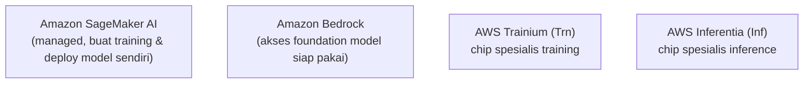
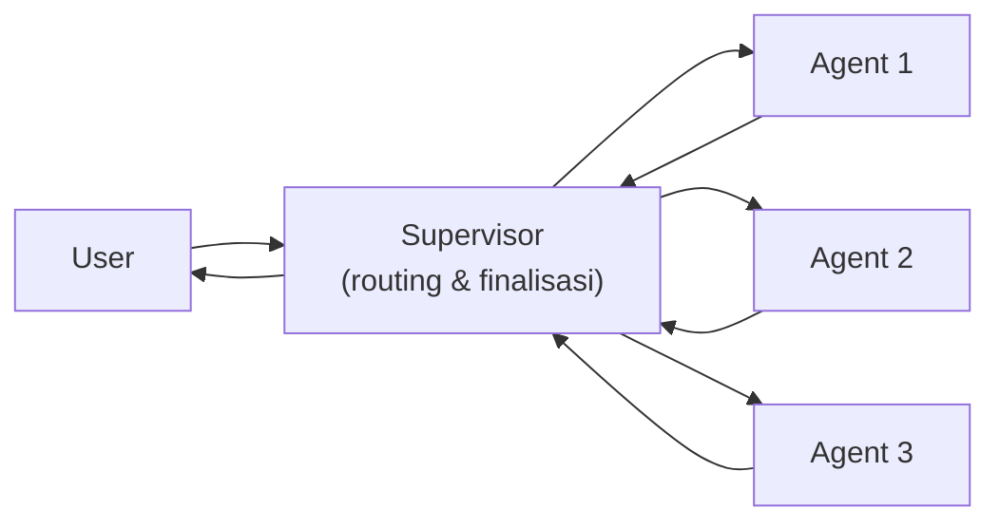

## Model Gede = Lebih Banyak Knowledge, Bukan Otomatis Lebih Pintar

Pertanyaan pancingan dari instruktur: apakah model yang ukurannya lebih besar otomatis lebih pintar? Jawabannya nggak sesederhana itu.

Model yang lebih besar itu **knowledge-nya lebih banyak**, karena di-training dari data yang lebih banyak juga. Tapi "banyak tahu" itu beda sama "pintar". Orang yang ilmunya banyak itu bikin dia bijak, tapi "pintar" itu soal jago di satu bidang spesifik (spesialis), bukan tau banyak hal secara general.

Analoginya: ahli gizi itu banyak ilmu soal nutrisi, tapi belum tentu jago nambal ban. Sebaliknya, tukang tambal ban nggak punya ilmu gizi, tapi dia jago banget di bidangnya. Kalau butuh tambal ban, ya panggil tukang tambal ban, bukan ahli gizi.

Makanya, buat kebutuhan spesifik kayak ngoding, instruktur lebih milih pakai model kecil yang spesialis (misalnya Qwen 2.5 Coder, ukuran cuma belasan GB) dibanding model umum yang jauh lebih besar. Hasilnya tetap bagus buat ngoding, tapi jauh lebih hemat resource dan lebih cepat.

## Trade-off: Ukuran, Biaya, dan Kecepatan

| | Model Besar | Model Kecil |
|---|---|---|
| Knowledge | Lebih luas (general) | Lebih sempit (spesialis) |
| Biaya | Lebih mahal | Lebih murah |
| Kecepatan respons | Lebih lambat | Lebih cepat |
| Spek infra | Butuh lebih besar | Lebih ringan |

Contoh perbandingan biaya nyata yang didemoin instruktur: jawaban dengan panjang token yang sama, pakai model besar (kelas GPT generasi terbaru) biayanya sekitar $0.05, sementara pakai model yang lebih kecil (kelas Gemini 2.5) cuma sekitar $0.000029. Bedanya jauh banget.

## Stack Layanan AI di AWS

- **Amazon SageMaker AI**: layanan managed buat training dan deploy model sendiri (end-to-end ML lifecycle). Kontrolnya lebih sedikit dibanding self-hosted, tapi lebih gampang dipakai. Perlu diingat, kalau butuh instance gede (misal kelas m5.4xlarge) buat serving, dan trafiknya tinggi sampai auto scaling jalan, billing-nya bisa bengkak signifikan.
- **Amazon Bedrock**: buat akses foundation model (Generative AI) siap pakai tanpa perlu training sendiri.
- **AWS Trainium (Trn)**: chip yang didesain spesifik buat training model. Beban kerjanya berat tapi stabil dari awal sampai selesai training.
- **AWS Inferentia (Inf)**: chip yang didesain spesifik buat inference. Beban kerjanya fluktuatif, tergantung berapa banyak user yang lagi nanya.

Alasan training dan inference butuh chip beda: training itu kerja berat tapi konsisten (nyala terus sampai model jadi), sementara inference itu naik-turun sesuai trafik pengguna.

## Context Engineering: Hemat Token

Salah satu skill penting: **context engineering**, teknik ngatur instruksi ke AI biar hemat token dan tetap akurat. Salah satu caranya pakai file instruksi (semacam skill file), isinya instruksi spesifik kayak "jawab yang penting aja", biar AI nggak ngasih jawaban muter-muter yang boros token.

## Arsitektur Multi-Agent: LLM Supervisor

Kalau butuh beberapa agent AI kerja bareng (masing-masing spesialis di tugasnya), pola yang umum dipakai namanya **LLM Supervisor**:

User kirim request ke supervisor, supervisor nentuin ini tugas siapa, routing ke agent yang sesuai, tiap agent balikin hasil ke supervisor, dan supervisor yang ngoreksi + finalisasi jawaban sebelum dikirim balik ke user. Ini beda sama routing biasa (yang cuma geser-geser pertanyaan ke agent yang sesuai tanpa proses koreksi/finalisasi).

## Yang Perlu Diinget

- Model besar = knowledge lebih luas, bukan otomatis lebih pintar di tugas spesifik.
- Model kecil yang spesialis bisa lebih efektif dan lebih murah buat kebutuhan tertentu (contoh: coding).
- SageMaker AI buat training/deploy model sendiri, Bedrock buat akses foundation model siap pakai.
- Trainium buat training (beban stabil), Inferentia buat inference (beban fluktuatif).
- Context engineering dan pola LLM Supervisor penting buat ngatur biaya dan koordinasi multi-agent.

## Referensi Resmi

- [Amazon SageMaker AI](https://aws.amazon.com/sagemaker/)
- [Amazon Bedrock](https://aws.amazon.com/bedrock/)
- [AWS Trainium](https://aws.amazon.com/machine-learning/trainium/)
- [AWS Inferentia](https://aws.amazon.com/machine-learning/inferentia/)
