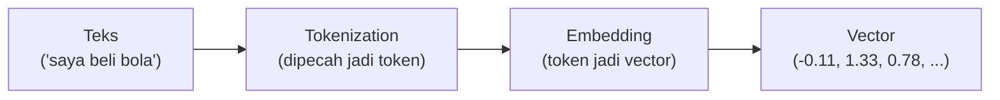
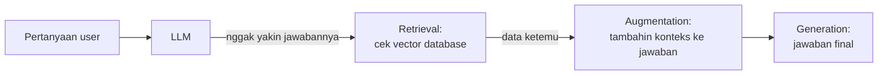

## AI Cuma Bisa Baca Angka

Poin pentingnya: AI itu nggak bisa "baca" teks kayak manusia. Yang bisa dia proses cuma angka. Jadi ada proses buat ngerubah teks jadi angka, dan itu yang disebut **embedding**.

## Tokenization

Sebelum jadi vector, teks dipecah dulu jadi **token**. Tiap model punya cara motong (tokenizer) yang beda-beda, bisa dari library seperti Hugging Face Tokenizers atau model tertentu. Contoh analoginya: pisau dan gergaji sama-sama alat potong, tapi cara motongnya beda.

Ini penting karena kalau proses embedding pakai model A tapi query-nya pakai model B, ada penurunan performa, karena cara "motong" datanya beda. Idealnya, satu ekosistem model dipakai konsisten dari awal sampai akhir (misalnya kalau embedding pakai ChatGPT, query-nya juga pakai ChatGPT).

## Vector: Angka yang Merepresentasikan Makna

Vector itu kumpulan angka desimal (termasuk bisa minus) yang jadi semacam koordinat posisi makna kata di ruang berdimensi. Manusia nggak bisa baca vector ini langsung, tapi AI justru cuma bisa baca ini.

Makin besar dimensi vector-nya, makin presisi posisinya (makin akurat), tapi ada trade-off: makin besar dimensi, makin berat prosesnya dan makin ada potensi latency.

## Vector Database

Vector database itu database yang bisa nyimpen data dalam bentuk vector. Beberapa opsi yang dibahas:

- **PostgreSQL dengan ekstensi pgvector**
- **Amazon DynamoDB** (bisa dipakai sebagai vector database)
- **Elasticsearch**

Poin penting: **setiap vector database punya spesialisasi masing-masing**, nggak semuanya sama persis kemampuannya. Instruktur cerita ini yang bikin dia gagal satu soal pas ujian CCP tanggal 3 Januari (skor 73.5, minimal lulus 75), karena waktu itu dia kira semua vector database itu setara, padahal beda-beda spesialisasinya.

## Cara Kerja RAG (Retrieval-Augmented Generation)

Analoginya kayak orang lagi ujian dan nggak tahu jawaban: dia nyontek dulu, dan kalau contekannya ada, dia jawab berdasarkan itu.

Kalau di bahasa AWS, "contekan" ini disebut **Knowledge Base**. Jadi RAG itu inti kerjanya adalah vector database plus mekanisme retrieval-augmentation-generation.

Kelebihan RAG: knowledge model nggak nambah secara permanen (nggak perlu training ulang), tapi model jadi bisa jawab hal-hal yang sebelumnya nggak dia tahu, karena ada "contekan" tambahan.

### Routing Antar Beberapa Knowledge Base

Kalau ada lebih dari satu knowledge base, biasanya dipakai mekanisme **confidence threshold**: kalau model nggak yakin di bawah persentase tertentu, dia akan cek ke vector database dulu buat validasi, baru jawab.

## Studi Kasus: Chatbot FAQ Bank

Contoh penerapan nyata: chatbot customer service bank (misal soal cara bikin rekening). Kalau model dasarnya nggak tahu jawabannya, dia cek ke FAQ atau knowledge base internal bank, ketemu jawabannya, baru dia jawab ke nasabah.

Best practice-nya: data-data perusahaan yang sifatnya privat (nggak pernah di-training oleh provider AI/foundation model manapun) ditaruh di knowledge base/RAG, bukan dipakai buat training ulang model (karena data privat kayak gaji karyawan jelas nggak boleh dipakai buat training).

## Layanan Suara di AWS

Masih nyambung ke topik pemrosesan data buat AI:

- **Amazon Transcribe**: speech-to-text (STT).
- **Amazon Polly**: text-to-speech (TTS), bisa pilih karakter suara.

Catatan penting soal risiko: teknologi voice cloning (misalnya berbasis RVC) bisa dipakai buat kloning suara orang, dan ini rawan disalahgunakan buat penipuan, apalagi kalau suaranya dibikin mirip customer service bank. Jadi kalau nerima telepon yang ngaku dari bank, tetap harus waspada dan cross-check.

## Yang Perlu Diinget

- AI cuma bisa proses angka, embedding adalah proses ubah teks jadi vector.
- Tokenizer beda-beda tiap model, sebaiknya konsisten satu ekosistem dari embedding sampai query.
- Vector database punya spesialisasi masing-masing, jangan asumsikan semuanya sama.
- RAG: retrieval (cek knowledge base) → augmentation → generation, dipakai buat nambahin knowledge tanpa training ulang.
- Amazon Transcribe (STT) dan Amazon Polly (TTS) buat pemrosesan suara, tapi hati-hati risiko voice cloning buat penipuan.

## Referensi Resmi

- [What Is RAG (Retrieval-Augmented Generation)?](https://aws.amazon.com/what-is/retrieval-augmented-generation/)
- [Amazon Bedrock Knowledge Bases](https://aws.amazon.com/bedrock/knowledge-bases/)
- [Amazon Transcribe](https://aws.amazon.com/transcribe/)
- [Amazon Polly](https://aws.amazon.com/polly/)
